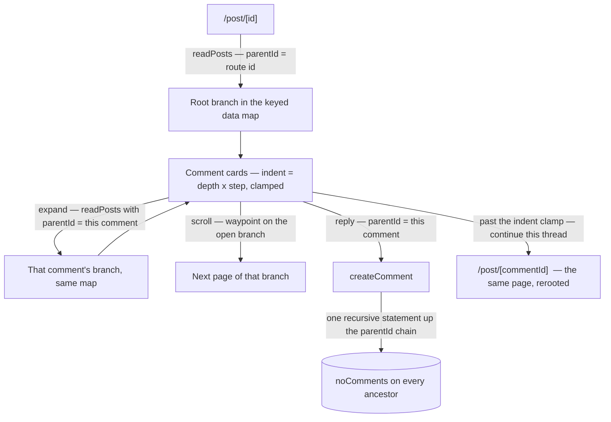

# Nested Comment Threads

Reply to a comment, and to that reply, without limit — the Reddit conversation shape. The data model has been threaded since the first commit: a comment **is** a post with a `parentId` and a `depth`, and `readPosts` already pages the children of any node. What is missing is entirely in the UI and one counter.

## Scope

**Today** ([posts and comments](/docs/posts/posts-and-comments)) `posts` is self-referencing — `parentId` plus `depth = parent + 1` — and `readPosts` takes a `parentId` (defaulting to the root feed), sorts by the stored ranking, and pages with a cursor. The comment store already holds its list in a **keyed** pagination data map, keyed by the post in the route, and the post page renders one flat level of cards with an infinite-scroll waypoint under them. `createComment` writes the child and bumps its parent's `noComments` in the same transaction.

**This adds** a tree over that, and nothing to the schema.

### Reading a branch

The store's data map is keyed by **the parent whose replies it holds** rather than by the post in the route. Every node then pages independently through the read it already has, and the root post is simply the branch whose key is the route's id — one code path for the page and for every reply beneath it, with each keyed read bound to its key when it is issued.

A branch is **collapsed until asked for**: a node with replies renders a reply-count toggle, and expanding it issues that branch's first read. That is expansion, not paging — once a branch is open, its own waypoint pages it by scroll like every other list in the app, and no Load-more button appears anywhere.

### Rendering depth

Indentation is `depth` times one spacing step, applied by the card's container — the whole of the tree's visual structure. The step count **clamps** at a small maximum so a long chain does not squeeze its text into a column, while the nesting itself stays unbounded: past the clamp, replies keep nesting in the data and stop moving right on screen.

At that clamp a node offers **continue this thread**, and that link needs no new route: a comment is a post, so `/post/[id]` on the comment's own id renders it as the root with its replies beneath — the same page, the same store, the same reads, one level of context shown instead of ten. Two things follow, and both are part of this work rather than consequences of it:

- **`useReadPostFromRoute` must accept a post with a `parentId`.** It treats one as a 404 today, which is the whole of what stops a comment being opened as a root.
- **Indentation is relative to the route, not to the stored `depth`.** `depth` is persisted as the parent's plus one, so rendering it directly would open a rerooted thread already clamped and already indented. The comment the route names renders at depth 0 and each descendant is indented by its distance below that comment; the maximum clamp and the unbounded nesting are unchanged.

### Replying

Each card gets a Reply action that opens the existing comment editor under it, with `parentId` set to that card. One editor is open at a time, held as the replying id in the comment dialog store next to the deleting id it already holds — the same store-driven single-instance shape the delete flow uses ([singleton dialogs](/docs/architecture/singleton-dialogs)).

### The counter has to mean the subtree

`noComments` is denormalized and written transactionally with the mutation, which is what keeps feed cards from aggregating ([likes](/docs/posts/likes) uses the same discipline for `noLikes`). Today every comment is a direct child, so a root post's counter happens to equal its total. Once replies nest, a counter that only counts direct children makes the feed under-report — a post with thirty comments showing three.

So a create increments **every ancestor**, and a delete decrements them by the size of the subtree it removes, each as one recursive statement walking the `parentId` chain rather than a loop of round trips. The client reconciles the same way: a delete drops the removed comment **and every loaded descendant** from the branch maps and adjusts the counters by the size the server reports removing, because a store that removes one row and subtracts one leaves orphaned descendants rendering under a parent that no longer exists. The cost is stated plainly: a write is now proportional to the depth it happens at, and the delete path has to count the subtree the cascade takes with it. That is the price of keeping the counter honest, and it is paid on the write side where it belongs.

### The flow

## Key files

| File                                                   | Change                                                   |
| :----------------------------------------------------- | :------------------------------------------------------- |
| `packages/app/app/store/post/comment/index.ts`         | the data map keyed by branch parent rather than by route |
| `packages/app/app/store/post/comment/dialog.ts`        | the replying id beside the deleting id                   |
| `packages/app/app/composables/post/useReadComments.ts` | a read per branch parent                                 |
| `packages/app/app/components/Post/Comment/Card.vue`    | indentation, expand toggle, Reply action, recursion      |
| `packages/app/app/pages/post/[id].vue`                 | the root branch as one case of the tree                  |
| `packages/app/server/trpc/routers/post.ts`             | ancestor-chain counter updates on create and delete      |

## Notes

Sort order inside a branch is the stored ranking the read already applies, so replies arrive best-first at every level with no new sort to choose.

Nothing here changes what a comment is, which is why the depth is unbounded in the first place: the clamp is a stylesheet decision and the continue-thread link is a route that already exists. A depth limit would be a product rule invented to make the layout easier, and the layout does not need it.
