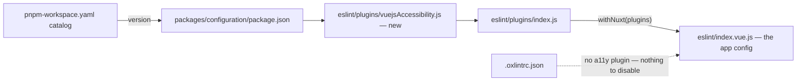

# Accessibility Linting

Put a static floor under template accessibility so obvious markup mistakes stop reaching review, and be clear that a floor is all it is.

## Scope

**Today:** accessibility in this repo is incidental rather than systematic. Across several hundred single-file components, only a handful carry any `aria-` attribute at all. Two widgets are deliberately accessible:

- The **resource search combobox** is the one fully specified widget — `app/components/Resource/Search/Menu.vue` sets `role="combobox"` with `aria-activedescendant`, `aria-controls`, `aria-expanded` and `aria-autocomplete`, `app/components/Resource/Search/ResultList.vue` renders `role="option"` rows, and `app/services/resource/search/getResourceSearchOptionId.ts` mints the stable option ids that make `aria-activedescendant` point at something real.
- `app/components/Styled/ResizeHandle.vue` is the most complete other widget-role usage, with `role="separator"`, `aria-orientation`, and the `aria-valuemin`/`aria-valuemax`/`aria-valuenow` triple.

Beyond those, a few scattered `aria-label`s on icon buttons and navigation landmarks. The document declares its language (`htmlAttrs: { lang: "en" }` in `configuration/app.ts`) and that is the extent of the global provision.

**There is no accessibility lint rule anywhere.** `.oxlintrc.json` enables no a11y category and its `plugins` list is `import`, `oxc`, `typescript`, `unicorn`, `vitest`, `vue` — no jsx-a11y or Vue equivalent. `eslint-plugin-vuejs-accessibility` is not a dependency of `packages/configuration` at all. There is no focus-trap library, no skip links, and no `prefers-reduced-motion` handling in any stylesheet the app ships.

**This adds** one dev dependency — `eslint-plugin-vuejs-accessibility`, open source, no runtime code and no external service — enabled one rule at a time.

## Where it plugs in

The composition is already in place and needs no restructuring. `packages/configuration/eslint/plugins/index.js` composes the per-plugin modules, and `packages/configuration/eslint/index.vue.js` feeds that whole set into `withNuxt(plugins)`. Adding a rule set means one new sibling module written like `plugins/pinia.js` and `plugins/unocss.js` — spread the plugin's flat config, then override individual rules — plus one entry in the `defineConfig(...)` call. The dependency version goes in the workspace catalog and is referenced as `catalog:`, like every other entry in `packages/configuration/package.json`.

**This stays an ESLint-side rule set.** Oxlint has no accessibility plugin, so there is nothing to migrate to it and nothing for `eslint-plugin-oxlint` to switch off — unlike a rule oxlint owns, an a11y rule configured in ESLint actually runs. Two consequences follow from how lint is wired here: these rules execute in the per-package ESLint scripts and the root CI pass, not in the repo-wide oxlint pass, and they will not appear in `pnpm lint:fix:packages` output for app changes because that path skips `packages/app`.

Critically, **nothing here is type-aware.** The plugin reads the SFC template AST and nothing else, so it needs no `parserOptions.projectService` and does not reintroduce the cost that got `neverthrow/must-use-result` deleted rather than migrated (see [ESLint → oxlint migration](/docs/proposals/refactors/eslint-to-oxlint-migration)). If a rule in this set ever turns out to need type information, that rule is dropped — it is not a reason to turn the project service on.

## Staged rollout

Enabling the plugin's recommended config in one commit produces an unfixable wall: a rule set with real coverage meeting several hundred never-linted templates yields more findings than one change can honestly fix, and the reflex is then to downgrade everything to `warn`, which is the same as not adopting it. Instead:

1. **Measure per rule first.** Run the full rule set in a scratch config and tally findings by rule id. Nothing is committed at this stage — the output is the adoption order.
2. **Land the plugin with only the zero-violation rules on.** Rules the repo already satisfies cost nothing, fix nothing, and are pure ratchet: they make the current state the floor and fail the next PR that drops below it. This is the commit that actually adopts the plugin.
3. **Turn on the remaining rules one at a time**, each with its fixes in the same commit, smallest violation count first. Every step stays green, every step is reviewable, and a rule whose fixes turn out to be wrong can be reverted alone.
4. **A rule that cannot be satisfied gets turned off with a reason**, in the plugin module next to it — not left failing and not globally downgraded. Vuetify is the likely source of these: most interactive markup in this app is `v-btn`, `v-text-field`, `v-list-item` rather than raw HTML elements, and rules that match on element names see a component tag and either skip it or misjudge it. Expect a meaningful share of the app's interactive surface to be invisible to this plugin for that reason, and expect at least one rule to produce findings that are wrong rather than merely inconvenient.

## What this actually buys

A lint plugin checks markup shape. It catches an image with no `alt`, a click handler on a non-interactive element with no keyboard equivalent, a `role` missing the ARIA attributes that role requires, a form control with no accessible label, an `aria-*` attribute that is misspelled or invalid for its element. That is a genuine floor — those mistakes are cheap to make and currently nothing stops them.

It does **not** make the app accessible, and adopting it must not be reported as having done so. It cannot evaluate colour contrast, focus order, focus trapping in dialogs and menus, whether a live region announces at the right moment, whether keyboard navigation through the message list or the resource grid is actually usable, or whether an `aria-label` says anything meaningful — a label of `"button"` passes every rule in the set. The combobox above is accessible because someone reasoned about the combobox pattern, and no rule would have produced it.

## Out of scope

Named explicitly so they are not assumed to come along: focus trapping in dialogs, skip links, `prefers-reduced-motion` handling, contrast auditing, and manual screen-reader testing. Each is real work with its own design, and each stays undone after this refactor lands.

## Key files

| File                                             | Change                                                                             |
| :----------------------------------------------- | :--------------------------------------------------------------------------------- |
| `pnpm-workspace.yaml`                            | Catalog entry for `eslint-plugin-vuejs-accessibility`                              |
| `packages/configuration/package.json`            | `catalog:` dev dependency                                                          |
| `packages/configuration/eslint/plugins/index.js` | Register the new plugin module in the `defineConfig` composition                   |
| `packages/configuration/eslint/index.vue.js`     | No change — it already feeds the whole plugin set into `withNuxt`                  |
| `.oxlintrc.json`                                 | No change — oxlint has no a11y plugin, so there is nothing to configure or disable |

## Notes

Rule flips after adoption follow the normal lint conventions: never hand-fix what `lint:fix` can fix, and any deliberate exception is an `eslint-disable` naming the rule the ESLint way, with a stated reason (the `oxlint` skill owns which directive applies where).
