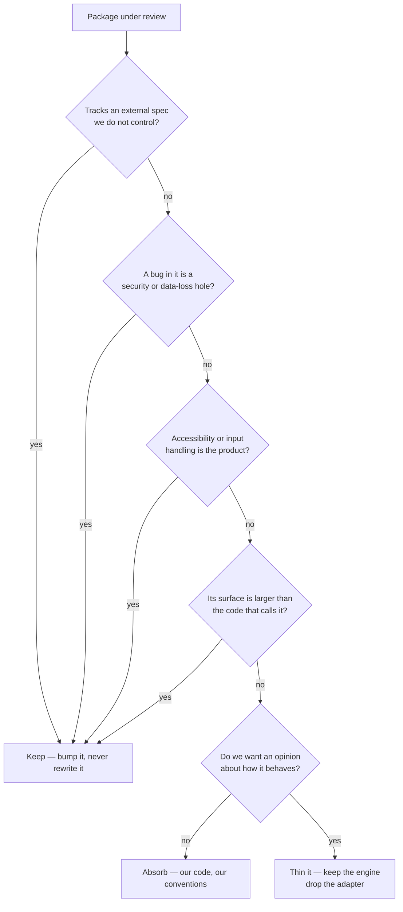
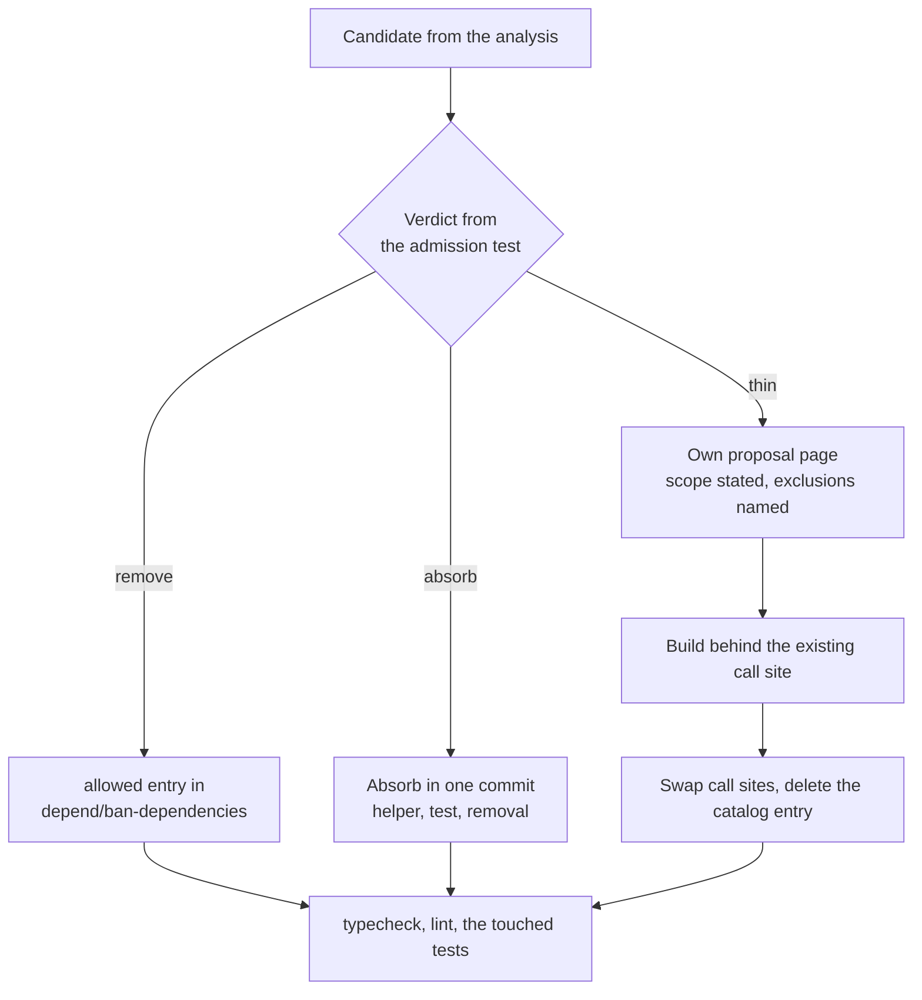

# Dependency Reduction

Every version in the workspace lives in one place — the `catalog` block of `pnpm-workspace.yaml`, with `catalogMode: strict` so no package may pin its own. That single file makes the whole dependency surface readable in one sitting, which is what makes an initiative like this possible at all: the question "what are we paying for" has one answer, not fourteen.

This page owns the **rule** for what a third-party package must earn, and the **gap analysis** that applies it once. It is deliberately not a list of rewrites. Most of the catalog passes the test, several entries that look absorbable are the ones we most want to keep, and the honest output of the analysis is a short backlog rather than a long one. When an entry on that backlog is big enough to need a design, it graduates to its own proposal page and is linked from here — this page never grows into the spec.

## What actually costs us

The instinct is that dependencies cost bytes. They mostly do not — the bundler drops what nothing imports, and the packages that dominate installed size are the engines we would never write: the game engine, the PDF renderer, the diagram renderer, the survey builder. Weight is a symptom worth reading, not the charge.

Three costs are real:

- **A behaviour we cannot change.** A library that owns DOM, keyboard handling and CSS decides the product's interaction model. When our answer to "make it behave the way the reference product does" is "the library doesn't do that", the library has taken a product decision away from us. This is the cost that matters, and it is the one the emoji work removed.
- **A version we do not control.** A wrapper is pinned behind the thing it wraps, so every upgrade of the underlying library waits for a maintainer who is not us. The PDF component is what that looks like when we refuse to wait: both of its wrappers declare a renderer major below the one we install, and an `overrides` entry forces them onto ours. It works, but nothing except our own reading verifies that it does, and each renderer bump is us accepting two libraries' compatibility testing as our own. Two of the page-builder plugins arrive at the same cost from the other direction, imported through `@ts-expect-error no d.ts file`.
- **A second way to do something we already do.** Three PDF packages render pages in one component. Two of them exist because neither did the whole job, so a reader has to learn which one answers a question — and the fuller of the two brings its own headless component library and a crypto package to do it.

Bytes, imports and call sites are the evidence; those three are the charge. A package that is large, old and imported once but costs us none of the three stays.

## The admission test

The same gate decides a package we are considering adding and a package already in the catalog. It is a chain of refusals — a package is absorbed only when it survives every one of them, which is rare by design.

The last branch is what carries the initiative. A package we have no opinion about is absorbed because it is small and we would rather own the twenty lines than the version range. A package we _do_ have an opinion about is not deleted — its engine is kept and the layer that decided the behaviour is replaced by ours. Those are different jobs with different risks, and conflating them is how a dependency cut turns into a rewrite.

## The precedent

The emoji picker is the shape every absorption on this page should take. What was removed was a package that owned the dataset, the search behaviour and the failure mode all at once, and threw on a query made of punctuation. What replaced it was not a rewrite of any of that. Two data packages generated from the Unicode spec were kept, a general-purpose search engine was kept, and what we wrote was the part that was always ours: which fields are boosted, that an exact shortcode outranks a longer match, that a room's own emoji lead the results, and that a query matching nothing renders the empty state.

The rule that generalises: **keep the data and the hard algorithm, take back the layer that decided behaviour.** Absorbing the dataset would have meant tracking Unicode releases forever, and absorbing the ranking would have meant writing BM25. Neither was the reason the picker was wrong.

## The stop list

Four kinds of package are never absorbed, whatever their size or call-site count. These exist so the initiative cannot talk itself into the expensive mistake later:

- **Spec-tracking.** Anything whose correctness is defined by a document that changes without us — PDF, OOXML, Unicode, XML, SQL dialects, the cloud REST surfaces. Absorbing one converts a version bump into a standing obligation.
- **Security-shaped.** Anything where a bug is a hole rather than a glitch — HTML sanitisation, auth, push encryption, rate limiting, the cloud SDKs. A hand-rolled version is not smaller, it is unaudited.
- **Accessibility-shaped.** Anything whose real surface is focus management, ARIA and keyboard semantics — the component framework, the rich text and code editors. Our own version reliably ships worse here, because the part we would reimplement is the part we would not think to test.
- **Engines.** Anything implementing a large algorithm as its product — the game, 3D, diagram, page-builder and survey runtimes. The plugins around an engine are a separate question from the engine.

## Gap analysis

Applying the gate across the catalog. Only entries with a verdict worth recording appear — everything absent from these tables passed the gate as an ordinary keep, and `pnpm-workspace.yaml` is the list.

### Remove — nothing to design

| Entry               | Finding                                                                                                                                                                                                                                                                               |
| ------------------- | ------------------------------------------------------------------------------------------------------------------------------------------------------------------------------------------------------------------------------------------------------------------------------------- |
| `temporal-polyfill` | A production dependency of the app with no import anywhere in the workspace                                                                                                                                                                                                           |
| `mjml-browser`      | Declared directly but never imported — it is the email editor plugin's own dependency, and the direct entry only forces a major above the range that plugin asks for. Either the pin is deliberate and belongs beside the others in the workspace `overrides` block, or it is residue |
| `sql-highlight`     | A production dependency used only by the development query logger — the entry is in the wrong section rather than wrong to exist                                                                                                                                                      |

### Absorb — small, bounded, no spec

Each is a single behaviour we would write once into `@esposter/shared` and stop tracking. None is worth a proposal page.

| Entry             | Call sites | What replaces it                                                                                                             |
| ----------------- | ---------- | ---------------------------------------------------------------------------------------------------------------------------- |
| `lodash-omitdeep` | one        | A recursive omit over the clicker snapshot, which is the only shape it is ever given                                         |
| `pathe/utils`     | one        | The `filename` helper alone — a basename without its extension                                                               |
| `dedent`          | a handful  | A template tag stripping the common indent, used by two request bodies and the query logger                                  |
| `p-progress`      | one        | The block-upload aggregate, which our own conventions want expressed as a `Result` chain rather than as a subclassed promise |

### Thin — keep the engine, drop the adapter

The wrapper here is a component file we could write, and its cost is the version lock rather than the styling. Ordered by what the thinning buys.

| Cluster              | Finding                                                                                                                                                                                                                                                                                                                                                                                                   |
| -------------------- | --------------------------------------------------------------------------------------------------------------------------------------------------------------------------------------------------------------------------------------------------------------------------------------------------------------------------------------------------------------------------------------------------------- |
| PDF rendering        | Three packages serve one component — a thumbnail embed, a full viewer, and the renderer both are built on, which we ship regardless. One renderer copy is installed, because an `overrides` entry forces both wrappers onto a major above what either declares. The renderer is a permanent keep; the two adapters are a page canvas and a dialog shell, and removing them retires the override with them |
| Media viewing        | An image lightbox and its Vue adapter, reached through one call that hands it a list and an index. The library is images-only, which is the actual gap — a video attachment opens in nothing                                                                                                                                                                                                              |
| 3D visual            | A declarative renderer, its helper library and its Nuxt module serve two decorative components, on top of the 3D engine already shipped for the globe                                                                                                                                                                                                                                                     |
| Charts               | The chart wrapper is a thin component over the chart engine, and our own component already sits in front of it                                                                                                                                                                                                                                                                                            |
| Page-builder plugins | Around a dozen single-purpose plugins around the page builder, several unmaintained and two imported through `@ts-expect-error`. The large ones — the webpage preset, the image editor, the exporter — are engines; the small ones register a block and a trait                                                                                                                                           |

### Keep — the ones that look absorbable and are not

Recording these matters as much as the backlog, because each is a candidate someone will re-propose:

- **The deep-equality helper**, used across many components. It is a few dozen lines that already handle the cases a hand-rolled version forgets, and rewriting it buys nothing but the chance to get `NaN` wrong.
- **The default-merge helper**, used by every chart resolver. The framework already depends on it, so keeping it costs nothing and replacing it is pure risk.
- **The worker-backed timers**, behind the recording indicator and the interval composable. Their whole value is surviving background-tab throttling, and the failure mode of a naive replacement is silent drift that no test notices.
- **The file-picker ponyfill**, behind import, export and attachment selection. Its value is the fallback path for browsers without the File System Access API, which is exactly the part a replacement would skip.
- **The spreadsheet reader and writer.** Two packages for one feature reads like duplication, but the format is a specification and this is the stop list's first rule.

## Backlog

Ranked by what each buys, not by size. The first two need no design and should not wait for the rest.

1. **Drain the removals.** Delete the unimported entry, resolve the pin, and move the logger's highlighter to development dependencies. One commit, no behaviour change.
2. **Absorb the four utilities.** One commit per helper into `@esposter/shared`, each landing with the test that pins the behaviour its call site depends on.
3. **Own the media viewer.** The strongest item, because it is a feature gap rather than a cleanup: one lightbox carrying images and video, keyboard and gesture navigation, a caption from the filename, and download — the behaviour the reference products have and the current library structurally cannot grow. Graduates to its own proposal page before any code.
4. **Consolidate PDF onto the renderer.** Removes two adapters, the question of which one answers what, and the override holding both above the major they declare. The scope has to be stated before it starts: a page canvas with navigation and zoom is bounded, and the text layer, annotations and in-document search are where it stops being bounded. Own proposal page.
5. **Question the 3D visual, then decide its dependencies.** Whether two decorative components earn a declarative renderer is a product question, and the dependency answer follows it rather than leading it. No work until that is answered.
6. **Prune the page-builder plugin belt.** Absorb the block-registering plugins that are unmaintained or untyped, keep the engines. Lowest value per unit of effort, so it goes last.

The chart wrapper is deliberately absent. It is the cheapest item in the analysis and it buys the least, which makes it something to fold into whichever change next touches that component rather than a task of its own.

## Executing an absorption

The pipeline below is what every backlog item runs through, and the gate in the middle is the point of it: most items never reach a proposal, and one that does is a case where behaviour is being _designed_ rather than merely relocated.

Two rules bind the whole pipeline. **The catalog entry is deleted in the same commit that removes its last import** — a dependency kept "until we are sure" is a dependency nobody removes, and the lockfile is the record of what we actually stopped paying for. And **a thinning is built behind the call site it will replace**, so the swap is one import change and the revert is one import change. A rewrite landing as a big-bang replacement of a working feature is how this initiative would earn a bad reputation.

## Handing the standing part to the enforcer

The recurring half of this work is already automated and should stay that way. `depend/ban-dependencies` runs over every `package.json` in the repo and fails lint on a dependency with a native or simpler replacement, with an explicit `allowed` list for the ones we have decided to keep anyway. That is the mechanism that stops the catalog re-growing, and it is why this page is a one-time analysis rather than a standing sweep.

So the follow-through from any decision here is an `allowed` entry carrying the reason, or nothing at all. A package we consciously keep against the enforcer's advice belongs on that list; a package we absorb disappears from it. Neither is a docs edit.

## Key files

| File                                              | Role                                                                      |
| ------------------------------------------------- | ------------------------------------------------------------------------- |
| `pnpm-workspace.yaml`                             | The catalog — every version in the workspace, under `catalogMode: strict` |
| `packages/configuration/eslint/plugins/depend.js` | `depend/ban-dependencies` and its `allowed` escape hatch                  |
| `packages/shared/src`                             | Where an absorbed utility lands                                           |
| `packages/app/app/services/message/emoji`         | The precedent — data and search engine kept, behaviour taken back         |
