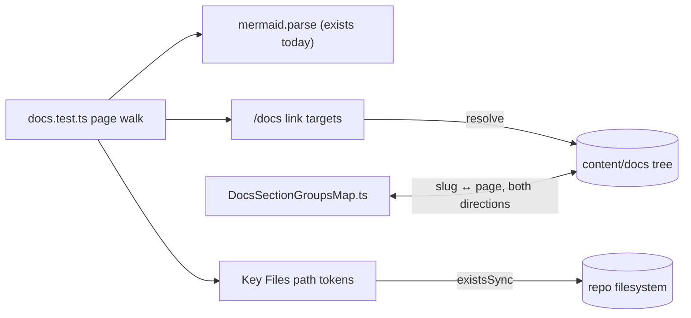

# Docs Consistency Tests

A 2026-07-19 manual audit of `packages/app/content/docs/` found eight broken `/docs/` links (proposals promoted to feature pages without sweeping their inbound links) and three shipped resource types missing from the architecture pages. Every one of these defect classes is mechanically detectable. The docs tree already has an enforcer seam — `packages/app/content/docs.test.ts` parse-validates every Mermaid block — so the fix is to widen that test, not to schedule more audits.

## What works today

`docs.test.ts` walks every `.md` page under `content/docs/` and runs `mermaid.parse` on each ` ```mermaid ` block, so a diagram syntax error fails `pnpm test`. Nothing validates links, page registration, or file-path claims — those rot silently until a human notices.

## What this adds

Three new checks in the same test file, over the same page walk:

1. **Internal link validation.** Collect every markdown link target starting with `/docs/` (including those inside tables). Resolve each to a content file: `/docs/a/b` → `content/docs/a/b.md` or `content/docs/a/b/index.md`. Assert the file exists. Maintain a small explicit allowlist for targets that are real routes but not content pages (today only `/docs/api/`, the generated TypeDoc output).
2. **Section-map registration.** For every slug in `DocsSectionGroupsMap.ts`, assert a matching page exists. Inversely, for each mapped section (architecture, esbabbler, platform, virrun), assert every top-level feature page's slug appears in the map — `roadmap`/`deferred`/`rejected` and nested sub-pages (owned by their own `index.md`) are exempt, matching the sidebar's automatic Planning grouping.
3. **Key Files path validation.** In any table whose header contains `File`, extract backticked cell tokens that look like repo paths (start with `packages/` or a known app-relative prefix like `app/`, `server/`, `shared/`) and assert they exist relative to the repo root (app-relative prefixes resolve against `packages/app/`). Tokens naming generated artifacts stay out of scope by construction — the check only runs on paths under version control prefixes.



## Failure semantics

Each check reports the offending page, the line's text, and the missing target in the assertion message, so a red CI run names the exact edit. False positives are handled by narrowing the extraction pattern or the allowlist in the same PR that hits them — never by weakening a check to a warning.

## Key files

| File                                                     | Role                                                   |
| -------------------------------------------------------- | ------------------------------------------------------ |
| `packages/app/content/docs.test.ts`                      | the existing mermaid gate — all three checks land here |
| `packages/app/app/services/docs/DocsSectionGroupsMap.ts` | sidebar registration map validated in both directions  |

## Notes

- Scope is deliberately structural: no prose claims, no enum-value cross-checks — those still need human review (this proposal exists because Note/Program/Blueprint drifted out of three architecture pages; the structural checks catch the link/registration half of that class).
- Cheapest viable infrastructure: zero new dependencies — `fs` walks and regex extraction inside the existing Vitest file.
