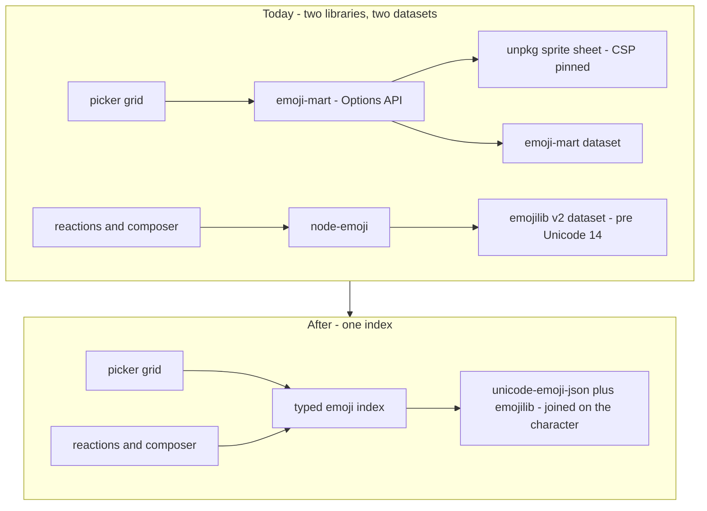

# Emoji Picker Rewrite

Emoji reach the app through two independent libraries that agree on nothing. `emoji-mart-vue-fast` draws the picker grid; `node-emoji` resolves the `:shortcode:` a reaction is stored as and backs the composer's `:` suggestions. Each carries its own dataset, its own vocabulary of shortcodes and its own search implementation, and both implementations are worse than what they replace.

Nothing here is ported. Both libraries are retired for a single typed index and a picker built from the repo's own primitives. This page is the investigation and the plan; nothing is built yet.

## Why neither library survives

**`emoji-mart-vue-fast` costs us the Options API runtime.** `compatibilityVersion: 5` defaults `vue.optionsApi` off, which drops `applyOptions` from the client build. Its `Picker.vue` is Options API, so without the flag it mounts with an empty `$data` and dies reading `allCategories` off `undefined` — upstream's #250, open since 2022. `configuration/vue.ts` turns the runtime back on for that one component. Nothing else needs it: no component here uses `export default {}`, and the other dependencies that ship Vue components are composition-API throughout (`survey-vue3-ui` has no `methods:` or `data()` at all).

**Its search is quadratic and leaks.** Each character typed walks a trie built lazily over the whole emoji set; at every new prefix it scans every candidate's comma-joined keyword blob with `indexOf`, and it caches the result array _and_ a copy of the surviving emoji map at that trie node forever — nothing evicts it, so memory grows with the set of distinct prefixes a session has ever typed. Multi-word queries then go through an `intersect` built on `uniq` + `indexOf`, which is quadratic in the result size. Ranking is `indexOf`'s byte offset into the keyword blob, so relevance is an artifact of keyword ordering rather than a score. Queries past two words are silently dropped.

**It renders emoji the rest of the app does not.** It defaults to `set: "apple"`, so `emoji-mart.css` pulls an Apple sprite sheet off `unpkg.com`, pinned by exact URL in `ImageSourceWhitelist` so the CSP permits it. Reactions and inserted emoji render native unicode. The grid is therefore drawn in a different typeface than what the user actually gets, and the app carries a third-party CDN in its image CSP to keep that mismatch running.

**It has no dark mode and never will.** A few hundred lines of hardcoded light-mode hex — panel, borders, anchor bar, preview strip, skin swatches — with no dark variant and no `prefers-color-scheme` block. Upstream's #126, open since 2021. Its types are stubbed behind `@ts-expect-error` against #121, open since the same year.

**`node-emoji` is smaller but not better.** Three defects, all reproducible against the version in the lockfile:

- **`search` ignores keywords.** Its data layer keeps only `name → char`, discarding the keywords its own `emojilib` dependency ships. `search("happy")` returns nothing, though 😀 lists `happy` as a keyword.
- **`search` compiles user input as a regex.** It is `name.match(keyword)` with a string argument, so the composer's `:` suggestion path throws `SyntaxError: Invalid regular expression` the moment a query contains an unbalanced `(` or `[`.
- **Its dataset predates Unicode 14.** `emojilib@2` covers fewer emoji than the picker offers, so anything newer round-trips as a raw character instead of a shortcode: 🫠, 🫶, 🥹 and 🩷 are all stored as the literal glyph while 😄 is stored as `:smile:`. The round trip only appears to work because both directions fall back to their input, which leaves `emojiTag` holding a mixed vocabulary.



## How Discord does it, and what we take

Discord is the parity default for this module (`esbabbler` skill), and its picker is the shape worth copying:

- **Unicode CLDR groups as categories**, in canonical order, with Frequently Used pinned first.
- **Search over names and keywords**, not names alone — and matched against the same `:shortcode:` vocabulary the composer autocompletes, so the two surfaces cannot disagree.
- **One skin tone chosen globally** and persisted, applied to every emoji that supports it, rather than a per-emoji long-press.
- **`:shortcode:` autocomplete inline in the composer**, sharing the picker's index.

We diverge on rendering. Discord ships its own image set for cross-platform consistency, which is exactly the CDN-and-CSP cost we are removing, and every other emoji surface here already renders native. Native it is.

We also diverge from [`emoji-picker-element`](https://github.com/nolanlawson/emoji-picker-element), the reference implementation for a modern picker, on storage. It keeps its dataset in IndexedDB because a general-purpose element must survive being mounted on page load with a multi-hundred-kilobyte dataset in memory. Ours sits behind a `v-menu`, so a dynamic import on first open buys the same thing for none of the machinery. We take its other two lessons: render native, and detect unsupported glyphs rather than showing empty boxes.

## The dataset

`unicode-emoji-json` and `emojilib` are both keyed by the emoji character and cover the same set at the same Unicode version, so they join with no glue and no reconciliation:

| Source               | Gives                                                      | Cost      |
| -------------------- | ---------------------------------------------------------- | --------- |
| `unicode-emoji-json` | name, slug, CLDR group, canonical order, skin-tone support | under 1MB |
| `emojilib`           | keywords per character, slug first                         | tiny      |

Together that is every field the picker, the reactions and the composer need. `emojibase-data` is the richer alternative — tags, subgroups, full skin records, and shortcode presets for several vocabularies — but it unpacks to tens of megabytes because it ships every locale, and we would import one file from it. Reconsider only if localisation lands.

Shortcode vocabulary changes as a result, and that is safe here: nothing is in production and the repo takes no legacy-data migrations, so `emojiTag` simply starts out consistent instead of being made consistent.

## The index

One module, built once, lazily, on first picker open or first suggestion query. Everything below is measured against a set of roughly two thousand emoji and under ten thousand distinct keyword tokens.

| Structure                     | Purpose                                     | Build        | Query                   |
| ----------------------------- | ------------------------------------------- | ------------ | ----------------------- |
| flat array in canonical order | the grid, and a stable tiebreak for ranking | linear, once | index access            |
| `Map<char, Emoji>`            | native → shortcode, for storing a reaction  | linear, once | constant                |
| `Map<slug, Emoji>`            | shortcode → native, for rendering one       | linear, once | constant                |
| sorted token array + postings | prefix search                               | linear, once | binary search + matches |

Search resolves a prefix by binary-searching the sorted token array for the range of tokens sharing it, then unioning those tokens' postings — logarithmic in the token count plus linear in what actually matched, rather than a scan of every emoji per keystroke. Multi-word queries intersect via a `Set` keyed on emoji index, walking the smaller side, so two words cost their sum rather than their product. Ranking is an explicit score — exact slug, then slug prefix, then keyword prefix, tiebroken by canonical order — and sorts only the matched set, which is capped before display.

That is strictly better than both incumbents on every axis that matters, and it is small enough to read in one sitting. The build is the only linear pass and it happens once, off the interaction path.

### Building it

Both datasets are keyed by the emoji character, so the build is one pass over the canonical order list, reading `data-by-emoji` for metadata and `emojilib` for keywords, and pushing into the four structures at once. `Emoji` carries the character, slug, name, group and skin-tone flag; keywords are only ever needed through the postings map, so they are not kept on the record.

Tokens are the slug split on `_` plus each keyword split on whitespace, lowercased and deduped per emoji. Postings hold the emoji's index in the flat array — a number, not a reference — so the postings map stays small and set operations compare integers.

The sorted token array is built once by sorting the postings map's keys. Prefix lookup is a pair of binary searches for the first token `>= prefix` and the first token `> prefix + "￿"`; every token between them shares the prefix, and their postings union to the candidate set.

### Skin tones

`unicode-emoji-json` marks which emoji support a tone but does not ship the toned variants, so they are synthesised. **The modifier goes after the first code point, not at the end** — appending naively produces `🧑‍💻🏻` where the correct form is `🧑🏽‍💻`, because the tone belongs to the person, not the laptop. The rule that holds for every case checked, including multi-component ZWJ sequences, is: take the first code point, append the tone, then re-append the rest with variation selectors dropped. Stripping the tone again is a filter for the modifier range, which round-trips exactly.

The one accepted limitation: Unicode allows a _different_ tone per person in sequences like 🧑‍🤝‍🧑, and a single global tone setting only tones the first. Discord behaves the same way.

## The picker

`StyledEmojiPicker` keeps its props and its `select` event, so no consumer changes. Inside it becomes a `<script setup>` component built from the repo's own primitives: a `v-text-field` for search, a slide group for the category anchors, a plain grid of buttons, all coloured by theme tokens so both themes come free.

**One category renders at a time, and there is no virtualisation.** The largest CLDR group is under four hundred emoji, which a grid of buttons handles without help; the repo has no virtual-scroll primitive in use, and introducing one to avoid a cost that does not exist would be the opposite of lean. Discord scrolls continuously across all categories, which does need virtualisation — that is a deliberate deferral, revisited only if the tabbed form is missed.

**Search does not go through `useAutoSearch`.** That ban is about hand-rolling debounce, abort and loading state around a `$trpc` query; this search is synchronous and in-memory, so it is a `computed` over the query ref and nothing else. Results replace the grid while the query is non-empty, capped before display.

Recents and the chosen skin tone live in a Pinia store, persisted through the `LocalStorageKey` registry rather than the dependency's own `emoji-mart.*` namespace. That is what makes the recents category update live — upstream's #289 is a module-level singleton the UI never re-reads. Several other upstream bugs stop existing rather than getting fixed: there is no scroll maths against a `$refs` array to get wrong (#305), category selection is store state instead of a `v-show` expression that also has to know whether a search is running (#136), and the dataset is read rather than mutated in place (#140).

### Files

Everything is client-side. The server stores `emojiTag` as a bare string with no vocabulary validation, so nothing here belongs in `shared/`.

```text
app/models/message/emoji/
  Emoji.ts                the record - character, slug, name, group, skin-tone support
  EmojiGroup.ts           the nine CLDR groups as an enum, declaration order being display order
app/services/message/emoji/
  getEmojiIndex.ts        the lazily built index - the four structures and the prefix search
  applySkinTone.ts        tone synthesis and stripping
  constants.ts            result caps, the tone modifier range, recents length
app/store/message/
  emojiPicker.ts          recents, chosen tone, active group
app/components/Styled/
  EmojiPicker.vue         unchanged props and select event, new internals
  EmojiPicker/Grid.vue    the emoji grid
  EmojiPicker/Tabs.vue    the category anchors
```

### The four node-emoji call sites

All of them collapse into map lookups, which is why the library earns nothing once the index exists:

| Today                                      | Becomes                                                     |
| ------------------------------------------ | ----------------------------------------------------------- |
| `emojify(emojiTag)` in `EmojiListItem.vue` | `BySlug.get(slug)?.character`                               |
| `unemojify(emoji)` in `useSelectEmoji.ts`  | `ByCharacter.get(stripped)?.slug`                           |
| `search(query)` in `EmojiSuggestion.ts`    | the index's prefix search, capped, mapped to `EmojiItem`    |
| `unemojify` in `EmojiDescriptionMap.ts`    | the same reverse lookup, still resolved once at module load |

`EmojiDescriptionMap` is the easy one to miss — it resolves tooltip text for the fixed quick-reaction lists (🤣 👍 ❤️ 👌) at module load, so it is a fourth consumer that has to move before the dependency can go. Note that its members carry variation selectors (❤️), which the reverse lookup must normalise away, exactly as `node-emoji` does today.

`Intl.Segmenter` replaces the `char-regex` grapheme splitting only if a future caller needs to walk a mixed string; the two call sites we have are each handed exactly one emoji, so they need a lookup and not a parser.

## Tests

The index is the part worth testing, and it is testable without the Nuxt runtime — plain `node` environment, no `mountSuspended`:

- **Round trip.** Every emoji in the dataset maps character → slug → character unchanged. This is the assertion that would have caught today's mixed vocabulary, where 🫠 stores as a raw glyph and 😄 stores as `:smile:`.
- **Ranking, against a fixed query set.** `"smile"` puts the exact slug first; `"happy"` finds 😀 through its keywords, which is the query `node-emoji` returns nothing for; `"grin f"` intersects rather than unions; a query with `(` or `[` returns results instead of throwing.
- **Tone synthesis.** The ZWJ cases explicitly — `🧑‍💻` at each tone, and stripping back to the base — since that is where the naive implementation is wrong.
- **Caps.** A one-character query returns no more than the display cap.

No test asserts the dataset's contents beyond what the code derives; the count of emoji in a category is the dataset's business, not ours.

## Feasibility

High, and higher than a port would be. Our contract with the picker is one prop in and one unicode string out — every other prop the dependency exposes sits at its default — so there is no compatibility surface to preserve. The index is a few small structures over a dataset that already carries every field we need. The judgement call is search relevance, which is why the index is built and tested against a fixed query set before any UI exists.

## Phases

1. **Index.** `Emoji`, `EmojiGroup`, `getEmojiIndex`, `applySkinTone`, and the tests above. Adds `unicode-emoji-json` and `emojilib` to the catalog. No UI, no consumer touched.
2. **Picker.** `StyledEmojiPicker`'s internals plus its grid and tabs children and the `emojiPicker` store, against that index. Existing props and `select` event unchanged, so no consumer changes here either. `emoji-mart-vue-fast` stops being imported at the end of this phase.
3. **Reactions and composer.** Move all four `node-emoji` call sites onto the index — `emojify`, `unemojify`, `EmojiDescriptionMap` and `EmojiSuggestion` — keeping `EmojiItem` as the suggestion contract so `Suggestion/EmojiList.vue` is untouched.
4. **Delete**, and only delete:
   - `emoji-mart-vue-fast` and `node-emoji` from `package.json` and the catalog
   - `app/services/message/emoji/emojiIndex.ts`, `emojify.ts`, `unemojify.ts`
   - the pinned `unpkg` sprite-sheet URL in `ImageSourceWhitelist`
   - both `@ts-expect-error` comments and the upstream issue links they cite
   - `configuration/vue.ts` and its line in `nuxt.config.ts`

   Then confirm `optionsApi` off by exercising the surfaces that mount third-party Vue components — survey, the date picker, GrapesJS, the Phaser wrapper. The check is worth doing explicitly: a missing Options API runtime fails at render with a property read off `undefined` and nothing thrown earlier to point at the cause, which is exactly how the emoji picker's failure presented.

Each phase is separately reviewable; the last only deletes.

## Upstream issues this closes for us

None of these is waiting on something we could contribute upstream faster than replacing the component.

| Issue | Subject                                | How the rewrite answers it                        |
| ----- | -------------------------------------- | ------------------------------------------------- |
| #250  | `reading 'allCategories'` on mount     | No Options API component, so no `optionsApi` flag |
| #126  | Dark theme support                     | Vuetify theme tokens, both themes                 |
| #121  | TypeScript support                     | Written in TypeScript                             |
| #95   | Bundle size                            | One dataset, lazily loaded behind the menu        |
| #289  | Recents do not update live             | Pinia store instead of a module singleton         |
| #305  | Null `scrollTop` during scroll         | No scroll maths — one category rendered at a time |
| #136  | Cannot switch category while searching | Category selection is store state                 |
| #140  | Frozen dataset module mutated          | The dataset is read, never written back           |
| #258  | Accessibility quirks                   | Vuetify primitives plus the staged a11y rules     |

Sprite-rendering issues (#262, #119, #78, #72, #71) go with the sprite sheet.

## Key files

| File                                                             | Role                                                            |
| ---------------------------------------------------------------- | --------------------------------------------------------------- |
| `packages/app/app/components/Styled/EmojiPicker.vue`             | The wrapper being rewritten — its props and `select` event stay |
| `packages/app/app/services/message/emoji/emojiIndex.ts`          | Module-scope `EmojiIndex` singleton, replaced by the new index  |
| `packages/app/app/services/message/emoji/emojify.ts`             | `node-emoji` shortcode lookup used by reactions                 |
| `packages/app/app/services/message/emoji/unemojify.ts`           | `node-emoji` reverse lookup used when a reaction is stored      |
| `packages/app/app/services/message/emoji/EmojiSuggestion.ts`     | `node-emoji` search behind the composer's `:` trigger           |
| `packages/app/app/services/message/emoji/EmojiDescriptionMap.ts` | Fourth `node-emoji` consumer — quick-reaction tooltip text      |
| `packages/app/app/composables/message/emoji/useSelectEmoji.ts`   | Turns a picked emoji into the stored `emojiTag`                 |
| `packages/app/app/services/shared/LocalStorageKey.ts`            | Gains the recents and skin-tone keys                            |
| `packages/app/configuration/vue.ts`                              | `optionsApi: true`, deleted in the last phase                   |
| `packages/app/shared/services/app/ImageSourceWhitelist.ts`       | Holds the pinned `unpkg` sprite-sheet URL                       |

## Open questions

- Unsupported-glyph detection: worth doing at build time, at runtime by measurement, or not at all until someone reports empty boxes?
- Custom emoji are not supported today and the rewrite makes them possible — in scope for esbabbler, or deliberately not?
- Does the composer's `:` list want the same ranking as the picker, or does an autocomplete want slug matches only?
