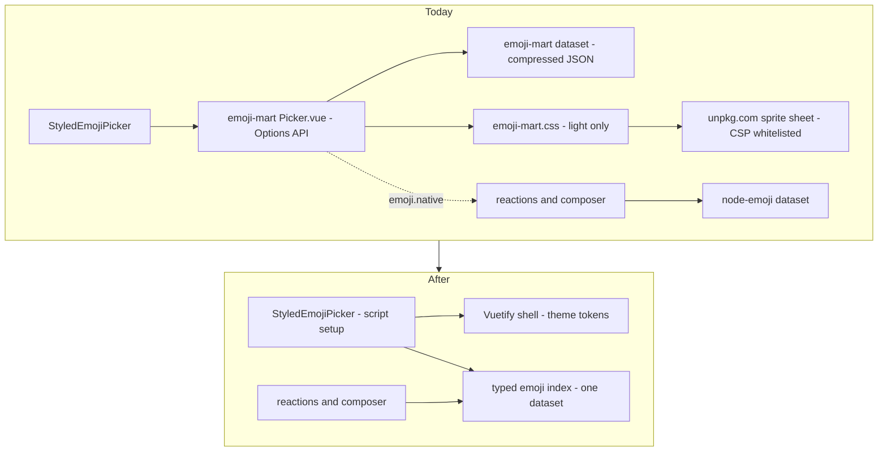

# Emoji Picker Rewrite

`StyledEmojiPicker` wraps `emoji-mart-vue-fast`'s `Picker.vue`, and it is the only third-party Vue component in the repo imported as raw source rather than a built bundle. Everything downstream of that one import is a compromise: the Options API runtime stays compiled into the client for it alone, its types are stubbed with `@ts-expect-error`, its stylesheet has no dark mode, and it pulls a sprite sheet off `unpkg.com` at runtime that the app has to whitelist in its CSP.

Rewriting it in the repo's own idiom removes all four at once. This page is the investigation and the plan; nothing here is built yet.

## Why it is worth doing

**The Options API runtime is compiled in for one component.** `compatibilityVersion: 5` defaults `vue.optionsApi` off, which drops `applyOptions` from the client build. `Picker.vue` is Options API, so without the flag it mounts with an empty `$data` and dies reading `allCategories` off `undefined` — upstream's #250, open since 2022. `configuration/vue.ts` turns the runtime back on to keep the picker alive. Nothing else in the repo needs it: no component here uses `export default {}`, and the other Vue dependencies that ship components (`survey-vue3-ui`, `@vuepic/vue-datepicker`) are composition-API throughout.

**It is untyped, permanently.** Both the component and `EmojiIndex` are imported behind `@ts-expect-error` pointing at upstream's #121 — a types request open since 2021 with no branch behind it.

**It cannot do dark mode.** The stylesheet is a few hundred lines of hardcoded light-mode hex — panel background, borders, the anchor bar, the preview strip, the skin-tone swatches. There is no dark variant and no `prefers-color-scheme` block, which is upstream's #126, also open since 2021. A Vuetify shell gets both themes from the theme tokens without a stylesheet of its own.

**It renders emoji that the rest of the app does not.** The picker defaults to `set: "apple"` sprites, so `emoji-mart.css` loads an Apple sprite sheet from `unpkg.com` — pinned by exact URL in `ImageSourceWhitelist` so the CSP allows it. Meanwhile reactions and inserted emoji render native unicode through `emojify`. The grid a user picks from is therefore drawn in a different typeface than the emoji they get, and the app carries a third-party CDN in its image CSP to make that mismatch happen. Rendering native drops the CSP entry, the sheet download, and the family of upstream issues about sprite artifacts (#262, #119, #78, #72, #71).

**Two emoji datasets ship.** `emoji-mart-vue-fast` brings a compressed dataset of roughly a megabyte for the picker, and `node-emoji` brings its own for `emojify`, `unemojify` and the `:tag:` suggestion list in the composer. They disagree about nothing important and duplicate almost everything.

## What the dependency actually is

The package ships its `src/` uncompiled under BSD-3-Clause, so the real implementation is readable and portable with attribution — the code in `node_modules` is the source, not a build artifact.

It splits cleanly in two. Rather more than half of it is framework-free logic: the `EmojiIndex`/`EmojiData`/`EmojiView` classes that uncompress the dataset, build the search index and compute sprite positions, plus the dataset uncompressor, the `frequently` recents tracker and its localStorage store. The rest is the Vue layer — the picker itself, plus a category grid, a preview strip, a search box, the anchor bar and a skin-tone selector, with a `PickerView` class holding the scroll and keyboard-navigation state that the picker component owns.

The logic half is what a rewrite ports; the Vue half is what it replaces. Neither is large, and the Vue half is the part the repo already knows how to build.

## What we actually use of it

One prop and one event. `StyledEmojiPicker` passes `:data="emojiIndex"` and listens for `@select`, taking only `native` off the payload; every other prop — sets, i18n, custom emoji, include/exclude filters, `perLine`, `emojiSize`, `showPreview`, `infiniteScroll` — sits at its default. The picker is opened from the message options menu, the reaction list and the rich-text-editor toolbar, always inside a `v-menu`.

So the contract a rewrite has to honour is one prop in, one unicode string out. That is what makes this feasible: almost none of the surface area of the dependency is load-bearing here.

## Design

**One dataset, chosen deliberately.** This is the open question, not a decision. `node-emoji` already backs `:tag:` search and is the smaller of the two, but it has no categories and no skin variations, which a grid needs. Either the emoji-mart dataset becomes the single source and `emojify`/`unemojify`/suggestion search are reimplemented on top of it, or `node-emoji` stays and categories come from a data-only package (`emojibase`, `unicode-emoji-json`). The spike decides it; either way exactly one dataset ships and one index serves the picker, the reactions and the composer.

**Native rendering.** The grid draws unicode, matching what a reaction and a message already show. The sprite sheet, its CSP entry and the whole sprite-position half of `EmojiView` go with it.

**A Vuetify shell.** Search is a `v-text-field`, the category anchors are a slide group, the grid is virtualised. Both themes come from the theme tokens, and the accessibility rules the repo stages get a component that can satisfy them (upstream's #258 is an accessibility issue and stays open).

**Lazily loaded.** The dataset is the bulk of it and the picker is behind a menu, so the index loads on first open rather than sitting in the messages chunk — upstream's #95 is a bundle-size complaint that a consumer can simply not have.

**The repo's own conventions throughout**, which is where several open upstream bugs stop being bugs:

- Recents and the chosen skin tone go through the `LocalStorageKey` registry instead of the dependency's own `emoji-mart.*` namespace, and through a Pinia store instead of a module-level singleton — which is what makes the recents category update live (#289).
- Scroll and active-category tracking come from a virtual list rather than hand-computed `offsetTop` maths against a `$refs` array, retiring the null-`scrollTop` guard upstream added for #305.
- Category switching is store state, not a `v-show` expression that also has to account for whether a search is running (#136).
- Typed models under `models/message/emoji/`, a service for the index, and the picker as a `<script setup>` component with `defineSlots`/`defineModel` like every other `Styled*` primitive.
- The dataset is not mutated in place. `uncompress` currently writes `compressed = false` back onto the imported JSON module object, which is upstream's #140.

## Feasibility

Medium, and the risk is not where it looks. The UI is small and the contract is one prop and one event, so the Vue work is routine. The real work is the index: search relevance is the thing users notice, and a port that ranks results differently will feel worse even when it is correct. That argues for porting the existing scoring rather than inventing one, and for testing it against a fixed set of queries before the UI is built at all.

## Phases

1. **Spike the dataset.** Pick the single source, confirm it carries categories, skin variations, keywords and shortcodes, and measure what it costs lazily loaded.
2. **Port the index** as typed TypeScript with tests over a fixed query set — search ranking, shortcode lookup, skin variation resolution, recents. No UI yet.
3. **Build the picker** on the Vuetify shell against the ported index, keeping `StyledEmojiPicker`'s existing props and `select` event so no consumer changes.
4. **Cut over and delete.** Drop `emoji-mart-vue-fast`, the `unpkg` entry in `ImageSourceWhitelist`, the two `@ts-expect-error`s, and `configuration/vue.ts` — then verify `optionsApi` off across the surfaces that mount third-party Vue components.

Phases 2 and 3 are separately reviewable; phase 4 is a single commit that only deletes.

## Upstream issues this closes for us

Every one of these is open, and none is waiting on anything we could contribute upstream faster than replacing the component.

| Issue | Subject                                | How the rewrite answers it                        |
| ----- | -------------------------------------- | ------------------------------------------------- |
| #250  | `reading 'allCategories'` on mount     | No Options API component, so no `optionsApi` flag |
| #126  | Dark theme support                     | Vuetify theme tokens, both themes                 |
| #121  | TypeScript support                     | Written in TypeScript                             |
| #95   | Bundle size                            | One dataset, lazily loaded behind the menu        |
| #289  | Recents do not update live             | Pinia store instead of a module singleton         |
| #305  | Null `scrollTop` during scroll         | Virtual list instead of manual scroll maths       |
| #136  | Cannot switch category while searching | Category selection is store state                 |
| #140  | Frozen dataset module mutated          | The dataset is read, never written back           |
| #258  | Accessibility quirks                   | Vuetify primitives plus the staged a11y rules     |

Sprite-rendering issues (#262, #119, #78, #72, #71) disappear with the sprite sheet.

## Key files

| File                                                         | Role                                                            |
| ------------------------------------------------------------ | --------------------------------------------------------------- |
| `packages/app/app/components/Styled/EmojiPicker.vue`         | The wrapper being rewritten — its props and `select` event stay |
| `packages/app/app/services/message/emoji/emojiIndex.ts`      | Module-scope `EmojiIndex` singleton, to be replaced             |
| `packages/app/app/services/message/emoji/emojify.ts`         | `node-emoji` shortcode lookup used by reactions                 |
| `packages/app/app/services/message/emoji/EmojiSuggestion.ts` | `node-emoji` search behind the composer's `:` trigger           |
| `packages/app/configuration/vue.ts`                          | `optionsApi: true`, deleted in phase 4                          |
| `packages/app/shared/services/app/ImageSourceWhitelist.ts`   | Holds the pinned `unpkg` sprite-sheet URL                       |

## Open questions

- Which dataset wins, and does the picker's grid need anything `node-emoji` cannot give (subcategories, ordering within a category)?
- Is the existing search scoring worth porting verbatim, or is shortcode-prefix plus keyword match enough for how the picker is actually used?
- Custom emoji are not supported today. The rewrite makes them possible — is that in scope for esbabbler, or deliberately not (see the Discord-parity default in the `esbabbler` skill)?
