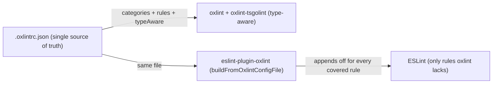

# ESLint → oxlint Migration

Move lint rules from ESLint to oxlint whenever oxlint gains coverage, prioritized by what actually costs time in the ESLint pass. Oxlint runs the whole repo in well under a minute; the ESLint pass takes several minutes, and a handful of type-aware rules account for most of its rule time.

## What works today

- One root `.oxlintrc.json` runs oxlint repo-wide with `typeAware: true` — `oxlint-tsgolint` executes the type-aware `typescript/*` rules (`no-floating-promises`, `await-thenable`, `no-duplicate-type-constituents`, …) natively.
- `eslint-plugin-oxlint` (`packages/configuration/eslint/oxlint.js`) reads the same `.oxlintrc.json` via `buildFromOxlintConfigFile` and appends `"off"` entries for every ESLint rule oxlint already covers. It is appended **last** in both flat configs, so its disables win.
- The `correctness` category is listed explicitly in `.oxlintrc.json`. This matters: oxlint itself keeps `correctness` enabled by default even when other categories are configured, but `eslint-plugin-oxlint` **replaces** its default categories with the configured ones. Before `correctness` was explicit, the plugin assumed the category was off and left the ESLint twins of every correctness rule enabled — so ESLint re-ran the four most expensive type-aware rules (roughly half its rule time) that oxlint was already checking.

## What remains in ESLint and why

The remaining expensive rules, in descending cost order, and the trigger for migrating each:

| Rule                         | Share of rule time | Blocker                                                                                                        | Migrate when                                                                               |
| ---------------------------- | ------------------ | -------------------------------------------------------------------------------------------------------------- | ------------------------------------------------------------------------------------------ |
| `neverthrow/must-use-result` | ~a third           | Type-aware custom plugin — oxlint's JS plugin API has no type information, and tsgolint has no custom-rule API | oxlint ships type-aware JS plugins, or tsgolint gains a custom-rule API                    |
| `vue/no-child-content`       | ~a tenth           | Not implemented in oxlint's vue plugin                                                                         | upstream implements it (check `eslint-plugin-oxlint`'s generated rule maps after upgrades) |
| `perfectionist/sort-imports` | small              | oxlint has no import-sorting rule                                                                              | upstream implements sorting                                                                |

Everything else in the ESLint pass is either Nuxt/Vue-specific (`vue/*` SFC rules, `nuxt/*`) or a `typescript-eslint` rule oxlint has not implemented; none of them individually costs meaningful time.

## Ongoing process

On every oxlint / `eslint-plugin-oxlint` catalog bump:

1. Re-measure with `TIMING=10` on the app ESLint run to see which rules now dominate.
2. Check whether the top ESLint rules appear in `eslint-plugin-oxlint`'s generated rule maps (`dist/generated/rules-by-category.*` — including the `*TypeAwareRules` sets). If a rule is newly covered, it disappears from ESLint automatically via the appended config — verify with `eslint --print-config` on a sample file rather than editing anything.
3. For custom rules (`neverthrow`, `no-restricted-syntax` selectors), evaluate oxlint's JS-plugin support as it matures — non-type-aware custom rules can move as soon as oxlint's plugin API supports the needed AST surface for `.vue` and `.ts` files.
4. Remove ESLint-side manual `"off"` entries that only existed to duplicate oxlint coverage (they are dead weight once `eslint-plugin-oxlint` disables the rule).

## Key files

| File                                                                | Role                                                                                                |
| ------------------------------------------------------------------- | --------------------------------------------------------------------------------------------------- |
| `.oxlintrc.json`                                                    | Single source of truth: categories (list `correctness` explicitly), per-rule overrides, `typeAware` |
| `packages/configuration/eslint/oxlint.js`                           | Builds the ESLint disable config from `.oxlintrc.json`                                              |
| `packages/configuration/eslint/index.typescript.js`, `index.vue.js` | Append the oxlint disables last so they win                                                         |
| `packages/configuration/eslint/typescriptRules.js`                  | ESLint-only type-aware rule set (strictTypeChecked minus deletions)                                 |

## Notes

- Never remove `correctness` from the explicit category list — oxlint would still run those rules (its own default), but `eslint-plugin-oxlint` would silently re-enable their ESLint twins and double-lint them.
- Coverage parity is verified, not assumed: before relying on oxlint for a migrated rule, reproduce a violation in a scratch file and confirm oxlint reports it (tsgolint rules included).
