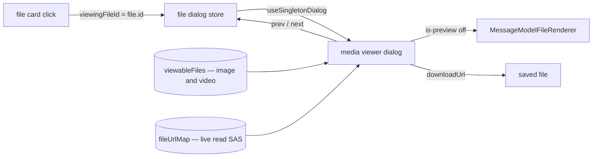

# Media Viewer

Clicking an image attachment opens a lightbox. Clicking a video attachment does nothing at all — the gallery the viewer is opened over skips every file that is not an image, and the card only binds a click when the file is in that gallery. Discord opens both in the same surface, with the filename, the position in the set, and a download.

This is the one item on the [dependency reduction](/docs/proposals/refactors/dependency-reduction) backlog that is a feature gap rather than a cleanup, and the library is the reason the gap cannot simply be closed. Viewer.js reads its gallery from the `img` children of an element that is already in the document, so opening one over urls means building a hidden `div` of detached images and taking it back out on close. That shape has nowhere to put a `video`, nowhere to put a caption or a download control, and no reactive link to the store — the `src` values are snapshotted at open, so a read-SAS refresh cannot reach a viewer that is still on screen. It is also the only dialog in the app that is not a `StyledDialog`: no theme, no Vuetify chrome, no `useSingletonDialog`.

## What it adds

### The gallery widens to media

`viewableFiles` keeps every file whose inferred mimetype is `image`; it keeps `video` too. Each entry carries what the dialog renders from — id, filename, and mimetype — rather than a resolved `src`, because the url is read live.

Nothing else joins. A PDF already opens its own dialog from its own renderer, and audio plays inline from the row, so pulling either into the lightbox would mean two dialogs racing for the same click.

### One singleton dialog, targeted by id

The [singleton dialog](/docs/architecture/singleton-dialogs) shape the rest of the app uses, applied here: a dialog store holds `viewingFileId` defaulting to `""`, the file card writes it on click, and one dialog mounted beside the message list resolves its entry through `useSingletonDialog`. `viewFiles` stops constructing DOM and becomes the assignment.

Resolving through the composable rather than a computed of its own is what makes a deleted file close the viewer instead of leaving it open over a url that no longer resolves — the same reason the sheet's row dialogs do it.

### The renderers are the ones already written

The dialog does not write a second image element and a second video element. `MessageModelFileRenderer` already dispatches on mimetype, and its `is-preview` flag is exactly the difference between the row's cropped thumbnail and the full-resolution render this needs — so the dialog mounts the same component with the flag off, and a renderer added later is in the lightbox for free.

The url comes from `fileUrlMap` by id, which is what the row does. That single change is the reactive link the detached version could not have: the store's refresh sweep re-mints an expiring read SAS, and an open viewer follows it.

### Chrome

Previous and next, bound to the arrow keys as well as to buttons, not wrapping — the ends of the set are ends. `Escape` closes through the dialog, which is where every other dialog's close already lives. The caption is the filename plus the position in the set. Download reuses `downloadUrl`, the helper the file options menu on the same card already calls.

Zoom is the one Viewer.js behaviour worth keeping: wheel and pinch scale with drag to pan, applied as a transform on the image and reset when the entry changes. Rotate, flip, crop and the fullscreen API go with the library — nothing asked for them, and they are named here so nobody re-adds them as parity.

## Failure and teardown

Closing resets the target to `""`, which unmounts the dialog and, with it, stops a playing video — the `v-if` is the only thing that does, and an always-mounted dialog would keep audio running behind a closed overlay.

A file removed while the viewer is open drops out of the gallery computed, the lookup returns nothing, and the dialog unmounts rather than rendering a dead url. A url that fails to load is the same case the row already handles: the store re-mints on its own schedule and the reactive `src` picks the new one up.

## Key files

| File                                                               | Change                                                          |
| :----------------------------------------------------------------- | :-------------------------------------------------------------- |
| `packages/app/app/services/file/showImageViewer.ts`                | deleted with the library                                        |
| `packages/app/app/store/message/file/index.ts`                     | gallery widens to video; `viewFiles` writes a target            |
| `packages/app/app/components/Message/Model/Message/File/Index.vue` | the card binds a click for every viewable file, not only images |
| `packages/app/app/components/Message/Model/FileRenderer/`          | the renderers the dialog mounts with `is-preview` off           |
| `packages/app/app/composables/useSingletonDialog.ts`               | open state and the entry lookup                                 |
| `pnpm-workspace.yaml`                                              | the `viewerjs` entry, deleted with the last import              |

## Notes

The charge here is not bytes. Viewer.js is small; what it costs is a product decision — what opening an attachment does — taken by a library that structurally cannot grow the second half of it. That is the first cost on the [admission test](/docs/proposals/refactors/dependency-reduction), and the emoji picker is the precedent for what replacing it looks like: keep nothing but the part that was never ours to write, which here is nothing at all, because the whole of it is a dialog over two elements.
