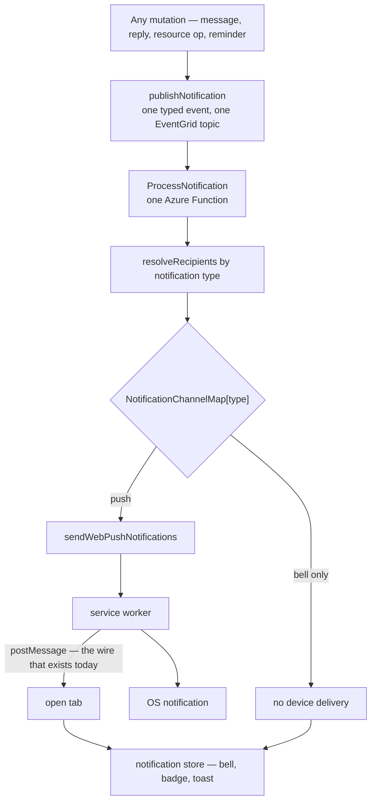

# Notification Consolidation

A notification is currently four unrelated things depending on where it starts. A chat message reaches another device through EventGrid and an Azure Function; a thread reply takes a second EventGrid event to a second Function; a scheduled reminder skips EventGrid entirely and calls `web-push` inline; and a resource operation reaches nothing but the tab it happened in. The user-visible symptom is the last one — publishing a resource on a desktop raises no notification on a phone — but the symptom is not the problem. The problem is that "is this a notification?" has four different answers, so every new notification has to pick one of them, and picking wrong is invisible.

This proposal replaces those with one concept: a notification is a typed event, published once, delivered by one Function, and fanned out to the surfaces its type declares. Nothing about the delivery mechanics needs inventing — most of the shared machinery already exists and is simply not reached from everywhere.

## What is already unified

Worth stating first, because it decides how much of this is new code rather than rewiring:

- **The delivery primitive.** `sendWebPushNotifications` is the single caller of `web-push`, and it already owns retry logging and the `410 Gone` subscription cleanup. Every sender goes through it.
- **The envelope.** `getPushNotificationPayload` already declares itself the one shape the service worker parses — body capped, deep link made absolute — so that neither is something a new notification can forget.
- **The ordering standard.** [Persist then notify](/docs/architecture/persist-then-notify) already fixes where a notify sits relative to its write, and that nothing fallible may sit between the two.
- **The client bridge, which is built but unterminated.** The service worker already `postMessage`s every push payload to all open clients before showing the OS notification. Nothing listens. The wire from a delivered push back into the running tab exists and ends in the air.

## What is actually fragmented

- **Four Functions and three EventGrid subscriptions** for one concept: `ProcessPushNotification`, `ProcessFriendRequestNotification`, `ProcessThreadReplyNotification`, plus the reminder path inside `ProcessScheduledMessageJob`.
- **One path bypasses EventGrid.** `processScheduledMessageJob` calls `sendPushNotification` directly, so that delivery has no dead-letter destination and no replay — the failure class that [dead-letter replay](/docs/infra/eventgrid-dead-letter) exists to catch simply does not apply to it.
- **Recipient resolution is per sender.** `getPushSubscriptionsForMessage`, `getPushSubscriptionsForUser` and the follower recomputation inside `ProcessThreadReplyNotification` each answer "who gets this" their own way, and the reply path has to pass `excludedUserIds` to stop two of them answering at once.
- **The subscription table is filed under the wrong domain.** `pushSubscriptionsInMessage` sits in `messageSchema`, though the physical table is `pushSubscriptions` and a row is per-session and per-user with nothing message-shaped about it. A resource notification cannot use it without importing the message domain.
- **The bell is a fifth system.** Client-only, session-scoped, reaching no device and surviving no reload — by design, but the design is the thing being changed.

## Target

The one new idea is `NotificationChannelMap` — a registry keyed by notification type declaring which surfaces that type reaches. It is what makes "everything that is a push notification uses the same system" true without also pushing a save-conflict warning to someone's phone. A type states its channels once, in one place, and a new notification that forgets to is a type error rather than a silent omission.

## Consequences worth deciding before implementing

- **Which existing bell notifications become push-worthy.** Resource operations are the ones the symptom is about. Mutation errors and save conflicts are almost certainly bell-only — they are feedback about the tab's own action, and a phone cannot act on them.
- **The bell stops being session-scoped.** A push delivered while the app was closed has to appear in the bell on next load, which means notifications become persisted rows rather than a Pinia array. That contradicts the current [notifications](/docs/platform/notifications) page, whose "deliberately not persisted" rationale is exactly what this proposal overturns; the page is rewritten, not amended.
- **The badge count follows.** The current page notes that badging a push delivered while closed "would need the count on the push payload and a service-worker writer". Persisted notifications remove that requirement — the count is a query.
- **`ProcessScheduledMessageJob` gives up its inline send** and publishes like everything else, which is what puts it behind the dead-letter replay.

## Migration shape

There is no compatibility phase and no legacy path ([no compatibility debt](/docs/architecture/no-compatibility-debt)): the four senders are moved to `publishNotification` in one change, the three subscriptions collapse to one, and the retired Functions and their Pulumi resources are deleted rather than left dormant.

## Key files

| File                                                                             | Role today                                       |
| -------------------------------------------------------------------------------- | ------------------------------------------------ |
| `packages/azure-functions/src/services/sendWebPushNotifications.ts`              | the single delivery primitive — kept as-is       |
| `packages/azure-functions/src/services/getPushNotificationPayload.ts`            | the one envelope — kept as-is                    |
| `packages/azure-functions/src/handlers/processPushNotificationHandler.ts`        | becomes the single `ProcessNotification` handler |
| `packages/azure-functions/src/handlers/processThreadReplyNotificationHandler.ts` | folded into recipient resolution                 |
| `packages/azure-functions/src/handlers/processScheduledMessageJobHandler.ts`     | loses its inline `sendPushNotification` call     |
| `packages/db-schema/src/schema/pushSubscriptionsInMessage.ts`                    | moves out of `messageSchema`                     |
| `packages/app/public/serviceWorker/push.js`                                      | its `postMessage` gains a listener               |
| `packages/app/app/store/notification.ts`                                         | becomes the render surface, not the source       |
