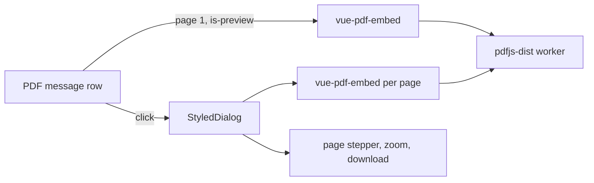

# PDF Viewer Consolidation

One component renders PDFs, and it mounts two libraries to do it. `vue-pdf-embed` draws the first page as the thumbnail every PDF message row shows; `@vue-pdf-viewer/viewer` is imported lazily and mounts only inside the dialog that opens on a click. Both are wrappers around `pdfjs-dist`, which the app depends on directly and ships regardless.

The reason to consolidate is the second cost on the [admission test](/docs/proposals/refactors/dependency-reduction) — a version we do not control:

- The embed declares the renderer major we install, and tracks it.
- The full viewer declares the major **below** it, as a pinned dependency and as a peer, and installs only because a repo-wide `overrides` entry forces it onto ours. Nothing except our own reading verifies that pairing works, and every renderer bump renews the same unverified promise.
- It also brings a headless component library and a crypto package along with it, for chrome we mostly do not use.
- And it carries configuration: a server-only transpile entry, a Vite pre-bundling exclusion, a `data:` allowance in the script CSP, and a fullscreen permission — four places that name one dialog.

A reader also has to learn which of the two answers a question, which is the third cost: two ways to do the thing we already do.

## Scope

Stated up front, because this is the item where scope creep turns a bounded swap into a rewrite of a document viewer.

**In:** multi-page render in the dialog, page navigation, page-fit and zoom, download by filename, and the dark-mode pass the dialog already threads. The text and annotation layers come from the embed and are already enabled on the thumbnail, so they are not work.

**Out, by name:** in-document search, an outline or bookmarks pane, printing, form filling, and annotation or signature editing. Any one of those being genuinely wanted makes this proposal the wrong shape, and the right answer is to keep the second viewer and accept its override.

## What changes

The thumbnail path does not change at all. The dialog stops mounting a second library and mounts the embed instead, page by page inside a scroll region, with our own control row above it — the page indicator and its stepper, the zoom control, and download.

The dialog is already a `StyledDialog` that owns its own close, so the chrome being ours is a control row rather than a shell. Dark mode stops being a two-way binding into a library's own state and becomes what the rest of the app does with the theme.

## What the removal retires

The catalog entry is deleted in the same commit as the last import — the rule the whole initiative runs on. Then, each checked against whether anything else claims it first:

- the `overrides` entry pinning the renderer, which exists for this package alone,
- the server-only transpile entry and the Vite pre-bundling exclusion that name it,
- the `data:` script-source allowance,
- the fullscreen permission — **verify before deleting**, since the call surface is the other plausible claimant.

## Failure

A document that fails to parse is not a blank dialog. The embed reports the failure, and the dialog falls back to the filename and the download control: a file we cannot render is still a file the reader can save, and that is what the row's own options menu already offers.

## Key files

| File                                                                 | Change                                                  |
| :------------------------------------------------------------------- | :------------------------------------------------------ |
| `packages/app/app/components/Message/Model/FileRenderer/Pdf.vue`     | one library, our control row                            |
| `packages/app/app/components/Message/Model/FileRenderer/Pdf.test.ts` | the dialog's own assertions follow the component        |
| `packages/app/configuration/build.ts`                                | the server-only transpile entry                         |
| `packages/app/configuration/vite.ts`                                 | the pre-bundling exclusion                              |
| `packages/app/configuration/security.ts`                             | the `data:` script source and the fullscreen permission |
| `pnpm-workspace.yaml`                                                | the catalog entry and the renderer `overrides` line     |

## Notes

The renderer itself is a permanent keep — PDF is a specification that changes without us, which is the first entry on the stop list. What this proposal removes is an adapter, and it is built behind the call site it replaces so the swap and the revert are each one import.
