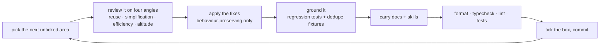

# Simplification Sweep

The [finishing-a-change](https://github.com/Esposter/Esposter/blob/main/AGENTS.md) ritual runs on new work by default. This ledger applies it **retroactively**, area by area, to code written before it existed — where duplicated copy, twin helpers, restated constants and special cases layered on shared mechanisms have had time to accumulate.

One area per pass, each bounded so it fits a single review chunk. A pass is not a rewrite: it changes no behaviour, and anything that would is split out and raised separately.

## What one pass does

The four angles, and the rules each answers to:

| Angle          | Looks for                                                               | Owner                                   |
| -------------- | ----------------------------------------------------------------------- | --------------------------------------- |
| Reuse          | a twin of an existing helper, a constant restated, copy duplicated      | `file-organization`                     |
| Simplification | derivable state, copy-paste variation, dead code, one-consumer generics | `typescript`, `vue-composable-patterns` |
| Efficiency     | repeated I/O, sequential independent work, needless recomputation       | `pinia`, `pagination`                   |
| Altitude       | a special case bolted onto shared infrastructure                        | the area's own skill                    |

**Tests are part of the pass, not a follow-up.** Repeated fixtures collapse into one `create*` helper, twin test files collapse into a behaviour matrix plus a thin wiring test, and anything the pass exposes gets the regression test it was missing (`testing` skill). A simplification with nothing asserting it is a claim, not a result.

**Docs move with the code.** A page whose Key Files or mechanism changed is updated in the same pass; a convention worth reusing goes into its owning skill rather than this ledger.

## Areas

Ordered by expected payoff — the biggest surfaces with the most recent churn first. Tick as each lands.

### Platform / resource explorer

- [x] `Resource/List` + the list composables — done as part of the service-menu work
- [x] `Resource/Blade`, `Resource/Overview`, `Resource/Explorer` — the resource page shell
- [ ] `Resource/Sheet` components — the grid, its slots and dialogs
- [ ] `composables/resource/sheet` — the command/history layer
- [ ] `services/resource/sheet` — column inference, transformations, (de)serialization
- [ ] `store/resource/sheet` + `shared/models/resource/sheet`
- [ ] `Resource/Dashboard`, `Resource/Email`, `Resource/Webpage`, `Resource/Flowchart` — the canvas editors
- [ ] `Resource/Survey`, `Resource/Program`, `Resource/TodoList`, `Resource/Blueprint`
- [ ] `app/composables/resource` + `app/services/resource` — what the sweep above leaves behind
- [ ] `app/store/resource` — store shapes against the `pinia` skill

### Messaging

- [ ] `app/components/Message` — the largest component tree in the repo
- [ ] `app/composables/message` + `app/services/message`
- [ ] `app/store/message` + the call/voice stores

### Server

- [ ] `server/trpc/routers/message` — the largest router, and its test file
- [ ] `server/trpc/routers/room` — same shape, same size
- [ ] the remaining routers, against the `trpc` skill
- [ ] `server/services` — the helpers the routers share

### Shared and cross-cutting

- [ ] `app/components/Styled` — the primitives everything else composes
- [ ] `shared/models` + `shared/services`
- [ ] `packages/shared` and `packages/shared-node`

### Packages

- [ ] `packages/db`, `packages/db-schema`, `packages/db-mock`, `packages/azure-mock`
- [ ] `packages/azure-functions`
- [ ] `packages/virrun`
- [ ] `packages/vue-phaserjs`, `packages/parse-tmx`, `packages/xml2js`
- [ ] `packages/infra`
- [ ] `packages/configuration`

### Prose

- [ ] `content/docs` — one decision per page, links instead of retellings
- [ ] `.claude/skills` — the same, against the ownership map in its README

## Bounds

- **Behaviour-preserving only.** A finding whose fix would change behaviour is noted in the commit message and raised as its own proposal, not folded in.
- **One area per commit**, so a pass that turns out wrong reverts cleanly.
- **Chunked for review** — an area that would exceed the review file budget is split at a sub-directory boundary and gets its own line here.
- Findings deliberately skipped (with the reason) belong in the commit message; this ledger only tracks coverage.

## Raised, not folded in

Findings a pass surfaced whose fix is real work rather than cleanup. Each needs its own proposal before it is attempted:

- **`useResource` as a blade-scoped store.** The resource page threads its whole state through page → Explorer → Actions/Outlet; the `pinia` and `vue-component-patterns` skills both point at a store instead, which would delete the drilling outright.
- **Content classes are not what the wire delivers.** A content schema is declared `satisfies z.ZodType<ToData<T>>` and `readContentBlob` parses plain JSON with it, so the client receives the data shape — never the class instances the Sheet, Dashboard and TodoList stores type their refs as. Those three casts are all that is left of the gap; the honest fix is for a store to revive its content the way `Dashboard` already does, or to hold the `ToData` shape it is actually given.
- **The publication on the generic resource read.** `readResource` then `readResourcePublication` is two round trips where the second re-resolves ownership; `resourcePublications` is one generic table, so the publication could ride the first response.
- **Lazy portable-format loading.** The command bar statically pulls the xlsx read/write libraries into every resource page's chunk, including types that can never import or export.

## Done

Delete this page once every box is ticked — the ritual it applies lives in `AGENTS.md`, and the conventions it enforces live in the skills. Nothing here is worth keeping as a record.
