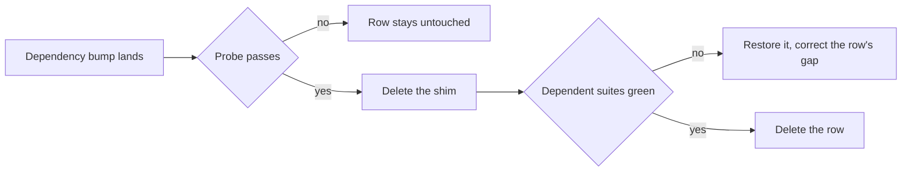

# Test Harness Workarounds

The suite carries a handful of shims that exist for one reason each: something the runner, its DOM, or a module does not implement. None of them is a design decision — they are the cost of running today's tests on today's tools, and every one is meant to be deleted rather than maintained.

The failure mode they share is silence. A shim whose cause is gone still passes: the stub is installed, nothing reads it, and no assertion notices. So a shim outlives its bug unless something tracks it, and the thing tracking it is this page — one row per shim, each with the probe that decides whether it is still needed and the code its removal deletes. A row leaves when its probe passes and the suites that depended on the shim stay green without it.

## The blocker table

| Workaround                                 | Gap it covers                                                                                                                                                                                                              | Retires when — and the probe                                                                                                                                                                                                  | Removal deletes                                                                                                                                               |
| ------------------------------------------ | -------------------------------------------------------------------------------------------------------------------------------------------------------------------------------------------------------------------------- | ----------------------------------------------------------------------------------------------------------------------------------------------------------------------------------------------------------------------------- | ------------------------------------------------------------------------------------------------------------------------------------------------------------- |
| Instants routed through `Date`             | The fake clock fakes no `Temporal`, so `Temporal.Now` reads the real instant inside a suite that pinned the clock, and the failure reads as the code ignoring its input rather than as the clock leaking                   | vitest ships the fake-timers `Temporal` method (`vitest-dev/vitest#10345`, closed against the 5.0.0 milestone) — the probe is whether the `FakeMethod` union in vitest's own `dist/chunks/config.d.*.d.ts` lists `"Temporal"` | the rule that testable code takes its instant through `getZonedDateTime(new Date())`; a test that pins the clock names `toFake: ["Date", "Temporal"]` instead |
| `MemoryStorage`                            | The nuxt environment's window carries no `localStorage` or `sessionStorage`                                                                                                                                                | the environment provides them — the probe is deleting both assignments and running one nuxt-environment suite                                                                                                                 | a `Storage` implementation and the `afterEach` clearing both                                                                                                  |
| The `visualViewport` stub                  | Happy-dom implements none, and Vuetify's overlay location strategy reads it unguarded, so mounting a real dialog or menu throws before a single assertion runs                                                             | happy-dom implements it — the probe is `"visualViewport" in globalThis` inside a nuxt-environment test                                                                                                                        | the stub object and its cast                                                                                                                                  |
| Canvas, image-load and `readyState` spies  | Happy-dom has no canvas, never fires an image load event, and reports `readyState` as loading; Phaser needs all three to boot synchronously                                                                                | happy-dom ships a canvas and fires image loads — the probe is booting one scene with the setup file removed                                                                                                                   | a hand-written `CanvasRenderingContext2D` and both prototype spies, the largest single removal on this page                                                   |
| The `Phaser` global stub                   | `phaser4-rex-plugins` reads `Phaser` as a browser global rather than importing it                                                                                                                                          | the plugin imports what it uses — the probe is loading a rex plugin with the stub gone                                                                                                                                        | a `stubGlobal` and `unstubAllGlobals` pair                                                                                                                    |
| The Vitest module allowlist                | `@unocss/nuxt` trips a Windows `spawn EPERM` while Nuxt resolves its config, taking down pure-node tests with it; the other excluded modules build a service worker, leak a teardown error, or add headers nothing asserts | each excluded module resolves cleanly under Vitest — the probe is moving one back into the Vitest branch and running any suite on Windows                                                                                     | the `process.env.VITEST` fork in the module list, leaving one list                                                                                            |
| The `app` block in the runtime-config mock | Nuxt's generated internal paths module reads `useRuntimeConfig().app.baseURL` at module scope, so a mock without the standard defaults fails on import                                                                     | the read stops being eager — the probe is dropping the block and importing any module that pulls the generated fetch helper                                                                                                   | three keys of a mock                                                                                                                                          |
| `fake-indexeddb/auto`                      | The nuxt environment sets `indexedDB` but not the `IDB*` constructors the `idb` library reaches for                                                                                                                        | the environment registers the constructors — the probe is running the offline-cache suites without the setup entry                                                                                                            | a global setup entry and a devDependency                                                                                                                      |
| The Nuxt runtime warm-up                   | The first mount in a worker evaluates the whole app graph, and charged inside a test body that cold cost can exceed the per-test timeout                                                                                   | `@nuxt/test-utils` warms its own worker — the probe is deleting the hook and reading component-test timings rather than only their pass or fail                                                                               | a `beforeEach` and its module-scoped flag                                                                                                                     |

## How a retirement runs

A row is not removed because a release note claims the gap is closed. It is removed when the shim is gone and the suites that leaned on it still pass, which is why every row carries a probe rather than a version alone.

The probes are cheap enough to run on the bump that plausibly moves one, so nothing here earns a scheduled pass of its own: the [dependency update process](/docs/architecture/monorepo-tooling) owns the bumps, and a row whose dependency has not moved cannot have changed.

## What is not on this list

Not every piece of test scaffolding is a workaround, and treating them alike would make the table unfalsifiable:

- **The harness itself** — the in-memory Azure clients, the PGlite database, the session mock. They stand in for services that have no business running inside a unit test, and no upstream release retires them.
- **Deliberate narrowing** — `toFake: ["Date"]` fakes _less_ than the default on purpose, because the wide default also freezes the monotonic clock a table write's `rowKey` depends on. That is a rule, not a gap.
- **Language ergonomics** — `takeOne` exists for `noUncheckedIndexedAccess` across the whole repo, not for tests.

## Key files

| File                                            | Role                                                                                       |
| ----------------------------------------------- | ------------------------------------------------------------------------------------------ |
| `packages/app/shared/test/setup.ts`             | Storage, `visualViewport`, the Azure and runtime-config mocks, and the warm-up hook        |
| `packages/app/vitest.config.ts`                 | `setupFiles` including `fake-indexeddb/auto`, the node default, and the timeouts around it |
| `packages/app/configuration/modules.ts`         | The Vitest module allowlist                                                                |
| `packages/vue-phaserjs/src/test/setupCanvas.ts` | The canvas, image and `readyState` spies Phaser boots against                              |
| `packages/vue-phaserjs/src/test/setup.ts`       | The `Phaser` global stub                                                                   |
