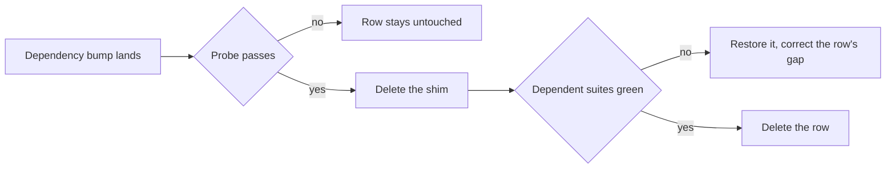

# Test Harness Workarounds

The suite carries a handful of shims that exist for one reason each: something the runner, its DOM, or a module does not implement. None of them is a design decision — they are the cost of running today's tests on today's tools, and every one is meant to be deleted rather than maintained.

The failure mode they share is silence. A shim whose cause is gone still passes: the stub is installed, nothing reads it, and no assertion notices. So a shim outlives its bug unless something tracks it, and the thing tracking it is this page — one row per shim, each with the probe that decides whether it is still needed and the code its removal deletes. A row leaves when its probe passes and the suites that leaned on the shim stay green without it.

Every row's third column is written so nobody re-derives the reasoning: it names the probe **and the signature that means the shim is still earning its place**. Running the probe and comparing against that signature is the whole check — an error string, an absent global, a failing suite. A row whose probe cannot be run at all says so, because an unrunnable probe is a finding rather than a pass.

## The blocker table

| Workaround                                 | Gap it covers                                                                                                                                                                                                                                                                                                                                                                  | Retires when — the probe, and what "still needed" looks like                                                                                                                                                                                                                                                        | Removal deletes                                                                                                                                               |
| ------------------------------------------ | ------------------------------------------------------------------------------------------------------------------------------------------------------------------------------------------------------------------------------------------------------------------------------------------------------------------------------------------------------------------------------ | ------------------------------------------------------------------------------------------------------------------------------------------------------------------------------------------------------------------------------------------------------------------------------------------------------------------- | ------------------------------------------------------------------------------------------------------------------------------------------------------------- |
| Instants routed through `Date`             | The fake clock fakes no `Temporal`, so `Temporal.Now` reads the real instant inside a suite that pinned the clock, and the failure reads as the code ignoring its input rather than as the clock leaking                                                                                                                                                                       | vitest ships the fake-timers `Temporal` method (`vitest-dev/vitest#10345`, closed against the 5.0.0 milestone) — the probe is the `FakeMethod` union in vitest's own `dist/chunks/config.d.*.d.ts`, and the shim stands while that union names `Date`, `performance` and `hrtime` but no `Temporal`                 | the rule that testable code takes its instant through `getZonedDateTime(new Date())`; a test that pins the clock names `toFake: ["Date", "Temporal"]` instead |
| `MemoryStorage` for `localStorage`         | Node defines a `localStorage` global that is undefined without `--localstorage-file`, and vitest copies a window property onto the global only where the key is absent there or named in its own key set — which names no storage. Happy-dom's working `Storage` is dropped on the floor, and `sessionStorage` arrives only because node's copy of that key does not shadow it | vitest names the storage keys, or node stops defining an unusable global — the probe is deleting the assignment and running the draft or emoji-picker suite, and the shim stands while that run fails on `localStorage` being undefined                                                                             | a `Storage` implementation and the `afterEach` clearing it                                                                                                    |
| The `visualViewport` stub                  | Happy-dom implements none, and Vuetify's overlay location strategy reads it unguarded, so mounting a real dialog or menu throws before a single assertion runs                                                                                                                                                                                                                 | happy-dom implements it — the probe is `new Window().visualViewport`, and the shim stands while that is `undefined`                                                                                                                                                                                                 | the stub object and its cast                                                                                                                                  |
| The canvas context mock                    | Happy-dom's canvas element answers `getContext("2d")` with `null`, and Phaser needs a context to boot                                                                                                                                                                                                                                                                          | happy-dom implements a 2D context — the probe is `new Window().document.createElement("canvas").getContext("2d")`, and the shim stands while that is `null`; deleting it fails every `vue-phaserjs` suite at once, so the confirmation is cheap                                                                     | a hand-written `CanvasRenderingContext2D` and the per-instance `createElement` spy, the largest single removal on this page                                   |
| The `Phaser` global stub                   | `phaser4-rex-plugins` reads `Phaser` as a browser global rather than importing it                                                                                                                                                                                                                                                                                              | **the probe cannot be run today** — no suite imports a module that loads a rex plugin, so removing the stub passes without proving anything. It becomes checkable the moment a test covers `useInitializeGameObjectEvents`, which is the reason to write that test                                                  | a `stubGlobal` and `unstubAllGlobals` pair                                                                                                                    |
| The Vitest module allowlist                | `@unocss/nuxt` breaks Nuxt's config resolution on Windows, taking pure-node tests down with it; the other excluded modules build a service worker, leak a teardown error, or add headers nothing asserts                                                                                                                                                                       | each excluded module resolves cleanly under Vitest — the probe is moving one back into the Vitest branch and running any suite on Windows, and the shim stands while that run dies with `The argument 'filename' must be a file URL object, file URL string, or absolute path string. Received 'file:///__uno.css'` | the `process.env.VITEST` fork in the module list, leaving one list                                                                                            |
| The `app` block in the runtime-config mock | Nuxt's generated internal paths module reads `useRuntimeConfig().app.baseURL` at module scope, so a mock without the standard defaults fails on import                                                                                                                                                                                                                         | the read stops being eager — the probe is the only one here that needs a **whole-suite** import graph rather than a file or two, since the failure depends on which modules a run happens to pull. It rides a CI run rather than a local pass, which is also why it is the cheapest row to leave alone              | three keys of a mock                                                                                                                                          |
| `fake-indexeddb/auto`                      | The nuxt environment sets `indexedDB` but not the `IDB*` constructors the `idb` library reaches for                                                                                                                                                                                                                                                                            | the environment registers the constructors — the probe is dropping the setup entry and running the IndexedDB cache suites, and the shim stands while they fail                                                                                                                                                      | a global setup entry and a devDependency                                                                                                                      |
| The Nuxt runtime warm-up                   | The first mount in a worker evaluates the whole app graph, and charged inside a test body that cold cost can exceed the per-test timeout                                                                                                                                                                                                                                       | `@nuxt/test-utils` warms its own worker — the probe reads component-test **timings** with the hook deleted rather than pass or fail, so it is the one row a green run does not settle                                                                                                                               | a `beforeEach` and its module-scoped flag                                                                                                                     |

## How a retirement runs

A row is not removed because a release note claims the gap is closed. It is removed when the shim is gone and the suites that leaned on it still pass, which is why every row carries a probe rather than a version alone.

The probes are cheap enough to run on the bump that plausibly moves one, so nothing here earns a scheduled pass of its own: the [dependency update process](/docs/architecture/monorepo-tooling) owns the bumps, and a row whose dependency has not moved cannot have changed.

Two things the first pass through this table settled are worth stating, because both are the reason a row's signature is written down rather than reasoned out again. A shim can be **half dead**: `sessionStorage` reached the global perfectly well while `localStorage` never did, so half the storage shim was overwriting a working implementation. And a shim can outlive its bug in the runtime rather than in the library — happy-dom fires image load events and reports a `readyState` Phaser accepts, so the two spies that forced both were deleted while the canvas mock beside them stayed load-bearing. Neither was visible from the code; both took one probe.

## What is not on this list

Not every piece of test scaffolding is a workaround, and treating them alike would make the table unfalsifiable:

- **The harness itself** — the in-memory Azure clients, the PGlite database, the session mock. They stand in for services that have no business running inside a unit test, and no upstream release retires them.
- **Deliberate narrowing** — `toFake: ["Date"]` fakes _less_ than the default on purpose, because the wide default also freezes the monotonic clock a table write's `rowKey` depends on. That is a rule, not a gap.
- **Language ergonomics** — `takeOne` exists for `noUncheckedIndexedAccess` across the whole repo, not for tests.

## Key files

| File                                            | Role                                                                                       |
| ----------------------------------------------- | ------------------------------------------------------------------------------------------ |
| `packages/app/shared/test/setup.ts`             | Storage, `visualViewport`, the Azure and runtime-config mocks, and the warm-up hook        |
| `packages/app/vitest.config.ts`                 | `setupFiles` including `fake-indexeddb/auto`, the node default, and the timeouts around it |
| `packages/app/configuration/modules.ts`         | The Vitest module allowlist                                                                |
| `packages/vue-phaserjs/src/test/setupCanvas.ts` | The canvas, image and `readyState` spies Phaser boots against                              |
| `packages/vue-phaserjs/src/test/setup.ts`       | The `Phaser` global stub                                                                   |
