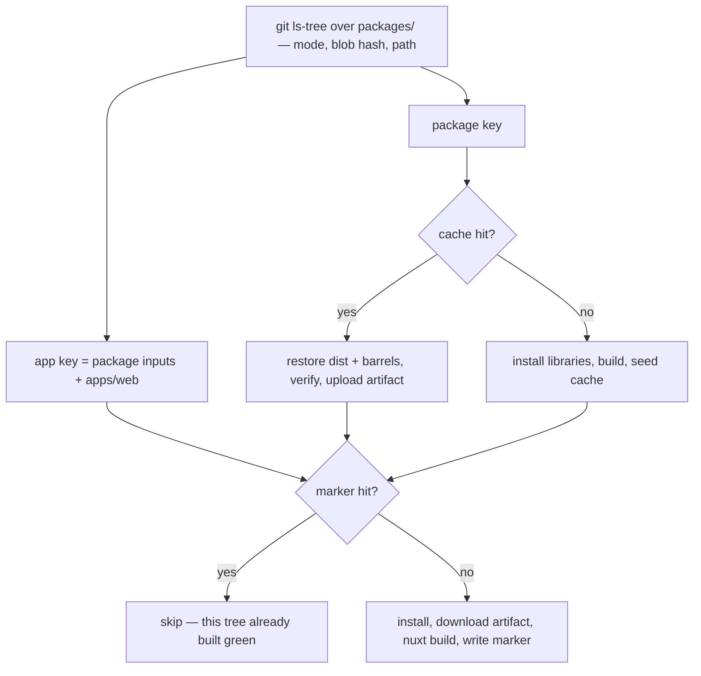

# The Toolchain After The Split

This is the pull request the refactor exists for. Every line of it deletes an exclusion whose only job was to say "not the app", and each deletion is now said by the tree instead.

## Root scripts

pnpm selects by path as readily as by name — `--filter "./packages/*"` resolves a directory glob against the workspace — so a script that wants the libraries asks for the libraries:

| Script               | Selector today                                       | Selector after                  |
| -------------------- | ---------------------------------------------------- | ------------------------------- |
| `build:packages`     | `--filter "!@esposter/app"`                          | `--filter "./packages/*"`       |
| `typecheck:packages` | `--filter "!@esposter/app"`                          | `--filter "./packages/*"`       |
| `watch:packages`     | `--filter "!@esposter/app"`                          | `--filter "./packages/*"`       |
| `lint:packages`      | `--ignore-pattern "packages/app/**"` plus the filter | the positional `packages` alone |
| `lint:fix:packages`  | `--ignore-pattern "packages/app/**"` plus the filter | the positional `packages` alone |

The two lint scripts are the clearest case: they already pass `packages` as the path to lint, then subtract a subdirectory of the path they just named. Once the app is not under it, the subtraction is the empty statement it always wanted to be.

`build:app` and `start` are renamed for the package they name, not restructured. **`test:packages` is renamed rather than rewritten**: its `--project "!@esposter/app"` is not a role filter at all — it skips the Nuxt project because that project is slow, and it would want to skip it wherever the app lived. Renaming it to `test:fast` and keeping the one name it excludes states the actual rule, and stops the word "packages" meaning two different sets in one manifest.

## Configs

| Config              | What goes                                                                                              |
| ------------------- | ------------------------------------------------------------------------------------------------------ |
| `typedoc.config.js` | The app leaves the `exclude` list — its entry points are `packages/*`, which no longer contains an app |
| `eslint.config.js`  | Ignores both product roots for one reason, that a member lints itself with its own flat config         |
| `vitest.config.ts`  | Projects become a glob per root; the hand-written entry for `scripts` goes with the next pull request  |
| `.oxlintrc.json`    | Nothing is deleted — the app-tree overrides move with the app and keep doing their job                 |

## CI

The shape is the one that already runs; what changes is that neither key subtracts anything. Today the package key is a hash of `packages/` with `packages/app` removed from it, because no consumer of that cache builds the app. After the move the app is not in the hashed tree, so the package key is a hash of `packages/`, and an app's key is that hash plus that app's own directory — which is the rule a second app follows without any of this being touched.

Both `verify-package-builds` and the artifact path list keep globbing `packages/*`, and both become exactly right by doing nothing: the set they discover is the set the cache holds, with no app in it to have been an exception.

### An app builds in the job that ships it

The Functions deploy and the Pulumi job restore the shared artifact today and find their own `dist` inside it, because `build:packages` builds every member. After the split it builds libraries, so each of those jobs runs its own `pnpm --filter <app> run build` on top of the artifact it already downloads, into an install it already performs.

Against the bar in [monorepo tooling](/docs/architecture/monorepo-tooling), that is a **spend, not a saving**, and a small one: two tsdown builds over small packages, moved out of one job and into the two jobs that consume them, and no longer covered by a cache hit — so a deploy pays them every run instead of most runs. Nothing is skipped that was not skipped before, and the artifact's correctness gate is untouched, so the failure worth fearing — a job reporting green over work it did not do — is unaffected in either direction.

What it buys is that a deploy stops depending on a cache entry keyed for someone else's purpose. The entry exists so library consumers can skip a build; a deployment reading its payload out of it is a coupling nothing states, and the day an app's build inputs stop being inside that key is the day a deploy ships a stale artifact and passes.

**The alternative is worth recording, because it is the tempting one.** The apps could stay in the shared artifact by adding `apps/functions` and `apps/infra` to the key inputs and `apps/*/dist` to the paths. That keeps the cache hit and costs nothing at deploy time — and it puts an enumeration of app names back into the definition the whole refactor exists to remove, in the one place where getting it wrong is silent. Two named directories in a cache key is exactly the shape of the six filters being deleted upstairs.

No cache gate is proposed for those two builds. Gating something measured in seconds behind a content hash spends more on the gate than the build.

## Key files

| File                                                | Role after the change                                                       |
| --------------------------------------------------- | --------------------------------------------------------------------------- |
| `package.json`                                      | Root scripts, addressing libraries by path                                  |
| `.github/actions/get-build-cache-keys/action.yaml`  | Both keys, each a plain statement of its inputs                             |
| `.github/actions/verify-package-builds/action.yaml` | Discovers buildable libraries by their tsdown config — unchanged, now exact |
| `.github/workflows/deploy-function-app.yaml`        | Builds the Functions app it deploys, on top of the library artifact         |
| `.github/workflows/Pulumi.yaml`                     | Builds the infra program it runs, on top of the library artifact            |
| `typedoc.config.js`                                 | Entry points over the libraries, with no app to exclude                     |
