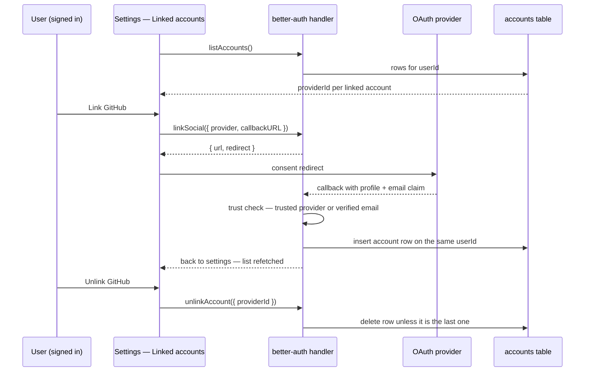

# Account Linking

One person, one account, several sign-in buttons.

## Scope

**Today:** `server/auth.ts` configures better-auth with three social providers — Google, GitHub and Facebook — and **no `account` block at all**, so every linking option sits at its library default without anyone having chosen it. Nothing in the app calls `linkSocial`, `unlinkAccount` or `listAccounts`; `app/components/Login/` contains a single `Button.vue` whose only job is `signIn.social({ provider })`. The `accounts` table is better-auth's stock shape with a plain `userId` foreign key, so several rows per user are already permitted — the storage for this feature exists and needs no migration.

The gap is user-facing. Sign in with Google today and GitHub tomorrow and you are two people: two user rows, two `biography` values, two sets of room memberships and achievements, and no path between them. Which one you are depends on which button you happened to press.

**This adds** a deliberate `account.accountLinking` configuration and a linked-accounts settings surface. No new tables, no new dependency, no new infrastructure.

## How it works

## Configuration

better-auth exposes six options under `account.accountLinking`. Every one of them is currently inherited rather than chosen:

| Option                   | Default | What it decides                                                                                                        |
| :----------------------- | :------ | :--------------------------------------------------------------------------------------------------------------------- |
| `enabled`                | `true`  | Whether linking happens at all                                                                                         |
| `disableImplicitLinking` | `false` | When true, sign-in never links — only an authenticated `linkSocial()` call does                                        |
| `trustedProviders`       | —       | Provider ids whose email claim is accepted as ownership proof without a verified-email check                           |
| `allowDifferentEmails`   | `false` | Whether a provider account with a different email may be linked manually                                               |
| `allowUnlinkingAll`      | `false` | Whether the last remaining account may be removed                                                                      |
| `updateUserInfoOnLink`   | `false` | Whether linking copies the provider's `name`/`image` onto the local user (`email`/`emailVerified` are never rewritten) |

`trustedProviders` also accepts a function of the incoming `Request` rather than a static array, and must tolerate being called with `request` undefined during context init. There is a seventh option, `requireLocalEmailVerified`, which the library marks deprecated because the gate it controls is becoming unconditional — do not configure it.

**The proposal is to write the block out explicitly**, defaults included, so the security posture is a recorded decision rather than a library default that a minor version can move.

## The security consideration

Implicit linking works by matching the incoming provider's email against an existing user. That match is only ownership proof if the provider actually verified the address. If an identity provider lets an account claim an arbitrary, unverified email, then anyone can register there as the victim's address, sign in here, and be linked straight into the victim's existing user — a full takeover with no password anywhere in the story.

better-auth's gate is exactly this: a provider **not** in `trustedProviders` must present an account with a verified email, or linking is refused with a `LINKING_NOT_ALLOWED` error. So `trustedProviders` is not a convenience list — **adding a provider to it is a statement that its email claim is trusted unconditionally**, skipping the verification check. Each of the three providers should be checked against its own documentation on whether the email it returns is verified before it goes in, and a provider that cannot promise that belongs out of the list, with `disableImplicitLinking` as the blunt instrument if the answer is unclear for all of them.

`allowDifferentEmails` removes the email comparison entirely for the manual path; better-auth's own option documentation warns that enabling it "might lead to account takeovers". Keep it `false`.

The mirror-image attack is worth knowing even though it is not reachable today: an attacker who can create a **local** account at the victim's address, unverified, waits for the victim's first OAuth sign-in to be linked into the attacker's row. Sign-in here is OAuth-only, so there is no way to create such a row — and email/password sign-up is [rejected](/docs/users/rejected/password-auth), so nobody should re-introduce one as a step toward this feature.

## The settings surface

A **Linked accounts** section on `app/pages/user/settings.vue`, added as a second `SideBarItem` beside the existing "General" entry:

- `authClient.listAccounts()` returns one row per linked account with `providerId`, `accountId`, `scopes`, and timestamps. Render a row per configured provider, linked or not.
- An unlinked provider gets a **Link** button calling `authClient.linkSocial({ provider, callbackURL })`, which returns `{ url, redirect }` and sends the user through the ordinary OAuth consent round trip back to the settings page.
- A linked provider gets **Unlink**, calling `authClient.unlinkAccount({ providerId })`. The `accountId` argument is optional and only narrows the match when one provider holds several accounts — omit it.
- The provider list and its logos must be shared with `Login/Button.vue`, not duplicated. That component already types `provider` as `keyof socialProviders` and takes the logo as a prop, so the two surfaces should read one provider definition; a second hand-maintained three-way logo mapping is how the login page and the settings page drift apart.

## Unlinking the last provider

better-auth counts **all** account rows, not rows per provider: with `allowUnlinkingAll` at its `false` default, unlinking while a single account remains fails with a 400 and `FAILED_TO_UNLINK_LAST_ACCOUNT` ("You can't unlink your last account").

Keep that default, and make the UI honest about it — **disable** the Unlink button on the last remaining row with an explanation, rather than letting the user press it and receive a server error. Sign-in is OAuth-only with no password fallback, so an account with zero linked providers is one nobody can ever sign into again, and there is no [self-service deletion](/docs/users/deferred/account-deletion) to reach for either. "Unlink everything" is not a supported way to leave.

## Failure modes

Every one of these surfaces through the existing alert store, the same way `Login/Button.vue` reports a failed `signIn.social`:

| Case                                                              | What happened                                                                                  |
| :---------------------------------------------------------------- | :--------------------------------------------------------------------------------------------- |
| `LINKING_NOT_ALLOWED`                                             | Untrusted provider with an unverified email, or linking disabled outright                      |
| `LINKING_DIFFERENT_EMAILS_NOT_ALLOWED`                            | Provider email differs from the user's and `allowDifferentEmails` is off                       |
| `SOCIAL_ACCOUNT_ALREADY_LINKED` / `LINKED_ACCOUNT_ALREADY_EXISTS` | That provider account already belongs to a different user                                      |
| `FAILED_TO_UNLINK_LAST_ACCOUNT`                                   | Last remaining account — should be unreachable if the button is disabled                       |
| `error=email_doesn't_match`                                       | The OAuth **callback** path redirects with a query parameter instead of returning a JSON error |

The last two rows carry the design work. The callback case means the settings page must read an error query parameter on return, not only the resolved promise — a rejection arriving as a redirect is invisible to the call site. And the "already belongs to another user" case has no remedy in this proposal: two user rows already exist, and better-auth will not join them. The message must say so plainly rather than implying a retry will help.

## Out of scope

**Merging two accounts that already exist.** This proposal prevents the split going forward; it does not repair one that already happened. Merging means reassigning rooms, memberships, roles, posts, achievements and messages across a user id and picking a winner for every profile field — a separate design with its own destructive-confirmation story, and one that only becomes worth writing if real users report the split.

## Key files

| File                                           | Change                                                                 |
| :--------------------------------------------- | :--------------------------------------------------------------------- |
| `packages/app/server/auth.ts`                  | Add the explicit `account.accountLinking` block                        |
| `packages/app/app/pages/user/settings.vue`     | New "Linked accounts" section entry                                    |
| `packages/app/app/components/Login/Button.vue` | Source of the shared provider list + logo shape                        |
| `packages/app/app/services/auth/authClient.ts` | No change — the client already exposes the account methods             |
| `packages/db-schema/src/schema/accounts.ts`    | No change — many rows per `userId` are already permitted, no migration |

## Notes

The whole feature is configuration plus a settings page, which is precisely why it is worth being deliberate about: nothing here is hard, and that makes it easy to enable linking without ever deciding what `trustedProviders` means. See [Auth](/docs/architecture/auth) for the surrounding OAuth setup.
