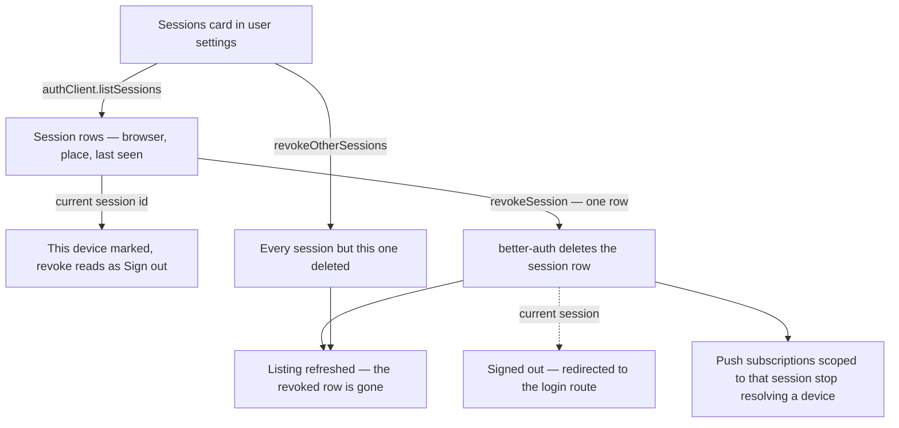

# Session And Device Management

A Sessions section in user settings that lists the account's active sessions — which browser, roughly where from, when last seen, which one you are using now — with a revoke button per row and a sign-out-everywhere-else action. It closes the one gap OAuth-only sign-in leaves open: revoking a provider grant stops future sign-ins, but the session rows are **ours** and keep working until they expire.

## Scope

**Today** the storage and the endpoints both exist and neither is used. The `sessions` table records `ipAddress` and `userAgent` on every row alongside `expiresAt`, and better-auth ships `listSessions`, `revokeSession`, `revokeSessions` and `revokeOtherSessions` — nothing in the app calls any of them and no UI exposes them. The settings page is a sidebar of sections over cards, and the Linked Accounts card is the precedent this one follows exactly: a `useQuery` over a better-auth listing, one row component, and mutations keyed so concurrent writes to one target serialize ([client data access](/docs/architecture/client-data)).

The device identity that does exist is a different thing and stays untouched — `Device` is `{ sessionId, userId }` used to scope push delivery so a notification never returns to the device that sent the message ([auth](/docs/architecture/auth)). It routes; it does not enumerate or revoke.

**This adds** a card, and no schema and no procedures: better-auth's own endpoints are the API, called from the client the way the account endpoints already are.

### What a row shows

A row is one session, rendered from what the row already stores:

- **The browser and platform**, parsed from `userAgent` into something a person recognises — not the raw string, which is unreadable and states more than the reader asked for.
- **Where from**, at city-or-country granularity. The stored value is a raw IP, and showing it back in full is a choice with no upside for the account holder: it does not help them recognise a session and it puts an address on screen that a shared screenshot then carries.
- **Last seen**, as a `NuxtTime` like every other rendered date in the app ([date and time display](/docs/architecture/date-time-display)).
- **This device**, marked on the row matching the current session, because that is the one a reader must not revoke by accident.

### Revoking

Per-row revoke, plus one destructive action that revokes every session except the current one. Both are keyed on the session set rather than per row, for the same reason the Linked Accounts card keys every row on one target: two revokes in flight against one list both read the same list, and the list is what the UI renders.

Revoking the current session is **sign out**, so the row for the current device offers that wording and lands on the login route rather than leaving the page authenticated against a session that no longer exists.

### The flow

### Push subscriptions follow

A push subscription is stored against a `userId` and an endpoint, so **per-session cleanup needs the session on the row first**: either the subscription table carries the session id that created it and revoke deletes by that, or revocation is account-wide and says so. Deleting the auth row alone leaves a subscription that still resolves and still delivers ([push notifications](/docs/esbabbler/push-notifications)).

A revoked session's **live connections have to be closed too**. A Web PubSub client access url outlives the session that minted it, so `closeUserConnections` is part of revoke rather than a consequence of it, and it is idempotent — a connection that already went away is not a failure. This is the one place the feature reaches beyond the auth tables, and it is the reason revoke is not purely better-auth's business.

## Key files

| File                                       | Change                                                    |
| :----------------------------------------- | :-------------------------------------------------------- |
| `packages/app/app/pages/user/settings.vue` | the Sessions section in the sidebar and the card below it |
| `packages/app/app/components/User/`        | the sessions card and its row, mirroring Linked Accounts  |
| `packages/app/app/services/auth/`          | user-agent parsing into a readable device label           |
| `packages/app/server/services/auth/`       | push-subscription teardown for a revoked session          |

## Notes

There is no admin-facing counterpart here. An operator terminating a specific user's sessions is a moderation capability, and moderation acts on room membership rather than on the account surface ([moderation](/docs/esbabbler/moderation)) — if that is ever wanted it is its own design, not a permission bolted onto a self-service card.

Location lookup from an IP is a dependency, not a computation. If nothing in the stack can answer it, the row drops the place rather than printing the address: a session is recognisable from its browser and its last-seen time alone, and that is a better outcome than rendering a number the reader has to interpret.
