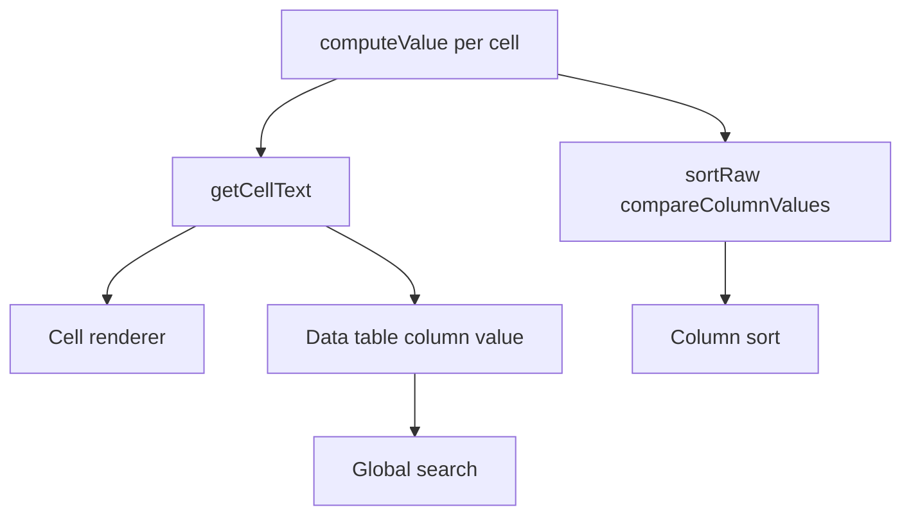

# Cell formatting

A boolean, date or number column carries a `format` — `Yes`/`No`, `DD/MM/YYYY`, currency, compact, percentage, scientific. The grid paints that formatted text, and everything the reader can act on follows one rule: **global search matches what is on screen, sorting compares what is behind it.**

That split is deliberate and is what a spreadsheet does. Searching `1,234` has to hit the cell that reads `1,234.00`, because the reader has no way to know the digits behind it are a bare `1234`. Sorting a currency column has to put `9` before `10`, which comparing the rendered `$9.00` against `$10.00` as text would get exactly backwards.

The rule holds for everything that only _reads_ a cell. Find and replace writes to one, and so is the documented exception below.

## How it works

`getDisplayText` is the single notion of what a cell shows: given a value and its column it applies `formatValue` when the column has a format, and falls back to the raw value otherwise. `String` and `Computed` columns have no `format` field at all, and it stays optional on `Number` and `Boolean`, so most sheets render some columns formatted and others raw.

The row store wraps it as `getCellText`, and both consumers of "the displayed value" go through that one function rather than each formatting for themselves:

- **The cell renderer.** `Row/Field/Index.vue` renders `getCellText`, so the outlier and find-and-replace highlight layers wrap the formatted text. They wrap it; they do not decide it — what find and replace _matches_ is the underlying value, for the reason in the Notes below.
- **The data table's `value`.** A column header's `value` resolves to the same text. Vuetify's global search filters on each column's `value`, so making it the display text is what routes search through the format — there is no second global search path to keep in step.

**Global search and find-and-replace are two different searches, and only the first follows the format.** Global search filters rows and changes nothing, so matching what the reader can see is free. Find and replace writes back into the cell, so it has to match what it can write: a hit against `$1,234.00` has no coherent value to store for the separators and the symbol. Both are pinned by tests — `Row/Table.test.ts` for the formatted global search, `findMatchingCells.test.ts` for the raw find-and-replace — because "make them consistent" is the obvious-looking change that would break the one that writes.

Sorting is then pulled back off that text by a `sortRaw` comparator per column, which the data table consults before its own string comparison. `compareColumnValues` orders numbers by magnitude, booleans false-first, empty cells ahead of filled ones, and everything else through the shared collator.

Both branches start at `computeValue`, which matters for computed columns: a computed column writes nothing into `row.data`, so a display path that read the row would render every one of its cells blank. Resolving the value first and formatting second means a computed column renders, searches and sorts like any other — it simply has no format to apply.

## Key files

All paths relative to `packages/app`.

| File                                                        | Role                                                                |
| ----------------------------------------------------------- | ------------------------------------------------------------------- |
| `app/services/resource/sheet/column/getDisplayText.ts`      | The one notion of a cell's displayed text                           |
| `app/services/resource/sheet/column/formatValue.ts`         | Dispatches a value to the boolean, number or date formatter         |
| `app/services/resource/sheet/column/compareColumnValues.ts` | Underlying-value comparator behind `sortRaw`                        |
| `app/store/resource/sheet/row.ts`                           | `getCellText` plus the headers that carry `value` and `sortRaw`     |
| `app/components/Resource/Sheet/Row/Field/Index.vue`         | Renders the displayed text with the outlier and find/replace layers |
| `shared/models/resource/sheet/column/ColumnFormat.ts`       | Union of the boolean, date and number format enums                  |

## Notes

- Editing a cell edits the underlying value: the inline editor and the row dialog show the raw value, not the formatted text, so a currency cell is typed as `1234`.
- Find and replace matches underlying values, since a replacement writes back into the cell. Two consequences the reader sees: searching `1,234` finds nothing in a cell rendered as `1,234.00`, and searching `1234` updates that cell while its highlight has nothing to mark, because the rendered text does not contain the term. That is the cost of the writes being valid, and it is the same trade every spreadsheet makes.
- Per-column filters run over the underlying values too — they are typed inputs bound to the column's type, not a text match against the grid.
