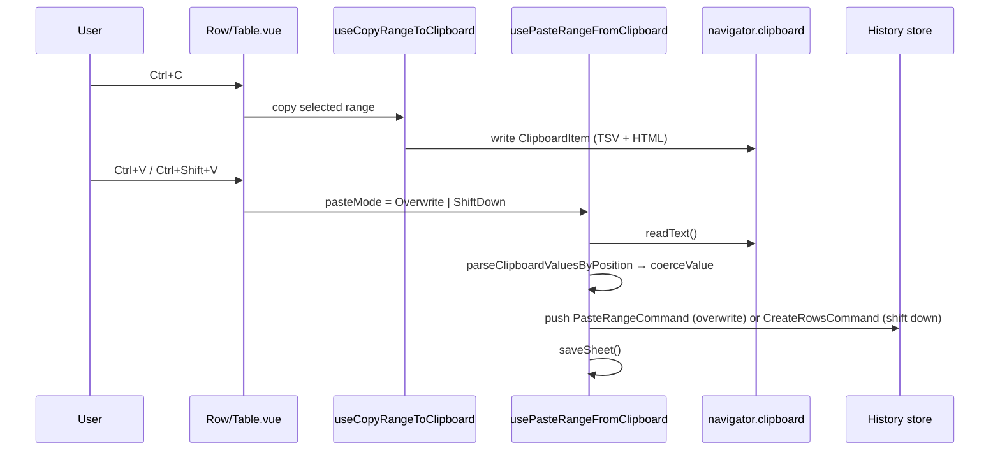

# Clipboard

Keyboard-driven copy/paste for cell ranges, aligned with Excel selection UX; every paste is reversible through undo/redo.

## How it works

The grid maintains an anchor/focus cell selection in the cell store. `Row/Table.vue` listens for keyboard shortcuts and routes them to two composables: `useCopyRangeToClipboard` and `usePasteRangeFromClipboard`.

**Copy (`Ctrl+C` / `Cmd+C`)** slices the visible columns and filtered rows by the selected range and hands the sub-DataSource to `copyToClipboard`, which writes both `text/plain` (TSV) and `text/html` (a styled table, so pasting into Excel/Sheets keeps structure) via `ClipboardItem`, falling back to `writeText` where `ClipboardItem` is unavailable (e.g. Firefox). Hidden columns are excluded; the header row is included or not based on the `copyIncludesHeaders` toolbar toggle.

**Paste** reads TSV from the clipboard, parses it position-based (no header row expected) with `parseClipboardValuesByPosition`, and coerces each value to its target column's type via `coerceValue`. The `Shift` key selects the mode:

| Mode                  | Trigger        | Behaviour                                                                                                                                                                                                    |
| --------------------- | -------------- | ------------------------------------------------------------------------------------------------------------------------------------------------------------------------------------------------------------ |
| `PasteMode.Overwrite` | `Ctrl+V`       | Overwrites cells in place starting at the anchor (top-left of the selection, or appends at the end with no selection); rows past the last row are appended; columns past the last display column are ignored |
| `PasteMode.ShiftDown` | `Ctrl+Shift+V` | Inserts the parsed rows at the anchor row index, shifting existing rows down                                                                                                                                 |

Overwrite pushes a `PasteRangeCommand` that snapshots the affected original rows, so undo removes any appended rows and restores overwritten cells. Shift-down reuses `CreateRowsCommand` with the anchor as start index, so undo removes the inserted rows. Both paths save the file after the command executes.

## Selection UX

| Gesture     | Behaviour                                    |
| ----------- | -------------------------------------------- |
| Click cell  | Start single-cell selection                  |
| Shift+click | Extend selection from anchor to clicked cell |
| Drag        | Extend selection while mouse held            |
| Arrow keys  | Move selection (collapses to single cell)    |
| Shift+Arrow | Extend selection in arrow direction          |
| Ctrl/Cmd+A  | Select all cells                             |
| Escape      | Clear selection                              |

The anchor is preserved across Shift+click and Shift+Arrow; dragging re-anchors on mousedown.

## Key files

All paths relative to `packages/app/app`.

| File                                                                 | Role                                                                                                                                               |
| -------------------------------------------------------------------- | -------------------------------------------------------------------------------------------------------------------------------------------------- |
| `models/resource/sheet/commands/PasteMode.ts`                        | `PasteMode` enum (`Overwrite` / `ShiftDown`)                                                                                                       |
| `models/resource/sheet/commands/PasteRangeCommand.ts`                | Overwrite paste + undo snapshot                                                                                                                    |
| `services/resource/sheet/commands/parseClipboardValuesByPosition.ts` | TSV → `string[][]` (no header row)                                                                                                                 |
| `services/resource/sheet/commands/copyToClipboard.ts`                | TSV + HTML `ClipboardItem` write with `writeText` fallback                                                                                         |
| `composables/resource/sheet/useCopyRangeToClipboard.ts`              | Slices the selected range and writes it to the clipboard                                                                                           |
| `composables/resource/sheet/commands/usePasteRangeFromClipboard.ts`  | Wires clipboard → `PasteRangeCommand` or `CreateRowsCommand`                                                                                       |
| `components/Resource/Sheet/Row/Table.vue`                            | Keyboard handlers; maps `shiftKey` → `PasteMode`                                                                                                   |
| `store/resource/sheet/cell.ts`                                       | Anchor/focus selection state, keyboard navigation, and the `selectedCellRange` computed (normalized `rowStart`/`rowEnd`/`columnStart`/`columnEnd`) |

## Notes

- Copy serializes stored cell values (`row.data`), so [computed columns](/docs/sheet-editor/computed-columns) copy as empty cells — use the export dialog when derived values are needed.
- Paste target columns are pre-indexed by name to avoid repeated linear scans over wide tables.
- The dedicated copy/paste buttons were removed from the cell text slot when keyboard range copy/paste shipped; row-level copy of checkbox-selected rows remains in the toolbar, alongside the `copyIncludesHeaders` toggle.
