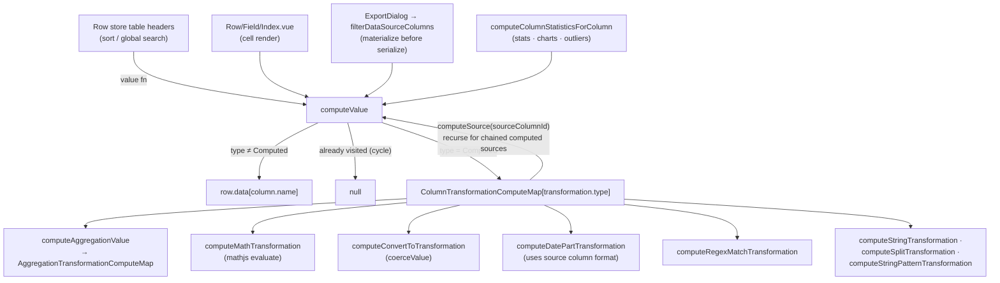

# Computed Columns

Computed columns derive their values from other columns instead of storing data — a `ComputedColumn` carries a `transformation` describing how to compute each cell from its source column(s), evaluated lazily at read time.

## How it works

A `ComputedColumn` is an ordinary column (`ColumnType.Computed`) whose `transformation` field is a discriminated union keyed by `ColumnTransformationType`: `Aggregation`, `ConvertTo`, `DatePart`, `Math`, `RegexMatch`, `String`, `StringPattern`, or `StringSplit`. Values are never written to `row.data` — computed columns are read-only, and every write site in the editor skips them.

All reads go through one resolver, `computeValue(rows, row, columns, column, rowIndex?, visited?)`. For a non-computed column it simply returns `row.data[column.name]`. For a computed column it dispatches to `ColumnTransformationComputeMap[transformation.type]`, handing the computer a context with:

- `computeSource(sourceColumnId)` — resolves a source column's value by calling `computeValue` recursively, so a computed column can source another computed column (chaining). A `visited` set of column ids guards against cycles: revisiting a column short-circuits to `null`.
- `findSource(sourceColumnId)` — looks up the source `Column` definition (used when the computer needs column metadata, e.g. a date column's format).
- `rows` and `rowIndex` — the full filtered dataset and the current row's position, consumed only by aggregation transformations.

The read sites are: the row store's table headers (each header's `value` function calls `computeValue`, so Vuetify sorting and global search operate on computed values), the cell renderer (`ResourceSheetRowField`), export (`filterDataSourceColumns` materializes computed values into plain row data before the serializers run, so exported CSV/JSON includes them), and statistics (`computeColumnStatisticsForColumn`, plus the outlier store reading the same values back per cell).

Computed columns are created and edited through the same vjsf-driven column dialog as every other column type — `computedColumnFormSchema` renders the transformation as a form, with per-transformation Zod validation surfacing errors before save.

Each transformation declares its output type via `getComputedColumnEffectiveType`: `Aggregation`, `DatePart`, and `Math` produce numbers; `RegexMatch`, `String`, `StringPattern`, and `StringSplit` produce strings; `ConvertTo` outputs its runtime `targetType`. The effective type drives filters, statistics, and charts for the computed column — `computeColumnStatisticsForColumn` reports it as the statistics row's `columnType`, which is what lets the chart map and the outlier sweep treat a number-producing computed column as a number column.

## Transformation categories

Single-source transformations carry `sourceColumnId`; `StringPattern` carries `sourceColumnIds` (multi-source); `Math` binds sources through its `variables` list.

### Math

A [mathjs](https://mathjs.org) expression string with column values bound as variables:

- `expression` — e.g. `col0 * (1 - col1)`; supports the full mathjs operator set (`+ - * / ^ %`, comparisons) and built-in functions (`abs`, `round`, `sqrt`, …).
- `variables` — an ordered list of `{ name, sourceColumnId }` bindings. Names are auto-generated `col0`, `col1`, … — valid mathjs identifiers that never collide with built-ins; users insert them via the form rather than typing them.

Evaluation coerces `null` source values to `0` and returns `null` for non-finite results (`NaN`, `Infinity`). The schema validates the expression at edit time by running mathjs `parse` inside a `superRefine`, so the exact parser message (e.g. "Unexpected end of expression") surfaces as the form error.

### String operations

Three string-producing variants:

- **String** — a basic single-column operation selected by `StringTransformationType`: `LowerCase`, `TitleCase`, `Trim`, or `UpperCase`. The source value is stringified first.
- **StringSplit** — splits the source string on a `delimiter` (default `,`) and returns the segment at `segmentIndex`; out-of-range segments yield `null`. Restricted to string source columns.
- **StringPattern** — multi-column templating: a `pattern` like `{0} {1}` substitutes positional `{N}` tokens with the values of `sourceColumnIds[N]` (e.g. first name + last name → full name). The schema rejects any `{N}` index outside the source list's bounds.

### Conversion and dates

- **ConvertTo** — coerces the source value to a `targetType` of `String`, `Number`, `Boolean`, or `Date` using the same `coerceValue` rules as manual type recasts.
- **DatePart** — extracts a calendar field (`DatePartType`: `Year`, `Month`, `Day`, `Weekday`, `Hour`, `Minute`) from a date source. The source must be a `Date` column; its `format` field is used to parse the stored value, so no separate input-format setting exists on the transformation.

### RegexMatch

Extracts a capture group from a string source: `pattern` plus `groupIndex` (e.g. `@(.+)` with group 1 pulls the domain out of an email column).

### Aggregation

Dataset-level aggregates — the only category that consumes the whole row set (`rows` + `rowIndex` from the compute context). `computeAggregationValue` resolves the numeric values of the source column across all filtered rows, then dispatches on `AggregationTransformationType`:

| Type               | Result per row                                          |
| ------------------ | ------------------------------------------------------- |
| `Average`          | Mean of all non-null source values (same for every row) |
| `Count`            | Count of rows with a non-null source value              |
| `Maximum`          | Largest source value                                    |
| `Minimum`          | Smallest source value                                   |
| `PercentOfTotal`   | This row's value ÷ column total × 100                   |
| `Rank`             | 1-based position of this row's value, sorted descending |
| `RunningSummation` | Cumulative sum of source values from row 0 to this row  |

Non-numeric and `null` source cells are ignored; an all-null column yields `null`.

## Key files

All paths relative to `packages/app`.

| File                                                                                       | Role                                                            |
| ------------------------------------------------------------------------------------------ | --------------------------------------------------------------- |
| `shared/models/resource/sheet/column/ComputedColumn.ts`                                    | Column class + Zod schema                                       |
| `shared/models/resource/sheet/column/transformation/ColumnTransformation.ts`               | Discriminated union of all transformation variants              |
| `shared/models/resource/sheet/column/transformation/ColumnTransformationType.ts`           | Discriminant enum                                               |
| `app/services/resource/sheet/column/computeValue.ts`                                       | Lazy resolver with inline cycle guard                           |
| `app/services/resource/sheet/column/computeColumnStatisticsForColumn.ts`                   | Per-column statistics over the resolved values                  |
| `app/services/resource/sheet/column/transformation/ColumnTransformationComputeMap.ts`      | Dispatch map: transformation type → computer                    |
| `app/services/resource/sheet/column/computeAggregationValue.ts`                            | Aggregation entry point (source resolution + numeric filtering) |
| `app/services/resource/sheet/column/transformation/AggregationTransformationComputeMap.ts` | Per-aggregation-type computers                                  |
| `app/services/resource/sheet/column/transformation/computeMathTransformation.ts`           | mathjs `evaluate` with variable scope                           |
| `app/services/resource/sheet/column/getComputedColumnEffectiveType.ts`                     | Transformation type → output `ColumnType`                       |
| `app/services/resource/sheet/dataSource/filterDataSourceColumns.ts`                        | Materializes computed values for export                         |
| `app/models/resource/sheet/commands/CreateComputedColumnCommand.ts`                        | Undoable create command                                         |

## Notes

- Values are recomputed on every read — there is no cache. Row data are plain objects with no dirty-tracking, and recomputation has been cheap enough in practice.
- Cycle handling is deliberately inline (the `visited` set) rather than a separate pre-validation pass; a cycle renders as empty cells instead of an error.
- Range copy ([clipboard](/docs/sheet-editor/clipboard)) and export both materialize computed values through `filterDataSourceColumns`, so a computed column copies its displayed value ([copy computed values](/docs/sheet-editor/copy-computed-values)).
