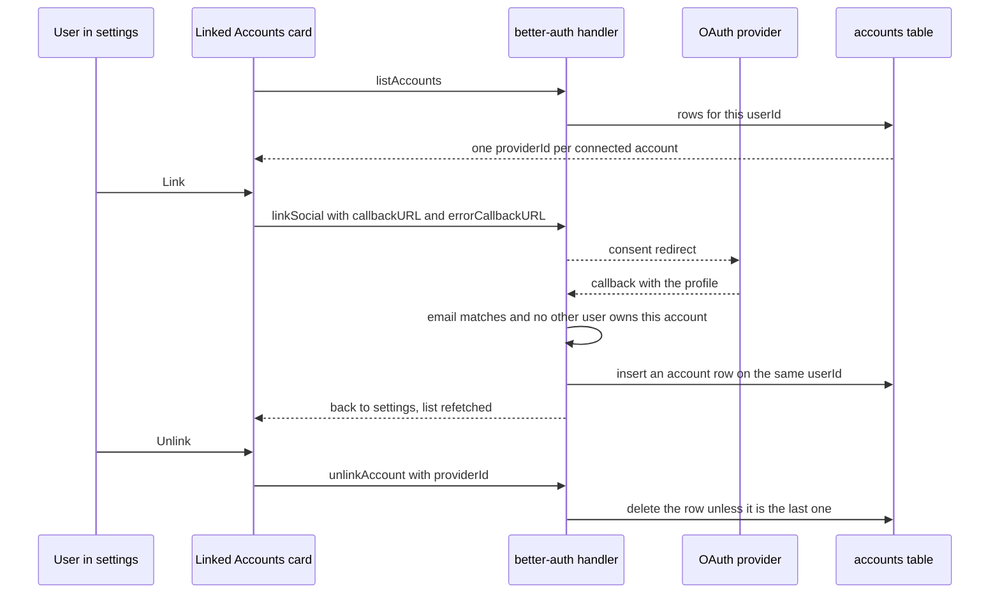

# Account Linking

One person, one account, several sign-in buttons. Sign-in is [OAuth-only](/docs/architecture/auth) through Google, GitHub and Facebook, and the `accounts` table holds one row per connected provider against a single `userId`. A user is therefore the set of providers they have connected, not the button they happened to press first.

## What links on its own

better-auth resolves an incoming provider account against the existing `users` row with the same email. It attaches the new account to that user only when two claims both hold: the provider says the address it returned is verified, and the stored user row is itself verified. When either fails the sign-in is **refused** — it does not fork into a second person, because the lookup found the existing row by email either way. The user is sent back with `?error=account_not_linked` and nothing is written.

`server/auth.ts` writes the whole `account.accountLinking` block out explicitly. Every value equals the library default, so nothing about the flow above is Esposter-specific — they are recorded because they are the security posture of sign-in, and a posture nobody chose is one a minor version is free to move.

The consequential entry is `trustedProviders`, which stays empty. Naming a provider there accepts its email claim as ownership proof and skips the verified-email check entirely, so anyone able to register the victim's address at that provider inherits the victim's Esposter user. None of the three providers earns that. `allowDifferentEmails` stays off for the same reason on the manual path, and `allowUnlinkingAll` stays off so the last remaining account cannot be removed.

## Why the settings section is not optional

Google and GitHub both report whether the address they return is verified, so signing in with one today and the other tomorrow already resolves to one user with nobody doing anything. Facebook does not: better-auth reads `email_verified` off the Graph API profile, which the request never asks for, so a Facebook sign-in always arrives **unverified**. Two consequences follow, and explicit linking is the only answer to either:

- Sign in with Google first, then press Facebook, and the Facebook sign-in is refused.
- Sign in with Facebook first and the user row is written unverified, which then refuses every later Google or GitHub sign-in as well.

Linking from settings takes a different path. The authenticated `linkSocial` round trip proves ownership from the session rather than from the provider's claim, so it checks only that the returned email matches the profile's and that the provider account does not already belong to someone else. A user in either state above signs in with whichever provider still works and connects the rest here.

## How the section works

The card renders one row per configured provider, connected or not, reading the provider list and its logos from the same `LoginButtonItems` constant the login page renders — a second hand-maintained logo mapping is how the two surfaces drift apart. Both actions run through `useMutation` keyed by the provider id, so the alert store reports a rejection the same way a failed sign-in does.

The link round trip is the exception that needs its own handling: a rejection in the OAuth callback arrives as a **redirect** back to `/user/settings?error=<code>`, never as a rejected promise, so the card reads that query parameter on return and translates the code through `AccountLinkErrorMessageMap`. The case with no remedy is `account_already_linked_to_different_user` — two user rows already exist and better-auth will not join them, so the message says to sign in with that provider directly rather than implying a retry helps.

## The last account

better-auth counts **every** `accounts` row for the user, not rows per provider, and refuses to delete the last one. The UI states that rule before the server has to: the final row is labelled as the only way back into the account and its Unlink button is disabled. Sign-in is OAuth-only with no password fallback, and there is no [self-service deletion](/docs/users/deferred/account-deletion) either, so an account with no providers is one nobody can ever reach again. Unlinking everything is not a supported way to leave.

Unlinking additionally demands a **fresh** session — better-auth measures freshness from when the session was created, not from the last request, so a session older than its freshness window is still valid for everything else and still rejected here. That rejection surfaces as an ordinary alert, and signing out and back in clears it.

## Out of scope

Merging two user rows that already exist. This prevents the split going forward, it does not repair one that happened: merging means reassigning rooms, memberships, roles, posts, achievements and messages across a user id and picking a winner for every profile field. That is a separate design with its own destructive-confirmation story, worth writing only if real users report the split.

## Key files

Paths relative to `packages/app`.

| File                                               | Role                                                           |
| -------------------------------------------------- | -------------------------------------------------------------- |
| `server/auth.ts`                                   | the explicit `account.accountLinking` block                    |
| `app/components/User/LinkedAccountsCard/Index.vue` | the settings section — lists accounts, links and unlinks       |
| `app/components/User/LinkedAccountsCard/Row.vue`   | one provider row and its Link / Unlink action                  |
| `app/services/auth/AccountLinkErrorMessageMap.ts`  | redirect error codes translated into readable text             |
| `app/services/login/LoginButtonItems.ts`           | the single provider list and logos, shared with the login page |
| `app/pages/user/settings.vue`                      | sidebar entry and where the section sits                       |

## Notes

- No migration was needed — the `accounts` table is better-auth's stock shape and already permits many rows per `userId`.
- Password sign-up is [rejected](/docs/users/rejected/password-auth), which closes the mirror-image attack on this feature: an attacker who could create a local account at the victim's address would otherwise wait for the victim's first OAuth sign-in to be linked into the attacker's row. Nothing should re-introduce one as a step toward anything here.
