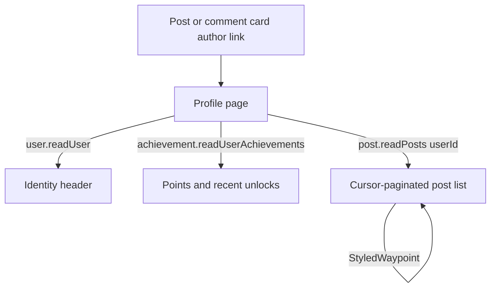

# Public Profile

Every post and comment names its author, and that name now links to `/user/[id]` — a public page showing the author's avatar, name, biography, achievement showcase, and their posts. It closes the social loop: see something interesting, then look at what else that person has made.

## How it works

The page is public — it renders for signed-out visitors on the rate-limited procedure, with no session required. It composes three reads:

- **Identity** comes from `user.readUser(id)`, whose Drizzle query projects only the allowlisted columns (name, image, biography). The private `email` column is never part of the projection, so it cannot leave the database regardless of what the client asks for.
- **Achievements** reuse `achievement.readUserAchievements(id)`, which is already public and takes any user id. The page merges each row with its static, client-side definition — the viewer-masked map `achievement.readAchievementMap` returns needs a session, which this page deliberately does not require — to show total unlocked points and the most recent unlocks, rendered with the achievement gallery's grid item.
- **Posts** reuse the home feed's machinery: the same cursor-paginated `post.readPosts`, now accepting an optional `userId` filter, feeding the same post card and infinite-scroll waypoint. Only top-level posts appear (`parentId IS NULL`) — comments are excluded.

Author name and avatar on post and comment cards are `NuxtLink`s to the profile. Messaging surfaces deliberately keep their own member-profile popovers — room identity is not global identity.

The `userId` filter composes with the existing clauses on `readPosts`: the `parentId` branch, the lexicographic cursor, and [feed block filtering](/docs/posts/feed-block-filtering). Block filtering still applies on a profile — a blocked author's identity stays reachable by direct navigation, but their posts stay hidden from the viewer who blocked them, exactly as in any other feed.

## Procedures

| Procedure        | Auth                  | Input       | Purpose                                                  |
| ---------------- | --------------------- | ----------- | -------------------------------------------------------- |
| `user.readUser`  | public (rate-limited) | user id     | identity fields (name, image, biography) for the header  |
| `post.readPosts` | public (rate-limited) | `+ userId?` | existing feed read, now filterable to one author's posts |

## Key files

Paths relative to `packages/app`.

| File                                                 | Role                                                        |
| ---------------------------------------------------- | ----------------------------------------------------------- |
| `app/pages/user/[id].vue`                            | the profile page                                            |
| `app/components/User/Profile/Header.vue`             | avatar, name, biography                                     |
| `app/components/User/Profile/AchievementSummary.vue` | achievement points and recent unlocks                       |
| `app/composables/post/useReadPosts.ts`               | cursor pagination, filtered by author when given a `userId` |
| `server/trpc/routers/user.ts`                        | `readUser` public identity query                            |
| `server/trpc/routers/post.ts`                        | `userId` filter on `readPosts`                              |
| `app/components/Post/Card.vue`                       | author link                                                 |
| `app/components/Post/Comment/Card.vue`               | author link                                                 |

## Notes

- No new tables or migration — `readUser` reads existing `users` columns and `readPosts` gains one optional filter.
- The identity projection omits a "member since" date — the `users` table has no `createdAt` column, so that line from the original design was dropped.
- Comments are intentionally excluded from the post list — a stream of context-free comments reads as noise. Revisit with a tab if it is asked for.
