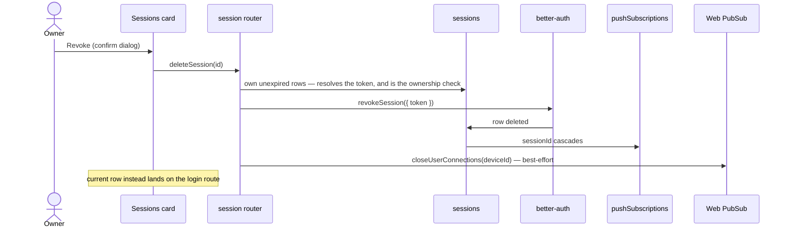

# Session And Device Management

A Sessions section at `/user/settings` lists the account's active sessions — which browser, when it was last active, which one you are reading from — with a confirm-guarded revoke per row and a sign-out-everywhere-else action. It closes the gap OAuth-only sign-in leaves open: revoking a provider grant stops future sign-ins, but the session rows are **ours** and keep working until they expire.

## What a row shows

A row renders what the session row already stores, and nothing more:

- **The browser and platform**, from `getDeviceLabel`, which reads the ordered marker list rather than the raw `userAgent`. Order is the whole trick — every Chromium browser still claims `Chrome` and every one of those still claims `Safari`, so the most specific claim has to be read first or Edge reports itself as Chrome. A string it recognises nothing in reads as `Unknown device` instead of being echoed back raw.
- **Last active**, as a `NuxtTime` like every rendered date ([date and time display](/docs/architecture/date-time-display)). The value is the session's `updatedAt`, which better-auth refreshes on its own session-update age rather than on every request — so this is "recently" rather than "to the second", and reads as such.
- **This device**, marked on the current row, because that is the one whose button signs the reader out rather than removing someone else.

**The stored `ipAddress` never leaves the server.** `SessionSummary` is the shape the endpoint returns and it has no address field: an address does not help the holder recognise a session, and a shared screenshot would carry it. Place at city granularity would be worth showing, but it is a lookup dependency rather than a computation — until something in the stack can answer it, the row shows a device and a time, which is enough to recognise.

## Revoking

**A session token never reaches the client.** The client names a session by id; the router reads the caller's own unexpired rows, resolves the token there, and revokes with that. Scoping the read to the caller is the ownership check — an id that is not in it is a `NOT_FOUND` rather than someone else's session being signed out.

**The reads are ours, the writes are better-auth's**, and the split is not stylistic. better-auth's `listSessions` endpoint sits behind its freshness middleware, which rejects any session older than `freshAge` — a day by default — so a reader who signed in yesterday would get a `SESSION_NOT_FRESH` where the card should be. Its revoke endpoints ask only for a valid session, so those are called directly, which keeps the session table better-auth's to mutate: a session cache or secondary storage added later invalidates with the revoke instead of behind its back.

Expired rows are filtered out of the listing, the same way better-auth's own listing filters them — nobody is signed in with a session that has run out, and showing it invites a revoke that does nothing.

**A push subscription belongs to the session that created it, not to the browser that once signed in.** `pushSubscriptions.sessionId` references `sessions` and cascades, so a revoke takes that device's pushes with it — and so do a plain sign-out and an expiry, with no cleanup path of their own. A subscription outliving its session still resolves and still delivers ([push notifications](/docs/esbabbler/push-notifications)), which is the hole this closes: keyed by account alone, a device someone had signed out of kept receiving that account's pushes.

Losing the row costs nothing, which is what makes the cascade cheap rather than destructive: `usePushSubscription` resubscribes on mount, so the next authenticated load writes it again under the session actually in use. That is also why the migration **clears the existing rows** — they predate the column, so no value would satisfy the constraint, and each browser rewrites its own on its next visit.

The constraint is worth the friction it caused. Writing a subscription now requires its session to exist as a row, which turned out to be false in the test harness rather than in the app: `auth.api.getSession` was mocked to fabricate session identity that nothing had ever stored. Since both callers await it, the mock now writes the row it fabricates, which is what the real sign-in does — so the suite exercises the same invariant production does instead of one nothing enforced.

One genuine schema fix travels with this: **`sessions.userId` cascades on the user now**, like every other row a user owns. It never did, so deleting a user who still held a session violated the constraint — a defect the suite was hiding, because no test had a session row until this feature gave sessions a reader.

**Live connections are closed explicitly**, because a Web PubSub client access url outlives the session that minted it. Web PubSub identifies a connection by _device_ — `userId⟂sessionId`, see `generateWebPubSubClientAccessUrl` — so `closeUserConnections` addresses exactly one session's connections. It is best-effort in full, the service client included: the revoke has already landed by then, so a hub that cannot be reached costs a connection living until it drops on its own, rather than a revoke reported as failed.

Revoking your **own** row is sign-out: the wording says so before the click, and the card lands on the login route rather than refreshing a listing the page can no longer read. The auth cookie is left in place and inert — it names a session row that no longer exists, so the next request resolves no session.

## Confirmation

Both destructive actions confirm through the shared `StyledDeleteFormDialog` ([destructive confirmation](/docs/architecture/destructive-confirmation)) at the plain-confirm tier — no type-the-name guard, because a revoked session is re-created by signing in again. The per-row dialog is a [singleton](/docs/architecture/singleton-dialogs) targeted by `revokingId` in `store/user/sessionDialog`; the sign-out-everywhere-else dialog mounts once beside the list, so it stays a button and its dialog in one component.

## Not included

No admin-facing counterpart. An operator terminating another user's sessions is a moderation capability, and moderation acts on room membership rather than on the account surface ([moderation](/docs/esbabbler/moderation)) — if it is ever wanted it is its own design, not a permission bolted onto a self-service card.

## Procedures

| Procedure                     | Auth   | Purpose                                                     |
| ----------------------------- | ------ | ----------------------------------------------------------- |
| `session.readSessions`        | authed | own sessions as `SessionSummary[]`, the current one marked  |
| `session.deleteSession`       | authed | revoke one session by id, then close its connections        |
| `session.deleteOtherSessions` | authed | revoke every session but the current one, then close theirs |

## Key files

| File                                                          | Role                                                 |
| ------------------------------------------------------------- | ---------------------------------------------------- |
| `packages/app/server/trpc/routers/session.ts`                 | the three procedures                                 |
| `packages/app/server/models/session/SessionSummary.ts`        | what a row is allowed to say — no address            |
| `packages/app/server/services/auth/closeDeviceConnections.ts` | best-effort per-device Web PubSub close              |
| `packages/app/app/components/User/SessionsCard/`              | the card, its row, and the two confirm dialogs       |
| `packages/app/app/services/auth/getDeviceLabel.ts`            | ordered user-agent markers → a readable device label |
| `packages/app/app/store/user/sessionDialog.ts`                | the singleton revoke target                          |
| `packages/db-schema/src/schema/pushSubscriptions.ts`          | `sessionId`, cascading on the session row            |
| `packages/db-schema/src/schema/sessions.ts`                   | the session rows, now cascading on the user          |
