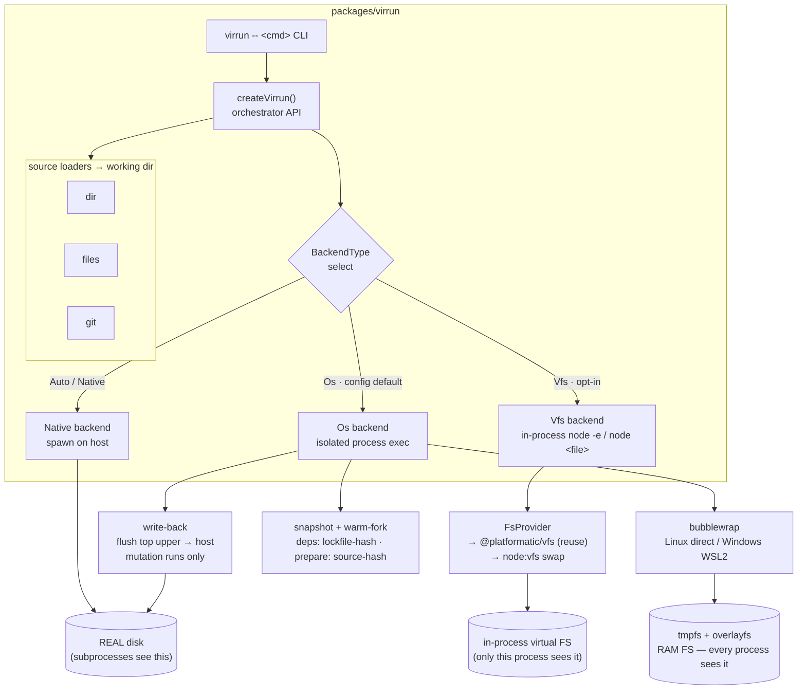

# Architecture

High-level system map for virrun. One entrypoint (`createVirrun` / the `virrun -- <cmd>` CLI) resolves a **source** to a working directory, picks an **exec backend**, and routes every command through it. The backend is the only axis that changes what actually runs — and the only place the **subprocess wall** (below) is solved differently.

## System overview



The two os-backend paths on the right are the persist axis: a **mutation run** flushes its produced files back to the real disk ([write-back](/docs/virrun/write-back)), while a **verification/CI fork** lets writes vanish in RAM ([snapshot and fork](/docs/virrun/snapshot-and-fork)). Both fork the warm snapshot — only the top mount differs.

## The five layers

```text
┌─ orchestrator API (TS, node-compat)   ← public surface — /docs/virrun/orchestrator-and-cli
├─ shell layer (optional)               ← parse/dispatch shell scripts
├─ exec + isolation layer   ★ THE CORE  ← run real processes, sandboxed — /docs/virrun/execution-backends
├─ snapshot / warm-fork layer           ← freeze + clone warm state; write-back flush
└─ virtual filesystem layer             ← RAM-backed files
```

| Layer            | Build or reuse                     | Source                                                       |
| ---------------- | ---------------------------------- | ------------------------------------------------------------ |
| Orchestrator API | **Build**                          | new                                                          |
| Shell            | **Reuse** (optional)               | just-bash (parser + builtins only)                           |
| Exec + isolation | **Build — this is the novel work** | new                                                          |
| Snapshot / fork  | **Build**                          | new — own overlayfs FS-only snapshot (CRIU/microVM deferred) |
| Virtual FS       | **Reuse**                          | `@platformatic/vfs` → swap to `node:vfs`                     |

The only layer no existing package solves is **exec + isolation**. Everything else is glue or reuse — see [prior art](/docs/virrun/prior-art). Write-back is a reconciliation step on the snapshot/fork layer: it reuses the same persistable overlay upper the snapshot capture uses, but flushes it to the host working directory instead of freezing it as a cache layer.

## The subprocess wall (the crux)

`node:vfs` and `@platformatic/vfs` intercept the **in-process** JS `fs` module and module loader. They are blind to anything a child process does:

```text
node process ──fs calls──► node:vfs        ✅ sees virtual files
   └─ spawn("pnpm" / "esbuild" / "sharp") ──raw syscalls──► REAL disk   ❌ VFS blind
```

A real toolchain (`pnpm install`, native postinstalls like sharp/esbuild) is mostly spawned subprocesses, so an in-process VFS alone **cannot** put a real install in RAM. This single fact splits the product into two execution backends:

- **`vfs` backend** — in-process, node:vfs-backed. Pure-npm, cross-platform, no native subprocess. Good for sandboxing/evaluating pure JS and lightweight runs.
- **`os` backend** — OS-level RAM filesystem (`tmpfs` + `overlayfs`) under an OS sandbox (`bubblewrap`). Every process, including native binaries, sees the RAM FS. This is the **generic any-repo** path. Linux-core; Windows reaches it through WSL2, macOS would need a VM bridge (deferred).

Detail: [execution backends](/docs/virrun/execution-backends).

## Where the speed comes from

1. **RAM filesystem** (`tmpfs` upperdir) — `node_modules` never touches disk.
2. **Shared content-addressable store** — deps download once into `.virrun/store/pnpm`, then are reused by each sandbox.
3. **Snapshot + warm-fork** — "clone repo + install" happens once; each run forks the warm state → near-instant repeated runs. The biggest win.
4. **Task cache** — skip a persist run whose inputs are unchanged, keyed by `sha256(lockfile-hash + working-tree-hash + command)`; a hit skips the sandbox and replays the recorded output diff + streams. A dev-loop lever — off in CI, where a fresh commit means ~0 hits. See [config and cache](/docs/virrun/config-and-cache).
5. **WSL source mirror + manifest delta (win32)** — the sandbox reads source from an ext4 mirror instead of `/mnt/c` (v9fs, 15–64× slower), kept fresh by a host-side manifest diff that ships only changed files. See [WSL source sync](/docs/virrun/wsl-source-sync).

A blunt caveat the numbers force: per **cold command**, the os backend is marginally _slower_ than native (inherent overlayfs read overhead, ~30–50% on the file I/O a command does) — the OS page cache already serves a warm native run's reads from RAM, so "RAM filesystem" is not a per-command speedup. Items 3–5 are the actual product: skip the install, skip the unchanged re-run, and don't pay bridge taxes for the privilege.

A persist (write-back) run keeps these wins: the toolchain still does its random I/O in RAM, and persistence is a single bulk copy-out of the final diff at the end — far cheaper than letting the command thrash the disk throughout.

## Platform reality

| Host              | Fast path                                             |
| ----------------- | ----------------------------------------------------- |
| Linux             | native: tmpfs + overlayfs + bwrap sandbox             |
| Windows           | WSL2 bridge into Linux bwrap                          |
| macOS             | Firecracker or lightweight Linux VM bridge (deferred) |
| Anywhere, JS-only | `vfs` backend, pure node, no OS features              |

A pure-TS, cross-platform engine that runs **native** binaries against a RAM FS does not exist and cannot — accept Linux core + VM bridge elsewhere. The `vfs` backend is the only truly cross-platform mode, and it is JS-only by nature.
