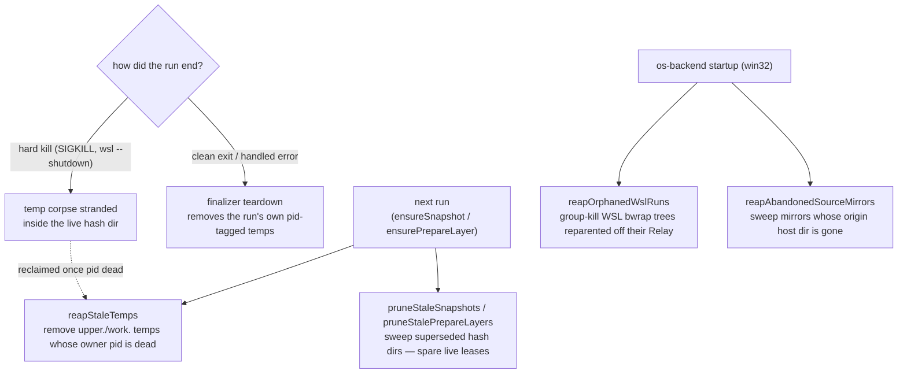

# Cache

Everything virrun materializes on disk to make sandboxed runs fast. Local, machine-specific, fully disposable — deleting it only forces the next routed run to repopulate. Never committed.

## Layout

```text
<repo>/.virrun/        # repo-local, gitignored (virrun adds the ignore line on first write)
  store/               # shared content-addressable pnpm dep store

~/.virrun/             # host-global (VIRRUN_CACHE_HOME override), shared across repos/CI
  snapshots/<hash>/    # warm post-install snapshots, keyed by lockfile hash
    upper/  work/       # overlayfs layers — upper persists the install, work is overlay scratch
    leases/<pid>        # live-user leases — a superseded dir is spared while a concurrent run holds one
  prepare/<key>/       # source-keyed prepare layers (.nuxt); key = lockfile + source-tree + prepare step
  tasks/<key>/         # task cache — one recorded exit-0 persist run per key
  sources/<hash>/      # win32 only — ext4 source mirrors, keyed by sha256(host cwd)
  capability.json      # persisted os-backend capability probe verdict

# win32 only — Windows-side (%USERPROFILE%\.virrun), NOT the WSL-ext4 ~/.virrun above
  wsl-login-path.json  # persisted WSL interactive-login PATH
  wsl-cache-root.json  # persisted WSL native ext4 cache root
```

- **`store/`** (repo-local) — deps download once; the `os` backend bind-mounts `<repo>/.virrun/store/pnpm` writable into each sandbox and exposes it through pnpm env. Repo-local is fine because it is a **bind** mount, and binds may overlap the working-dir overlay. Package imports use copy — hardlinks cannot cross from the on-disk store into the RAM overlay.
- **`snapshots/`** and **`prepare/`** (host-global) — the warm-fork layers; keying, publish, and eviction are covered in [snapshot and fork](/docs/virrun/snapshot-and-fork). They live in `~/.virrun`, not the repo, because a fork stacks them as **overlay lowers** beside the source, and overlayfs rejects a lower that nests inside another.
- **`tasks/`** (host-global) — the [task cache](/docs/virrun/task-cache).
- **`sources/`** (host-global, win32) — the [WSL source mirrors](/docs/virrun/wsl-source-mirror).
- **`capability.json`** — the persisted verdict of the os-backend capability probe (`isOsBackendSupported`), keyed by `platform:kernel-release`. Every `virrun -- <cmd>` is a fresh process; without this each command would re-run the probe — a bwrap overlay mount on Linux, three `wsl.exe` round-trips on win32. The key self-invalidates on a kernel change; a change it can't see (bwrap just installed) is covered by `VIRRUN_FORCE_PROBE` or `cache clean --all`.
- **`wsl-login-path.json` / `wsl-cache-root.json`** (win32, Windows-side) — the persisted results of the two WSL environment probes: the interactive-login `PATH` (a login-shell spawn, the expensive one) and the WSL native ext4 cache root. Stored Windows-side rather than in the WSL-ext4 `~/.virrun` because locating that root _is_ `getWslNativeCacheRoot` — caching it there would be circular. Only a **successful** probe is persisted; a transient WSL failure returns the degraded default and re-probes next run rather than caching the miss.

## Cleanup and self-healing

Every cache write is disposable, but it must not accumulate. All cleanup runs off the command's critical path — detached, best-effort, a failure never aborts the run — and all of it is **concurrency-safe via process liveness**: every temp and lease carries its owning pid, so a sweep reclaims only what a _dead_ process left behind. The host-global cache is shared across repos, worktrees, and mid-run branch switches, so "two live runs at once" is the normal case, not an edge one.



- **Finalizer teardown (clean exit)** — each run captures into a private pid-tagged `mkdtemp` sibling (`upper.<pid>.<rand>` + `work.<pid>.<rand>`); its finalizer removes that temp on success and handled error. The published layer is promoted by an atomic `renameSync`, so the temp never survives a normal exit.
- **Stale-entry prune (next run)** — only the current lockfile hash / source key is reused, so `ensureSnapshot`/`ensurePrepareLayer` sweep every superseded `snapshots/<hash>` and `prepare/<key>` before hitting or minting the live one. A superseded dir may still be _another_ live run's current one, so each is spared while it holds a live **lease** — a `leases/<pid>` file written on mount and dropped on dispose; dead-pid leases are reaped in passing, so a hard-killed run's lease self-heals.
- **Temp-corpse reap (next run)** — a hard kill skips the finalizer, stranding a temp inside the live hash dir, which the prune deliberately skips. `reapStaleTemps` removes an `upper.`/`work.`-prefixed sibling **only when its owner pid is dead** (`parseTempOwnerPid` → `isProcessAlive`), never the published bare `upper`/`work` or `leases/`. The task cache's recorder temps use the same pid-gated reaper.
- **Abandoned-mirror reap (win32, startup)** — the source mirror is the one cache entry keyed on a live repo path rather than a lockfile/source hash, so nothing supersedes it; `reapAbandonedSourceMirrors` instead sweeps entries whose `origin` marker points to a now-absent host path (deleted worktree, moved repo). A missing or blank marker is spared — reap only what is provably abandoned.
- **Orphaned-WSL-run reap (win32, startup)** — a hard kill also skips the SIGINT/SIGTERM reaper that group-kills the run's WSL-side bwrap tree, leaving `sh`+bwrap reparented to init and pinning the store/snapshot open. `reapOrphanedWslRuns` group-kills exactly those orphans, identified precisely rather than by TTL: a live run's shell is parented by the `wsl.exe` `Relay(<pid>)`, so a shell whose parent is not a `Relay` is orphaned.

The prune and the reaps share one primitive, `sweepStaleEntries(dir, isStale)` — list a cache dir's child directories and detach-remove each the predicate selects — so "iterate + guarded detached teardown" lives in exactly one place. The pid-gated selectors build on one liveness check, `isProcessAlive(pid)` (`process.kill(pid, 0)`).

## Key files

Paths relative to `packages/virrun/src/`.

| File                                              | Role                                                                          |
| ------------------------------------------------- | ----------------------------------------------------------------------------- |
| `services/exec/util/getGlobalCacheDirectory.ts`   | host-global cache root (`VIRRUN_CACHE_HOME` override; WSL ext4 root on win32) |
| `services/exec/snapshot/sweepStaleEntries.ts`     | the shared iterate + guarded detached-teardown primitive                      |
| `services/exec/snapshot/reapStaleTemps.ts`        | pid-gated temp-corpse reaper                                                  |
| `services/exec/snapshot/createLease.ts`           | `leases/<pid>` live-user lease written on mount                               |
| `services/exec/os/isOsBackendSupported.ts`        | the capability probe behind `capability.json`                                 |
| `services/exec/wsl/reapOrphanedWslRuns.ts`        | startup group-kill of Relay-orphaned WSL bwrap trees                          |
| `services/exec/wsl/reapAbandonedSourceMirrors.ts` | startup sweep of origin-dead source mirrors                                   |

## Notes

- The `os.tmpdir()` git/files source-clone root is deliberately outside this scoping — it has no per-entry owner and is left to the OS's tmp reaping (reboot / systemd-tmpfiles).
- `cache ls` inspects, `cache clean` removes the repo-local `.virrun`, `cache clean --all` additionally drops the host-global snapshots, prepare layers, task cache, and win32 source mirrors — all via the safe detached teardown.
