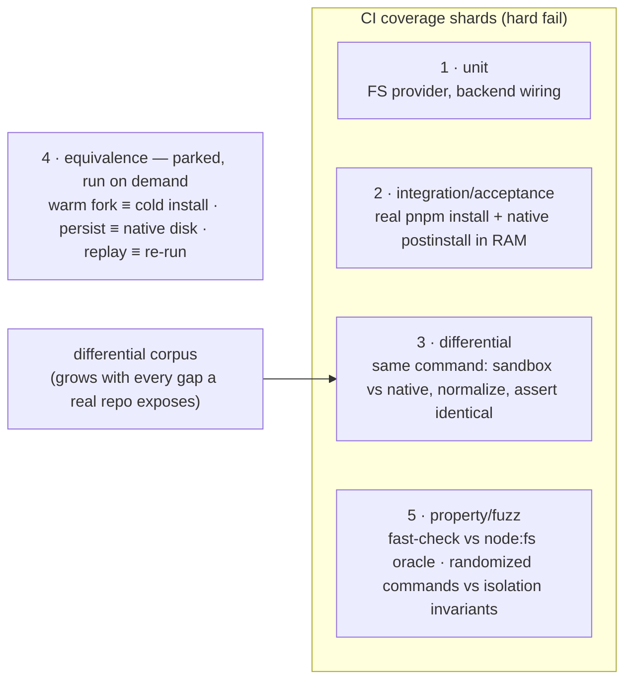

# Correctness

The correctness gate. A sandbox that runs commands faster but produces different results than running them normally is worse than useless — it silently breaks builds. Correctness beats speed, always; this is the largest test surface in the package.

## The bar: behaviourally identical to native

For any command, the sandbox must produce the same observable result as running it natively: same **exit code**, same **stdout/stderr** (modulo explicitly-normalized nondeterminism), same **files produced** (content-identical), same **dependency resolution** (lockfile honored). The `vfs` backend's no-native-subprocess limit is a _capability_ boundary, not a correctness excuse — within its scope it must match native exactly; outside it, it must fail loudly (fall back), never silently differ.

## Test layers

1. **Unit** — FS provider (read/write/overlay/symlink/module-load), exec backend wiring, snapshot addressing. Fast, deterministic, run everywhere; lives beside the code (`*.test.ts`).
2. **Integration/acceptance** — a real `pnpm install` with a native postinstall (sharp, esbuild) completing fully in RAM — the `os` backend's reason to exist (`*.acceptance.test.ts`).
3. **Differential (golden)** — the core technique: run the _same command_ through the candidate backend and the native baseline, normalize both, assert identical. Shared infrastructure under `services/exec/differential/`; each backend's `*.differential.test.ts` feeds its corpus to one helper. **Nothing is normalized implicitly** — each case carries explicit `{ pattern, placeholder }` rules, so a real divergence is never hidden. Every reported correctness bug becomes a permanent golden case before it's fixed.
4. **Equivalence** — `forkSnapshot.equivalence.test.ts` proves a forked warm run is observably identical to a cold in-place install; `persistRun.equivalence.test.ts` proves a persist run leaves the host disk exactly as native would ([write-back](/docs/virrun/write-back)); `taskCache.equivalence.test.ts` proves a replay matches a real re-run. All three are **parked as `describe.todo`**, not skipped by host capability: every case boots a sandbox and installs, so a layer that costs minutes of wall clock is not worth paying on every run of the whole repo's suite. Bodies stay intact and each grows its golden cases as usual — drop the `.todo` to run one when the path it covers changes. Nothing else in the package asserts these three properties, so a regression in one merges green.
5. **Property/fuzz** — two halves. The vfs seam: fast-check drives randomized read/write/exists sequences against the provider and a real `node:fs` temp dir in lockstep and diffs the full trace (node:fs is the oracle, so no fs semantics are re-implemented; failures shrink to a minimal counterexample). The os half: randomized _command_ sequences through the ephemeral RAM overlay assert the isolation invariants under every ordering — the host disk is never mutated, no write leaks across fresh-per-exec uppers, every command yields a well-formed result. Host-gated, small run counts (each op is a real subprocess).

## Key files

Paths relative to `packages/virrun/src/`.

| File                                                         | Role                                                                                          |
| ------------------------------------------------------------ | --------------------------------------------------------------------------------------------- |
| `models/exec/differential/DifferentialCase.ts`               | one corpus entry — `command` + `name` + optional per-case normalization rules                 |
| `models/exec/differential/NormalizationRule.ts`              | a single explicit `{ pattern, placeholder }` substitution                                     |
| `services/exec/differential/normalizeExecResult.ts`          | applies a case's rules to stdout/stderr (exit code untouched)                                 |
| `services/exec/differential/differentialCorpus.test.ts`      | `NODE_DIFFERENTIAL_CORPUS` (every backend) + `SHELL_DIFFERENTIAL_CORPUS` (real-exec backends) |
| `services/exec/differential/assertDifferential.test.ts`      | candidate vs native baseline, normalize, assert identical — the shared body                   |
| `services/exec/os/createOsBackend.differential.test.ts`      | os backend × shell corpus + the host-disk isolation assertion                                 |
| `services/exec/vfs/createVfsBackend.differential.test.ts`    | vfs backend × node corpus + the overlay fall-through case                                     |
| `services/exec/snapshot/forkSnapshot.equivalence.test.ts`    | warm fork ≡ cold install                                                                      |
| `services/exec/snapshot/persistRun.equivalence.test.ts`      | write-back host parity vs native                                                              |
| `services/exec/cache/taskCache.equivalence.test.ts`          | cache replay ≡ a real re-run                                                                  |
| `services/vfs/createPlatformaticFsProvider.property.test.ts` | fast-check FS sequences vs the node:fs oracle                                                 |
| `services/exec/os/createOsBackend.property.test.ts`          | fast-check command sequences vs the isolation invariants                                      |

## Notes

- The full matrix to keep covering as the corpus grows: package managers × {with, without native deps} × backends × cache states (cold, warm store, warm snapshot) × hosts (Linux native, WSL2 bridge). A pass on one cell is not a pass on the matrix.
- The differential suite is plain Vitest, so it hard-fails the CI coverage shards; speed is tracked separately by the committed bench artifacts ([benchmarking](/docs/virrun/benchmarking)) — a hard wall-clock CI gate is rejected as runner-noise-flaky ([CI wall-time gate](/docs/virrun/rejected/ci-walltime-gate)).
