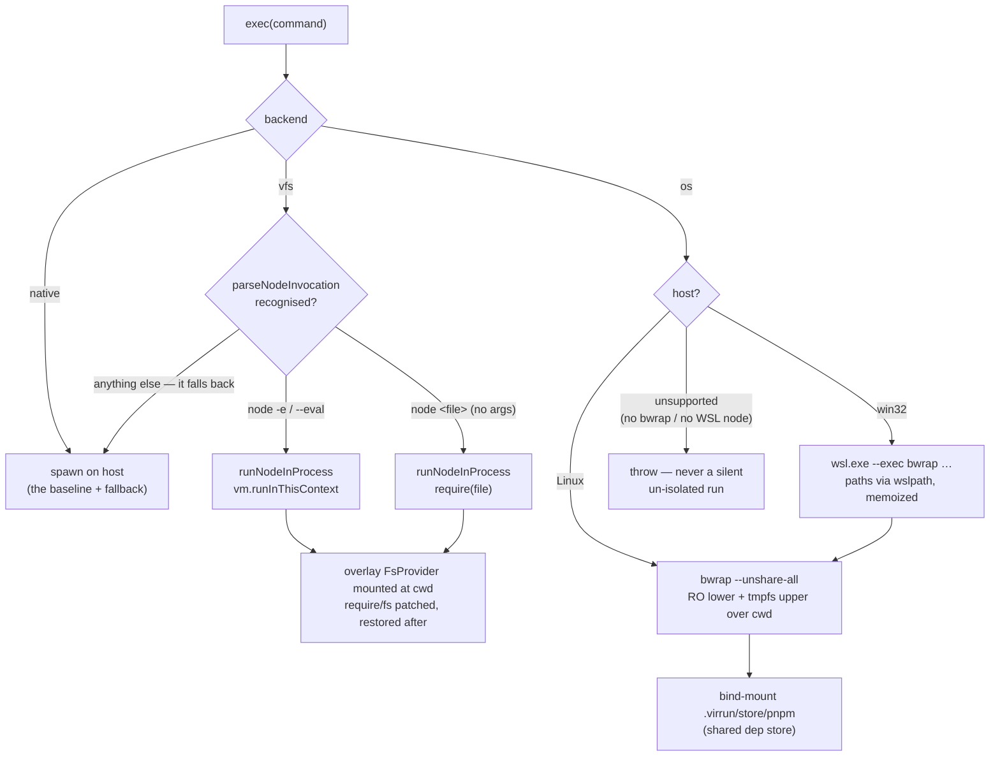

# Execution backends

The core, novel work: run a repo's **real** commands against a RAM filesystem, isolated from the host. Three pluggable backends implement one `ExecBackend` interface; the orchestrator picks via `BackendType` (`auto` | `native` | `vfs` | `os`). `auto` resolves to `native` today — no non-native backend has beaten the gates by default.

## How it works

## `vfs` backend — in-process, pure npm

Runs JS workloads in-process so the virtual filesystem intercepts their fs calls and module loading. A shell-aware tokenizer parses the invocation; inline code (`node -e`/`--eval`) runs via `vm.runInThisContext`, a file (`node <file>`, a lone non-flag path, no script args) via `require` — both inside an overlay `FsProvider` mounted at the working directory so the module loader and core `fs` serve virtual files (or fall through to real disk). Process streams/exit and `require` are patched for the run and restored after; the require cache is cleared back to its pre-run state so each run re-executes like a fresh process.

**Correctness is preserved by falling back to native** for anything not run faithfully in-process — shell features, other flags, file runs with args, syntax errors, uncaught errors, async results, missing files — so the observable result always matches the baseline. Opt-in only: it runs code in the host process with no isolation, so `Auto` never selects it.

### The virtual filesystem underneath

The FS layer is **reused, not built**. Node is standardizing a core `node:vfs` module (nodejs/node#61478); `@platformatic/vfs` (MIT) is the same work extracted to userland. virrun depends on platformatic behind a thin internal interface (`FsProvider`) — one module owns the import, so the swap to `node:vfs` when it lands is a single-file change. It provides fs API compatibility (read/write/streams/promises/symlinks/watchers), mounting at a path prefix, overlay mode (virtual paths intercepted, everything else falls through to real disk), and module loading from virtual files.

Usage contract: `mount(prefix)` maps the prefix onto the provider root, so **mount first, then read/write the prefixed paths** — writing a prefixed path before mounting stores it literally and the post-mount lookup misses it. `dispose()` unmounts and is safe to call when already torn down.

Hard limit: in-process JS only. Child processes and native binaries bypass it with raw syscalls — the subprocess wall in [architecture](/docs/virrun/architecture). Closing that gap is the `os` backend's job.

## `os` backend — native, generic (Linux core, WSL2 bridge)

Makes **every** process, including spawned native binaries, see the RAM FS by moving the filesystem and isolation down to the OS:

- **RAM filesystem** — `bubblewrap` supplies it directly: `--overlay-src <cwd>` is the read-only lower (the source) and `--tmp-overlay <cwd>` overmounts the working directory with an overlay whose upper is an invisible `tmpfs`. Reads hit the real source; all writes (`node_modules`, build output) stay in RAM.
- **Isolation** — bubblewrap: one unprivileged tool collapses overlay + tmpfs + namespaces (`--unshare-all`, `--die-with-parent`). Unlike `vfs`, the `os` backend **never falls back to native at run time**: an unsupported host throws, because a silent un-isolated run would be a wrong answer disguised as success. (Backend _selection_ may still degrade to native before a run starts — and says so on stderr, because the sandbox's own lines are the only other trace of it.)
- **Dep store** — `.virrun/store/pnpm` is created lazily in the consuming repo, gitignored, bind-mounted writable into the sandbox, and exposed through pnpm env so deps download once. Package imports use copy because hardlinks cannot cross from the on-disk store into the RAM overlay.
- **Package-manager bootstrap** — `/` is mounted read-only, so a command that shells out to `pnpm` runs the node manager's corepack shim and its download of the repo's pinned `packageManager` would die `EROFS` under `$HOME/.cache`. `COREPACK_HOME` points at `.virrun/store/corepack`, bound writable into **every** run — the install and the ordinary commands alike ([cache](/docs/virrun/cache)).
- **Guest toolchain (win32)** — `wsl.exe --exec` skips the login + rc files, so a profile-bound version manager's node is off `PATH`. `readWslLoginEnvironment` captures the `PATH` a real interactive login shell sees — plus that `PATH`'s node version, which is the node the sandbox actually runs and what the run banner reports. The capture is persisted host-side and age-bounded, so a node upgrade can't silently pin the sandbox to the old version.
- **Windows bridge** — on win32, `createOsBackend` invokes `wsl.exe --exec bwrap ...` against the same bwrap argv. Windows cwd and bind paths are translated once through `wslpath` (memoized), and pnpm store env is translated before entering Linux, so the public backend contract stays unchanged. Source reads come from an ext4 mirror, not `/mnt/c`.
- **macOS bridge** — deferred; there is no WSL equivalent to target.

The acceptance test that proves the subprocess wall is broken: `pnpm install` on a repo with a native postinstall (sharp or esbuild) completes **fully in RAM**, isolated from the host, and the resulting `node_modules` is invisible to the real disk.

## Key files

Paths relative to `packages/virrun/src/`.

| File                                           | Role                                                                         |
| ---------------------------------------------- | ---------------------------------------------------------------------------- |
| `models/exec/ExecBackend.ts`                   | interface every backend implements                                           |
| `services/exec/native/createNativeBackend.ts`  | native passthrough (the baseline + fallback)                                 |
| `services/exec/vfs/createVfsBackend.ts`        | parse-and-delegate: in-process when recognised, else native                  |
| `services/exec/vfs/parseNodeInvocation.ts`     | recognise `node -e`/`--eval` and `node <file>`                               |
| `services/exec/vfs/runNodeInProcess.ts`        | in-process runner over the overlay-mounted FS layer                          |
| `models/vfs/FsProvider.ts`                     | internal FS interface the runtime codes against                              |
| `services/vfs/createPlatformaticFsProvider.ts` | adapter over `@platformatic/vfs`; the lone import = the `node:vfs` swap shim |
| `services/exec/os/createOsBackend.ts`          | chooses Linux bwrap or Windows/WSL bwrap                                     |
| `services/exec/bwrap/createLinuxOsBackend.ts`  | spawns commands inside the Linux bwrap RAM overlay                           |
| `services/exec/wsl/createWslOsBackend.ts`      | spawns Linux bwrap through `wsl.exe` on Windows                              |
| `services/exec/bwrap/buildBwrapArgs.ts`        | pure builder for the bwrap overlay argv                                      |
| `services/exec/os/isOsBackendSupported.ts`     | Linux/WSL + bubblewrap availability check                                    |

## Notes

- Native-binary support across platforms is impossible in pure JS; the `os` backend is Linux-core and bridged elsewhere — accepted, see the platform table in [architecture](/docs/virrun/architecture).
- The shell layer (just-bash parser/builtins) is optional sugar for running shell scripts; it is **not** an exec engine and never spawns native binaries ([pure-JS exec](/docs/virrun/rejected/pure-js-exec)).
- Do **not** use just-bash's FS abstraction — platformatic _is_ node's fs, not a parallel one, so in-process tooling and the module loader see virtual files for free.
