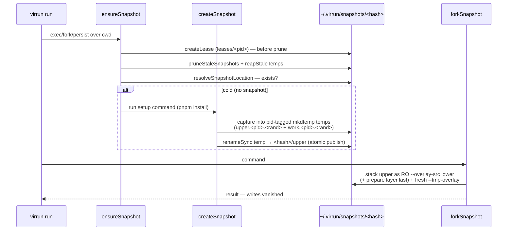

# Snapshot and fork

Booting a repo and installing deps is the slow part and it is identical across runs. virrun does it **once**, snapshots the warm state, then forks a fresh isolated sandbox per command — repeated runs skip install entirely. This is the largest speed win.

## How it works

On the `os` backend the mechanism is a custom **overlay-layer snapshot** (FS-only, no CRIU): a capture run persists the post-install writes into a real overlay upper (`bwrap --overlay <upper> <work> <dir>`); a fork run stacks that frozen upper as a read-only `--overlay-src` lower beside the source and tops it with a fresh `--tmp-overlay` so its own writes vanish.

## Caching

- The snapshot cache is keyed by **lockfile hash** (`computeLockfileHash`, sha256 of `pnpm-lock.yaml`) and stored in the **host-global** cache root `~/.virrun/snapshots/<hash>` (`VIRRUN_CACHE_HOME` override; on win32 the WSL-native ext4 root). Host-global for two reasons: overlayfs rejects a lower that nests inside another lower, so a `<cwd>/.virrun/snapshots` layer would fail at fork; and the same deps then reuse one warm snapshot across repos. The repo-local `.virrun/store` (dep store) stays put — it is a **bind** mount, and binds may overlap the overlay.
- Evicted by lockfile hash, not LRU: only the current lockfile's hash is reused, so `ensureSnapshot` sweeps every superseded `snapshots/<hash>` (`pruneStaleSnapshots`), sparing any a concurrent run still leases. See [config and cache](/docs/virrun/config-and-cache) for the full cleanup model.
- CI does not consume the snapshot: the platform-branched config resolves `native` on the Linux runners, so verify jobs run a plain `pnpm i` from the pnpm store cache. The snapshot is the win32/local os-backend warm path — `virrun warm` provisions it ahead of time.

## Prepare layer (source-keyed generated artifacts)

The deps snapshot is keyed on the **lockfile** and must freeze only what the lockfile determines. Framework codegen written into the source tree (Nuxt's `.nuxt`) is **source**-derived and, on a win32 host, also **platform**-specific: the host's win32-generated `.nuxt` makes a Linux sandbox's type-aware linter collapse types to `any` (a phantom `no-unnecessary-type-parameters`) even though it is fine natively. `pruneSnapshotUpper` strips it from the deps snapshot; a **second overlay layer** owns it instead:

- **Keyed by lockfile + source-tree hash + the resolved prepare step** (`resolvePrepareLocation`, reusing `computeSourceTreeHash` — the same git-based working-tree hash as the task cache). A source edit re-keys and rebuilds *this* layer only; the deps snapshot is untouched (no reinstall).
- **Built by `createPrepareLayer`**: fork the deps snapshot as a read-only lower, run the environment's prepare command (`nuxt prepare`), keep only the declared outputs (`pruneToOutputs`), then atomically publish (same per-pid temp + rename barrier). The sandbox thus owns a **Linux-generated** `.nuxt` matching current source.
- **Stacked last** in the fork/persist lowers (`[depsUpper, prepareUpper]`): the last `--overlay-src` wins, so it shadows both the deps lower and the host's source copy. On win32 the source mirror excludes the outputs so the host copy never enters the sandbox.
- **Selected by the `environment` config preset** — omitted (default) means no layer; `nuxt` detects the nuxt package by its git-tracked `nuxt.config`. Preset-driven, no overrides. Write-back masks the outputs like `node_modules` (cache-owned, never flushed to the host).
- **Resolved once per fork/persist**: `ensurePrepareLayer` calls `resolvePrepareLocation` a single time, prunes superseded entries, re-checks existence **after** the prune, builds if absent — passing that same location so the layer publishes exactly where it will be mounted. One resolve means fork/persist can never key off a source-tree hash that shifted between the existence check and the mount.

## Concurrency safety (atomic publish)

`exists: existsSync(upperDir)` is the readiness signal every reader consumes, so it must only flip true on a **finished** layer. `createSnapshot` captures into pid-tagged `mkdtemp` temps under `<hash>/`, runs the setup command there, then a single `renameSync` promotes the temp upper onto the final `<hash>/upper`. Rename is the publish barrier — a concurrent reader sees either no upper or the complete one, never a half-built install.

- Parallel capturers never share an overlay upper/work (pid-tagged temps). A capturer that loses the race finds `upperDir` already published, keeps that equivalent layer, and drops its own temp.
- Teardown removes **only the capturing process's own temps**, never the shared `<hash>/` root.
- Cleanup is gated on **process liveness**, not a serial-run assumption: a hard-killed run's temp corpse is reaped only once its owner pid is dead, and a published hash dir a concurrent run still needs is pinned by a `leases/<pid>` file the prune honors. Detail: [config and cache](/docs/virrun/config-and-cache).

## Key files

Paths relative to `packages/virrun/src/`.

| File | Role |
| ---- | ---- |
| `services/exec/snapshot/computeLockfileHash.ts` | sha256 of `pnpm-lock.yaml` — the snapshot cache key |
| `services/exec/snapshot/resolveSnapshotLocation.ts` | resolve `~/.virrun/snapshots/<hash>` — pure addressing |
| `services/exec/util/getGlobalCacheDirectory.ts` | host-global cache root (`VIRRUN_CACHE_HOME` override; WSL ext4 root on win32) |
| `services/exec/bwrap/buildBwrapArgs.ts` | emit stacked `--overlay-src` lowers (fork) + persisted `--overlay` upper (capture) vs `--tmp-overlay` (ephemeral) |
| `services/exec/snapshot/createSnapshot.ts` | capture a setup command's writes into a per-pid temp upper, atomically rename into place |
| `services/exec/snapshot/forkSnapshot.ts` | run a command over a captured snapshot (upper stacked read-only, writes vanish) |
| `services/exec/snapshot/resolvePrepareLocation.ts` | resolve `~/.virrun/prepare/<key>` (lockfile + source-tree + prepare-step key) |
| `services/exec/snapshot/createPrepareLayer.ts` | fork the deps snapshot, run the prepare command, keep only outputs, atomically publish |
| `services/exec/snapshot/pruneToOutputs.ts` | strip a prepare capture down to the declared output subtrees |
| `services/exec/snapshot/pruneStaleSnapshots.ts` / `pruneStalePrepareLayers.ts` | evict superseded lockfile-/source-keyed entries |
| `services/configuration/resolvePrepareStep.ts` | resolve the `environment` preset to a `{ command, outputs }` step |
| `services/virrun/createVirrun.ts` | orchestrator `fork()`/`persist()` — os captures-or-reuses the snapshot + prepare layer; other backends fall through to `exec` |

## Notes

- FS-only snapshotting is the realized approach; CRIU process-state forking and Firecracker microVM snapshots stay deferred unless measured warm-boot time justifies them — see [decisions](/docs/virrun/decisions).
- Generated artifacts that are both source- and platform-specific never belong in the lockfile-keyed deps snapshot: they go in the source-keyed prepare layer, regenerated in-sandbox for the sandbox's own platform.
- The prepare layer obviated (and removed) the former `virtual-store-dir-max-length=60` install pin.
- On the `vfs` backend a fork would be a volume clone; process state is never preserved — only files.
