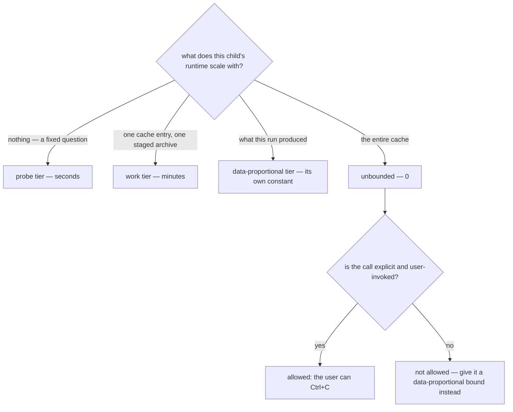

# Subprocess Timeouts

virrun spawns synchronous child processes for everything it cannot do in-process: capability probes, WSL round-trips, `rm -rf` of a cache root, `tar` staging a source mirror, the overlay write-back. Every one of them needs an answer to "how long may this take", and the answer kept getting re-argued per call site — a bound is added because a wedged WSL service must not hang the CLI, then removed because a SIGTERM mid-copy is worse than waiting, then added again.

Both halves of that argument are true. What settles it is not weighing them again, it is asking what the work **scales with**.

## The tiers

| Tier              | Constant                                                         | Scales with                   |
| ----------------- | ---------------------------------------------------------------- | ----------------------------- |
| Probe             | `PROBE_TIMEOUT_MS` (10s)                                         | nothing — a fixed question    |
| Work              | `WSL_WORK_TIMEOUT_MS`, `SOURCE_MIRROR_ARCHIVE_TIMEOUT_MS` (5min) | one cache entry / one archive |
| Data-proportional | `OVERLAY_WRITE_BACK_TIMEOUT_MS` (30min)                          | what the run itself wrote     |
| Unbounded         | `CACHE_CLEAN_TIMEOUT_MS` (0)                                     | the whole cache               |

**A timeout bounds a hang, never the work.** Its only job is to turn "this never returns and there is no error to explain it" — how an unbounded `execFileSync` against a wedged WSL service or 9p bridge actually presents — into a failure the caller can report. It is never a budget, and a child hitting its bound is always a bug report, never a routine outcome.

**So the bound is sized above the largest realistic run of that work, and the tier is chosen by what "largest realistic" depends on.** A probe asks a fixed question, so seconds is generous. A `rm -rf` of one cache entry is bounded by that entry, so minutes is generous. The write-back copies whatever the command wrote, so a cold `pnpm install` moves an entire `node_modules` across the 9p bridge — and putting that on the work tier is what produced the recurring bug: a copy SIGTERM'd partway, reported as a failure for a command that had already succeeded.

**Unbounded is a real option, and it is narrow.** `cache clean` gets `0` because a SIGTERM mid-sweep leaves a half-swept cache with no record of which roots survived, and — the part that makes it admissible — a clean is explicit and user-invoked, so the user is present and may Ctrl+C it. A child on the critical path of every run has neither property: nobody is watching it, so a hang there is indistinguishable from a crash and strands the CLI. **Never make an implicit, always-on step unbounded to avoid a partial artifact. Give it a data-proportional bound and make the partial artifact recoverable instead.**

## Adding a call site

1. Decide what its runtime scales with, and take the tier from the table.
2. If nothing in the table scales the same way, add a constant rather than borrowing the nearest one — a shared constant makes two unrelated bounds move together, which is how the write-back inherited a cap sized for a cache entry.
3. State in the constant's comment what the work is and why that size is above its largest realistic run.

## Key files

| File                                                             | Role                                       |
| ---------------------------------------------------------------- | ------------------------------------------ |
| `packages/virrun/src/services/exec/util/constants.ts`            | every bound, each with its own rationale   |
| `packages/virrun/src/services/exec/util/execFileHidden.ts`       | the single `execFileSync` wrapper          |
| `packages/virrun/src/services/exec/wsl/execWsl.ts`               | defaults WSL round-trips to the probe tier |
| `packages/virrun/src/services/exec/snapshot/runOverlayScript.ts` | the data-proportional case                 |

## Notes

- Two bounds are expressed in **seconds**, not milliseconds (`SOURCE_MIRROR_TIMEOUT_SECONDS`, `ORPHAN_REAP_MINIMUM_AGE_SECONDS`), because their consumers are Linux shell utilities (`flock -w`, `timeout`, `ps -o etimes`) rather than `execFileSync`. The tier rule is the same; only the unit changes.
- `execWsl` defaults to the probe tier so a call site that forgets to pass one gets the conservative bound rather than none. A call site doing real work must pass its own.
