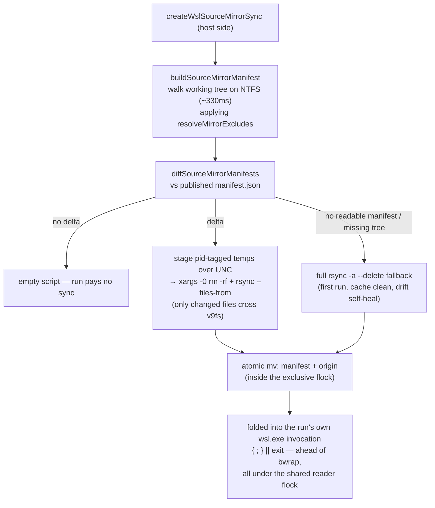

# WSL source mirror

On win32, the sandbox reads the repo source from a WSL-native ext4 mirror instead of straight from `/mnt/c`, so an `os` run stops paying the v9fs read tax on every source file — and the mirror is kept fresh by a **host-side manifest delta**, so the sync itself never stat-walks the tree over v9fs either.

## Why it exists

The WSL bridge had already moved the write-heavy caches (pnpm store, snapshot layers) onto ext4, but the source lower was still `/mnt/c`: every fork re-read the whole source tree — and the toolchain's own reads (tsc, vitest, eslint walking the tree) — over 9p/v9fs, documented at 15–64× slower than ext4. That was the win32 gap: `os/wsl` benched at 0.06–0.31× native vs Linux's 0.76–0.95×. The mirror fixed the toolchain's reads, but the first cut's per-run `rsync -a --delete` still quick-check stat-walked every source file over 9p — **~12.5s on a ~5k-file repo with zero changes**, larger than all the remaining overhead — which the manifest delta removes. Post-fix, win32 `vs base` moved to 0.46–0.91×, with build/persist/test in the Linux band.

## How it works

The mirror is a self-contained entry `<wslCacheRoot>/sources/<sha256(hostCwd)>/` holding the synced tree in `tree/`, an `origin` marker (the host cwd it was cloned from), and a `manifest.json` (the tree state the mirror holds). The `tree/` leaf is the `--overlay-src` read-only lower — but the overlay is mounted at, and `--chdir` goes to, the repo's **logical `/mnt/c` path**, not the mirror path (`buildBwrapArgs` takes a `sourceDir` decoupled from `cwd` for exactly this). Reads hit ext4 at native speed while `pwd` and every absolute path a tool emits match the native baseline. Write-back is unaffected: its flush target derives independently from `options.cwd`, and the mountpoint equals that host path, so the upper diff maps back 1:1.

- **Manifest delta** — the planner walks the working tree on the host FS (posix relative path → type/size/mtimeMs/symlink target — the same quick-check signal rsync uses) and diffs it against the published manifest. The walk is synchronous, unconditional, and on the hot path deliberately: it _is_ the change detector, and off-threading it would add IPC without cutting wall time.
- **Excludes** — `node_modules` (supplied by the snapshot lower), `.git` (large, churns every commit, unread by dev-loop commands), and an active `environment` preset's prepare outputs (`.nuxt` — owned by the prepare layer; the host's platform-specific copy must stay out of the sandbox or it shadows the layer). Everything else is mirrored: **over-copy is correctness-safe, under-copy is a bug.** One `resolveMirrorExcludes` feeds both the walk and the rsync fallback so the two sides always agree.
- **Folded invocation** — a non-empty sync script rides the run's own `wsl.exe` invocation as a preamble ahead of bwrap, not a separate spawn. A failed sync exits before the sandbox starts and surfaces its stderr — never a stale mirror, never an `os` → native fallback. On success the sync is silent, so the child's streams stay byte-exact vs native for the differential/task-cache captures.
- **Concurrency** — one per-mirror lock file, two sides. The whole mutation runs under the **exclusive** `flock`, so concurrent syncs serialize and a manifest is never published for a half-applied delta. Every run then holds the **shared** side for bwrap's whole duration, so a concurrent same-cwd sync waits for live readers to drain instead of tearing the source lower out from under a running sandbox — while concurrent clean-tree runs stay fully parallel. `flock -w` + `timeout` bound a stalled lock (`SOURCE_MIRROR_TIMEOUT_SECONDS`); it fails loudly rather than corrupting a reader.
- **Reaping** — `reapAbandonedSourceMirrors` sweeps entries whose `origin` points to a now-absent host path at os-backend startup; `reapStaleSourceMirrorTemps` unlinks staged temps whose host owner pid is dead. Both best-effort, off the critical path ([cache](/docs/virrun/cache)).

## Key files

Paths relative to `packages/virrun/src/services/exec/wsl/`.

| File                           | Role                                                                                                         |
| ------------------------------ | ------------------------------------------------------------------------------------------------------------ |
| `getSourceMirrorKey.ts`        | pure `sha256(hostCwd)` entry key, shared by the Linux-path and UNC-path resolvers                            |
| `getWslSourceMirrorPath.ts`    | pure `<entry>/tree` resolver — the `--overlay-src` lower                                                     |
| `buildSourceMirrorManifest.ts` | host-FS walk → manifest, applying the shared excludes; unreadable entries drop out and self-heal             |
| `diffSourceMirrorManifests.ts` | pure manifest diff → sorted copy/delete lists; a type flip lands in both so rsync recreates it cleanly       |
| `readSourceMirrorManifest.ts`  | UNC read + zod parse; undefined on missing/torn/drifted → full-rsync fallback                                |
| `resolveMirrorExcludes.ts`     | the one exclude source feeding both the walk and the rsync fallback                                          |
| `createWslSourceMirrorSync.ts` | the planner: walk + diff + temp staging → `{ lockPath, mirrorPath, script }` (`""` = skip)                   |
| `shellQuote.ts`                | single-quote shell escaping shared by the planner's script and the backend's lock wrapper                    |
| `createWslOsBackend.ts`        | startup reaps + fold the sync script ahead of bwrap inside the shared reader flock                           |
| `createWslBwrapArgs.ts`        | pass the mirror path as `buildBwrapArgs`' `sourceDir` while keeping the wslpath-translated cwd as mountpoint |
| `../bwrap/buildBwrapArgs.ts`   | optional `sourceDir` decoupling the lower from the mountpoint + `--chdir` (defaults to `cwd` on Linux)       |

## Notes

- **Goal is closing the v9fs gap, not guaranteed native-beating on win32.** Typecheck-cold stays at 0.46× because a ~0.9s native command cannot amortise the fixed sandbox setup. Report measured numbers honestly — never claim a win the bench doesn't show.
- **Manifest delta over git introspection (decided).** A git-driven delta (`git ls-files` + `git diff`) would miss gitignored-but-mirrored outputs (`dist`, …) and leave them stale — an under-copy bug. The stat-walk is also the change detector rsync itself uses, so delta and fallback agree by construction. Same blind spot as rsync's quick-check (a content change preserving size+mtime), accepted as parity.
- **Rejected: copy source into the snapshot** — the deps snapshot is lockfile-keyed and reused across many source states; folding mutable source into the immutable install layer breaks the cache model. **Rejected: full copy per run** — a cross-boundary full write each run costs more than the reads it saves; incrementality is load-bearing.
- The differential + write-back equivalence corpora already run on win32 and gate this: a stale or mis-synced mirror fails them. An unreadable working-tree **root** aborts the plan outright — degrading to an empty manifest would diff as "delete everything".
- Mirror sharing across worktrees of the same repo is unsupported (keyed by exact cwd).
- Native Linux keeps `--overlay-src` on the real source — no mirror, no sync.
