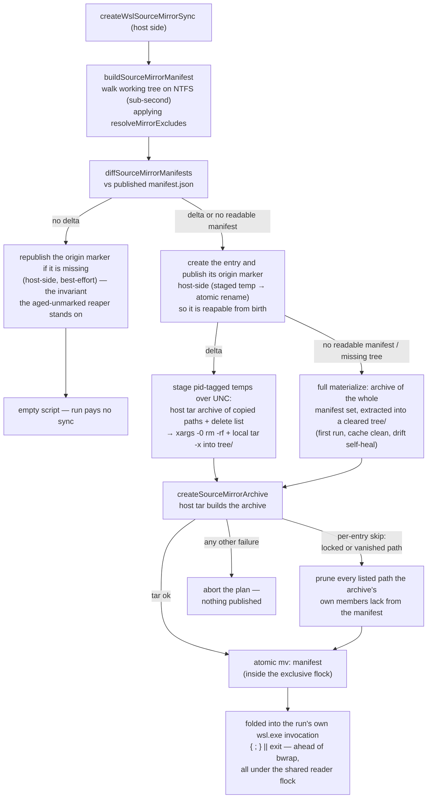

# WSL source mirror

On win32, the sandbox reads the repo source from a WSL-native ext4 mirror instead of straight from `/mnt/c`, so an `os` run stops paying the v9fs read tax on every source file — and the mirror is kept fresh by a **host-side manifest delta** whose data plane is a **host-staged tar archive**, so the sync itself never stat-walks _or copies_ the tree over v9fs file-by-file.

## Why it exists

The WSL bridge had already moved the write-heavy caches (pnpm store, snapshot layers) onto ext4, but the source lower was still `/mnt/c`: every fork re-read the whole source tree — and the toolchain's own reads (tsc, vitest, eslint walking the tree) — over 9p/v9fs, an order of magnitude slower than ext4 or worse. That was the win32 gap: `os/wsl` benched at a fraction of native vs Linux's near-native band. The mirror fixed the toolchain's reads, but the first cut's per-run `rsync -a --delete` still quick-check stat-walked every source file over 9p — **>10s on a repo of thousands of files with zero changes**, larger than all the remaining overhead — which the manifest delta removes. Post-fix, win32 moved with build/persist/test into the Linux band ([benchmarking](/docs/virrun/benchmarking) has the measured numbers).

The delta's data plane then hit the same wall the stat-walk had: rsync applying the copy list still opened every copied file across v9fs, so a cold materialize (or a large legitimate delta) paid a per-file round-trip tax that scaled with file count — a real run's full-tree rsync blew past the 5-minute `timeout` and hard-failed the command. The archive data plane removes that class: host `tar` (bsdtar, ships with Windows) reads the copied paths at native NTFS speed into one archive, the 9p bridge carries a single sequential write, and the Linux side extracts locally on ext4 — a cold materialize of a tens-of-thousands-of-files repo went from minutes to seconds, and the rsync dependency inside the distro is gone entirely.

## How it works

The mirror is a self-contained entry `<wslCacheRoot>/sources/<sha256(hostCwd)>/` holding the synced tree in `tree/`, an `origin` marker (the host cwd it was cloned from), and a `manifest.json` (the tree state the mirror holds). The `tree/` leaf is the `--overlay-src` read-only lower — but the overlay is mounted at, and `--chdir` goes to, the repo's **logical `/mnt/c` path**, not the mirror path (`buildBwrapArgs` takes a `sourceDir` decoupled from `cwd` for exactly this). Reads hit ext4 at native speed while `pwd` and every absolute path a tool emits match the native baseline. Write-back is unaffected: its flush target derives independently from `options.cwd`, and the mountpoint equals that host path, so the upper diff maps back 1:1.

- **Manifest delta** — the planner walks the working tree on the host FS (posix relative path → type/size/mtimeMs/symlink target — rsync's classic quick-check signal; a symlink's signal is its _own_ lstat plus its link target, since the archive ships it as a link) and diffs it against the published manifest. The walk is synchronous, unconditional, and on the hot path deliberately: it _is_ the change detector, and off-threading it would add IPC without cutting wall time.
- **Archive data plane** — `createSourceMirrorArchive` feeds the copy list to host `tar` (`--no-recursion --null -T`, so entries mirror the manifest's per-entry bookkeeping and any filename survives; symlinks are archived as symlinks, since the repo's intra-tree links carry position-dependent relative targets that dereferencing would break — note host `tar` strips the drive letter from an _absolute_ NTFS target, so `C:\repo\x` arrives in the guest as `/c/repo/x` and dangles; repo links are relative, and anything virrun stages itself copies rather than links), which reads the sources at native NTFS speed and writes one archive over the UNC. The Linux script applies deletes (`xargs -0 rm -rf`), extracts the archive locally on ext4, and `chmod -R 777`s the tree to keep the drvfs-parity modes the old rsync propagated (bsdtar records NTFS entries as 644/755, which would strip exec bits). No source file ever crosses 9p individually; a full materialize clears `tree/` first and extracts the complete manifest set, which is also the drift self-heal.
- **Per-entry skips are never fatal** — the walk and the archive spawn cannot be atomic, so a listed path may be unreadable by the time tar reaches it: Windows-locked (a live sqlite db) or simply gone (a build output, an editor temp). Tar skips it, archives the rest, exits non-zero. Only that class is tolerated (`getIsTolerableArchiveFailure`); anything else aborts the plan, since an untrustworthy archive must never be published. The skips are then attributed from **the archive's own members** (`tar -tf`) — not the stderr, which names no path at all on bsdtar's vanished-entry report (`tar: : Couldn't visit directory`) — and every listed path the members lack is pruned from the published manifest. The mirror never claims a state it doesn't hold; a locked path retries until readable, a vanished one is simply absent from the next walk.
- **Excludes** — `node_modules` (supplied by the snapshot lower), `.git` (large, churns every commit, unread by dev-loop commands), `.claude/worktrees` (agent worktrees are whole sibling working trees nested inside the repo — each is its own virrun cwd with its own mirror entry, and before this exclude a real run's delta was tens of thousands of worktree paths dwarfing a few hundred real changes), and an active `environment` preset's prepare outputs (`.nuxt` — owned by the prepare layer; the host's platform-specific copy must stay out of the sandbox or it shadows the layer). Everything else is mirrored: **over-copy is correctness-safe, under-copy is a bug.** The walk's manifest is the single source of truth for the mirrored set — the archive carries exactly its paths, so the two sides agree by construction.
- **Folded invocation** — a non-empty sync script rides the run's own `wsl.exe` invocation as a preamble ahead of bwrap, not a separate spawn. A failed sync prints the `WSL_SOURCE_MIRROR_SYNC_FAILURE_MARKER` line and exits before the sandbox starts; `createBwrapBackend` keys on that marker so the failure surfaces as a sync failure instead of masquerading as "bubblewrap failed to set up the sandbox" (no status block reaches stderr on this path). Never a stale mirror, never an `os` → native fallback. On success the sync is silent, so the child's streams stay byte-exact vs native for the differential/task-cache captures.
- **Concurrency** — one per-mirror lock file, two sides. The whole mutation runs under the **exclusive** `flock`, so concurrent syncs serialize and a manifest is never published for a half-applied delta. Every run then holds the **shared** side for bwrap's whole duration, so a concurrent same-cwd sync waits for live readers to drain instead of tearing the source lower out from under a running sandbox — while concurrent clean-tree runs stay fully parallel. `flock -w` + `timeout` bound a stalled lock or ext4 volume (`SOURCE_MIRROR_TIMEOUT_SECONDS`) as pure hang guards — the bounded work is one local extract, not a cross-boundary copy — and the host `tar` spawn has its own bound (`SOURCE_MIRROR_ARCHIVE_TIMEOUT_MS`); both fail loudly rather than corrupting a reader.
- **Reaping** — `reapAbandonedSourceMirrors` sweeps entries whose `origin` points to a now-absent host path at os-backend startup, plus entries that aged out carrying no marker at all; `reapStaleSourceMirrorTemps` unlinks staged temps whose host owner pid is dead. Both best-effort, off the critical path ([cache](/docs/virrun/cache)). The aged-unmarked arm is only safe because **every** planning pass republishes a missing marker — the no-delta early return included, which is the path a live repo takes on nearly every run — so an absent marker means no pass has completed for that entry since it died. The marker publish itself stays best-effort (its rename crosses 9p, where a concurrent reaper's open handle can fail it), and that republish is what keeps one swallowed failure from aging a live mirror into the sweep.

## Key files

Paths relative to `packages/virrun/src/services/exec/wsl/`.

| File                                | Role                                                                                                          |
| ----------------------------------- | ------------------------------------------------------------------------------------------------------------- |
| `getSourceMirrorKey.ts`             | pure `sha256(hostCwd)` entry key, shared by the Linux-path and UNC-path resolvers                             |
| `getWslSourceMirrorPath.ts`         | pure `<entry>/tree` resolver — the `--overlay-src` lower                                                      |
| `buildSourceMirrorManifest.ts`      | host-FS walk → manifest, applying the excludes; unreadable entries drop out and self-heal                     |
| `diffSourceMirrorManifests.ts`      | pure manifest diff → sorted copy/delete lists; a type flip lands in both so the extract recreates it cleanly  |
| `readSourceMirrorManifest.ts`       | UNC read + zod parse; undefined on missing/torn/drifted → full materialize                                    |
| `resolveMirrorExcludes.ts`          | the one exclude source feeding the walk, whose manifest defines the mirrored set                              |
| `createSourceMirrorArchive.ts`      | host `tar` staging: copy list → one archive written over the UNC (native NTFS reads, one sequential 9p write) |
| `getIsTolerableArchiveFailure.ts`   | classify a failed archive tar: per-entry skips it archived past (prune) vs anything else (abort)              |
| `readSourceMirrorArchiveMembers.ts` | `tar -tf` → the paths the archive actually captured, the one honest source for what to prune                  |
| `createWslSourceMirrorSync.ts`      | the planner: walk + diff + temp/archive staging → `{ lockPath, mirrorPath, script }` (`""` = skip)            |
| `shellQuote.ts`                     | single-quote shell escaping shared by the planner's script and the backend's lock wrapper                     |
| `createWslOsBackend.ts`             | startup reaps + fold the sync script ahead of bwrap inside the shared reader flock                            |
| `createWslBwrapArgs.ts`             | pass the mirror path as `buildBwrapArgs`' `sourceDir` while keeping the wslpath-translated cwd as mountpoint  |
| `../bwrap/buildBwrapArgs.ts`        | optional `sourceDir` decoupling the lower from the mountpoint + `--chdir` (defaults to `cwd` on Linux)        |

## Notes

- **Goal is closing the v9fs gap, not guaranteed native-beating on win32.** Typecheck-cold stays around half of native because a sub-second native command cannot amortise the fixed sandbox setup. Report measured numbers honestly — never claim a win the bench doesn't show; the [benchmarking](/docs/virrun/benchmarking) page owns the exact figures.
- **Manifest delta over git introspection (decided).** A git-driven delta (`git ls-files` + `git diff`) would miss gitignored-but-mirrored outputs (`dist`, …) and leave them stale — an under-copy bug. The stat-walk is also the change detector rsync itself uses, so delta and fallback agree by construction. Same blind spot as rsync's quick-check (a content change preserving size+mtime), accepted as parity.
- **Rejected: copy source into the snapshot** — the deps snapshot is environment-keyed (lockfile digest + sandbox node major) and reused across many source states; folding mutable source into the immutable install layer breaks the cache model. **Rejected: full copy per run** — a cross-boundary full write each run costs more than the reads it saves; incrementality is load-bearing.
- The differential + write-back equivalence corpora already run on win32 and gate this: a stale or mis-synced mirror fails them. An unreadable working-tree **root** aborts the plan outright — degrading to an empty manifest would diff as "delete everything".
- Mirror sharing across worktrees of the same repo is unsupported (keyed by exact cwd).
- Native Linux keeps `--overlay-src` on the real source — no mirror, no sync.
