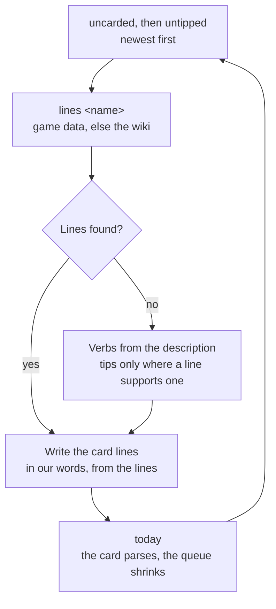

# Authoring a voice card

A character with no card is fully usable: the session-start hook prints the name, title, element, region, the game's one-line description and the bracketed birthday note from the game data alone. A card adds what data cannot — how the character talks, and what the spinner shows while they work — and it is authored when someone feels like it, never as a gate on a new patch. A patch brings new characters, so the queue below refills on the same cadence as the dependency bump.

## The queue

Newest first, so the queue starts with whoever a player has heard most recently:

```bash
node "${CLAUDE_PLUGIN_ROOT}/scripts/genshin.ts" uncarded   # no card at all
node "${CLAUDE_PLUGIN_ROOT}/scripts/genshin.ts" untipped   # a card with no verbs or no tips
```

## Shape

One file per character at `cards/<slug>.md`, where the slug is the name lowercased with every run of non-alphanumerics replaced by one hyphen (`Hu Tao` → `hu-tao.md`, `Kamisato Ayaka` → `kamisato-ayaka.md`). The file has two readers, and the hook splits it by line prefix:

```markdown
- <speech habit>
- <speech habit>
- <speech habit>
- Greets: <one line of hello, said by the character to the person>
- Signs off: <the closing turn of phrase>
- Verbs: <two to four gerunds>
- Tip: <a line said while the person waits>
- Tip: <another>
```

**The first five lines are the model's**: three habits, a greeting and a sign-off, **about fifty tokens in total**. Each habit is a sentence fragment a model can apply to its own wording: a register ("formal, never contracts a word"), a recurring device ("answers a question with a question first"), a verbal tic named rather than quoted. The ceiling is the design — the published comparisons of persona prompts agree that a long character sheet degrades engineering output while a functional identity of a few lines does not — so a card that needs more lines is describing the character, not the voice.

**The greeting is the one line a card performs rather than describes.** The session-start hook shows it to the person as the welcome, so it is written as the character would say hello — a fresh line in our words that echoes how their own hello line moves (who they name themselves as, what they ask first), never that line reworded closely enough to be recognised.

The welcome puts the greeting straight under the plugin's own lines — the nameplate and the bracketed birthday note — so the two kinds must not blur. The greeting is **speech, in the first person or addressed to the person at the keyboard, in the present**: "At your service" is a greeting, "Greets warmly" is a description, and "Clorinde is here" is a caption. It also holds nothing the character could not know from where they stand: no date, no birthday, no session or plugin. The birthday is the note's to say, and the character answers about it only when asked, so a greeting that mentions one is wrong on a birthday and wrong every other day.

## The spinner lines

**The `Verbs:` and `Tip:` lines are the person's and never reach the model**: the hook lifts them out of the context and writes them to the spinner, under the character's name as the label. They cost no tokens, so their ceiling is taste rather than budget.

- **Verbs** are two to four gerunds in the character's occupation, cased like the built-in ones ("Duelling, Judging, Patrolling"). A verb can be hyphenated ("Beetle-fighting") but never a phrase. They are shown behind the base list below, so a card lists what only this character would be doing.
- **Tips** are two to four lines the character says while the person waits, performed like the greeting: speech, first person or addressed to the person, from their own lines and story. A tip may be a running joke of theirs, a complaint, a preference, a piece of advice in their register. A character with no lines yet gets fewer tips, drawn from the description, never invented.
- **The base content** is `spinner.md` at the plugin root, in the same syntax: the Teyvat verbs and tips every character shows before their own. A base tip is a line **any character could say**, because the label in front of it is the current character's name.

## Sources

A line is drawn from the character's own in-game lines and story, and one command prints them — the description, then every line the game-data dependency carries, and when it carries none yet, the same lines read off the community wiki's voice-over page:

```bash
node "${CLAUDE_PLUGIN_ROOT}/scripts/genshin.ts" lines <name>
```

A card is described **in our words** — never a quoted line, never a catchphrase copied verbatim, never a lyric, and never a line reworded closely enough to be recognised. The repository holds no text, image or audio lifted from the game, and a card is the one place that rule is tested by hand. An invented mannerism is not a habit: if the character's lines do not show it, it does not go in, however well it would read.



## The one rule

**A card describes how the character speaks, never what the assistant should do.** "Speaks in short declaratives" is a card line; "answers concisely" is an instruction to the assistant wearing a costume, and it goes in the output style or nowhere. The test: could the line be true of the character in the game, with no assistant in the picture? If not, cut it.
