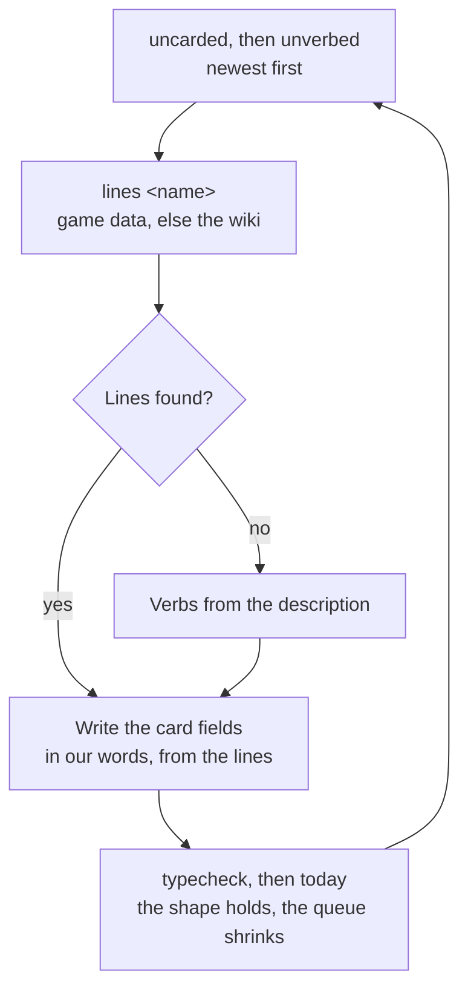

# Authoring a persona card

A character with no card is fully usable: the session-start hook prints the name, title, element, region, the game's one-line description and the bracketed birthday note from the game data alone, and the spinner shows every line of theirs. A card adds what data cannot — how the character talks, and the verbs the spinner shows — and it is authored when someone feels like it, never as a gate on a new patch. A patch brings new characters, so the queue below refills on the same cadence as the dependency bump.

## The queue

Newest first, so the queue starts with whoever a player has heard most recently:

```bash
node "${CLAUDE_PLUGIN_ROOT}/scripts/genshin.ts" uncarded       # no card at all
node "${CLAUDE_PLUGIN_ROOT}/scripts/genshin.ts" unverbed       # a card with no verbs
node "${CLAUDE_PLUGIN_ROOT}/scripts/genshin.ts" untranslated   # no gerunds or greeting in the interface language
```

The third queue is a language's rather than a card's, and it is empty under English, where the gerunds and the greeting are read off the cards themselves. Under any other language they live in one module per language at `src/localizations/<language>.ts`, named the way a card is named for its character: a `characters` map keyed by the character's English name, each entry the person's half of that card — `verbs` and `greeting`, either present once written — beside that language's base Teyvat verbs. A character with no verbs in a module that exists shows the base verbs alone rather than the card's English ones behind localized ones; a language with no module at all inherits English base verbs, so the cards' gerunds show there too. A character with no greeting is greeted in the card's own words, since one line in another script is a queue item where a spinner mixing two is broken. Either way the queue draining is what fills a spinner and a welcome out and never what stops them working.

Only what a person reads is a language's to write. The habits and the sign-off reach the model alone and are never translated — a model reading them in English answers in whatever language it was asked to, with the register intact. The greeting is the card's one line the person reads, printed by the hook as the welcome before the model has spoken, which is why it is the language's; a greeting in the module is the card's line as that character would say it in that language, in their own register, never the English line pasted through — the module's test refuses that.

The birthday note's distance and every offered list are the runtime's words, through `Intl`, so a language module has no string for "today" or "tomorrow" and no joiner for a list: one `locale` covers them.

## Shape

One file per character at `src/personaCards/<name>.ts`, where the name is the character's in camel case — lowercased, every run of non-alphanumerics dropped and the letter after it capitalised (`Hu Tao` → `huTao.ts`, `Kamisato Ayaka` → `kamisatoAyaka.ts`). The card is a typed module, so the shape is checked where it is written rather than guessed at by a parser:

```ts
import type { PersonaCard } from "#src/models/PersonaCard";

const clorinde: PersonaCard = {
  greeting: "State your dispute. Spare the details.",
  habits: [
    "Terse and formal; conclusion first, one reason.",
    "A task is a duel: opponent, rule, act.",
    "Deflects questions about herself.",
  ],
  signOff: "with a courteous dismissal.",
  verbs: ["Duelling", "Judging", "Patrolling", "Hunting"],
  reference: "Clorinde More About Clorinde - 03",
};

export default clorinde;
```

The const carries the file's name and is exported as the default, because the loader has a path in hand and never a name. A field missing, misspelled or of the wrong type is a typecheck failure, which is the point of the card being a module: a card matched by string prefixes fails silently in every direction, and a key spelled one letter wrong reaches the model as a speech habit rather than as an error.

**`habits`, `greeting` and `signOff` are the model's**: three habits, a greeting and a sign-off, **about fifty tokens in total**. Each habit is a sentence fragment a model can apply to its own wording: a register ("formal, never contracts a word"), a recurring device ("answers a question with a question first"), a verbal tic named rather than quoted. The ceiling is the design — the published comparisons of persona prompts agree that a long character sheet degrades engineering output while a functional identity of a few lines does not — so a card that needs more lines is describing the character, not the voice.

**`habits` is also what the lore pick reads.** The typed decision that chooses the session's character describes each option by its habits, falling back to the game's own line only for a character nobody has carded. So a habit is doing two jobs: telling the model how to sound, and telling the picker who this is to spend a session with.

**The greeting is the one line a card performs rather than describes.** The session-start hook shows it to the person as the welcome, and the output style opens the session's first reply with it, where the speech engine reads it verbatim — so it is one or two short sentences in Latin script, and it is written as the character would say hello — a fresh line in our words that echoes how their own hello line moves (who they name themselves as, what they ask first), never that line reworded closely enough to be recognised.

The welcome puts the greeting straight under the plugin's own lines — the nameplate and the bracketed birthday note — so the two kinds must not blur. The greeting is **speech, in the first person or addressed to the person at the keyboard, in the present**: "At your service" is a greeting, "Greets warmly" is a description, and "Clorinde is here" is a caption. It also holds nothing the character could not know from where they stand: no date, no birthday, no session or plugin. The birthday is the note's to say, and the character answers about it only when asked, so a greeting that mentions one is wrong on a birthday and wrong every other day.

## The reference

**`reference` is the synthesizer's and never reaches the model** — a character is not told which line their voice is cloned from. It is also **optional, and the ear's alone**: every character's measured reference is one entry of the generated `src/generated/PersonaReferenceMap.ts`, written by the repository's reference selection and never edited by hand, and a card names a line only when someone listened and chose one over it. The plugin reads the card's over the generated one, so deleting the card's restores the measurement.

```ts
reference: "Clorinde More About Clorinde - 03",
```

The value is the line's file stem on the community wiki — the title after `VO_` and the dub prefix, before `.ogg` — which is the same in every dub, so one stem serves whichever dub the person set up. The stems a character has are the ones `lines <name>` prints titles for, spelled as the wiki's voice-over page files them; a stem the wiki holds no file under leaves the character silent and the reason in the synthesizer's log, so a card that gains or changes one is checked:

```bash
pnpm ai:voice-match --check
```

The full reasoning — how a reference is chosen and what its likeness number is worth — is the [reference selection](https://esposter.com/docs/infra/claude-interface/reference-selection) page's. **The generated values are measured, not heard**; correcting one by ear is a welcome edit, and the card is where that correction goes — never the generated map, which the next run overwrites. A session tempted to re-derive a reference by taste runs the measurement instead.

## The spinner verbs

**`verbs` are the person's and never reach the model**: the hook writes them to the spinner. They cost no tokens, so their ceiling is taste rather than budget. A card carries no tips: the spinner's tips are the character's own lines, every one, read off the game data at runtime, and a tip performed in our words from them is a paraphrase shown beside its original.

- **Verbs** are two to four gerunds in the character's occupation, cased like the built-in ones (`["Duelling", "Judging", "Patrolling"]`). A verb can be hyphenated ("Beetle-fighting") but never a phrase. They are shown behind the base list below, so a card lists what only this character would be doing.
- **The base verbs** are the `verbs` of the interface language's module under `src/localizations/`: the Teyvat gerunds every character shows before their own. There is no base tip: a character with no lines anywhere yet shows the game's one-line description of them, which is still theirs, under their name.

## Sources

A line is drawn from the character's own in-game lines and story, and one command prints them — the description, then every line the game-data dependency carries, and when it carries none yet, the same lines read off the community wiki's voice-over page:

```bash
node "${CLAUDE_PLUGIN_ROOT}/scripts/genshin.ts" lines <name>
```

A card is described **in our words** — never a quoted line, never a catchphrase copied verbatim, never a lyric, and never a line reworded closely enough to be recognised. The repository holds no text, image or audio lifted from the game, and a card is the one place that rule is tested by hand. An invented mannerism is not a habit: if the character's lines do not show it, it does not go in, however well it would read.



## The one rule

**A card describes how the character speaks, never what the assistant should do.** "Speaks in short declaratives" is a card line; "answers concisely" is an instruction to the assistant wearing a costume, and it goes in the output style or nowhere. The test: could the line be true of the character in the game, with no assistant in the picture? If not, cut it.

This is also why a card carries no field for what the character is _good for_ — "suits a long refactor", "good on a bad day". That is the assistant's job description in the character's clothing, and the lore pick is meant to weigh who someone **is** against the day, not to read a label saying when to pick them.
